# Pipeline Benchmark

End-to-end evaluation of the **DetectionPipeline** on **10,000 placement-stratified synthetic benchmark images** (2,500 per layout) across all 3 detector sizes using **Hungarian Bipartite Matching** (`matching_mode="hungarian"`) and **Non-Maximum Suppression** (`nms_threshold=0.35`).

## Pipeline Architecture & Workflow

```
                   Input Image (224x224 grayscale)
                                 │
                                 ▼
                     ResNet Backbone (Detector)
                                 │
                                 ▼
                  Prediction Head (24 Output Slots)
                                 │
                      Predicted Boxes + Scores
                                 │
       ┌─────────────────────────┴─────────────────────────┐
       │                                                   │
 ──────── Training ────────                         ──────── Inference ────────
    Hungarian Matching                                 Confidence Threshold
            │                                               │
      Detection Loss                                       NMS
 (Huber + BCE w/ pos_weight)                                │
                                                       Final Boxes
                                                            │
                                                   Crop, Pad & Resize
                                                            │
                                                  Character Classifier
                                                      (47 classes)
```

## Models

| Stage | Model | Size | Model Params | Combined Pipeline Params (Det + Cls) | Weights |
|:---|:---|:---:|:---:|:---:|:---|
| Stage 1 | `ObjectDetectorResNet` — Nano | `n` | **0.57M** (565,784) | **0.94M** (936,135) | `weights/detector_n_new_best.pth` |
| Stage 1 | `ObjectDetectorResNet` — Small | `s` | **2.23M** (2,227,128) | **2.60M** (2,597,479) | `weights/detector_s_new_best.pth` |
| Stage 1 | `ObjectDetectorResNet` — Medium | `m` | **8.84M** (8,836,856) | **9.21M** (9,207,207) | `weights/detector_m_new_best.pth` |
| Stage 2 | `CharacterClassifierResNet` — ByMerge | — | **0.37M** (370,351) | — | `weights/classifier_resent_bymerge_s_best.pth` |

**Configuration**: `conf_threshold=0.70`, `iou_threshold=0.50` (matching), `nms_threshold=0.35` (NMS inference suppression), `matching_mode=hungarian`, `device=cuda`

---

## Sample Detections

Each image shows a 224×224 canvas with detected bounding boxes. Labels display predicted character + joint confidence score.

### 🔬 Nano (0.57M Det / 0.94M Total)

| random | random | grid | grid |
|:---:|:---:|:---:|:---:|
| 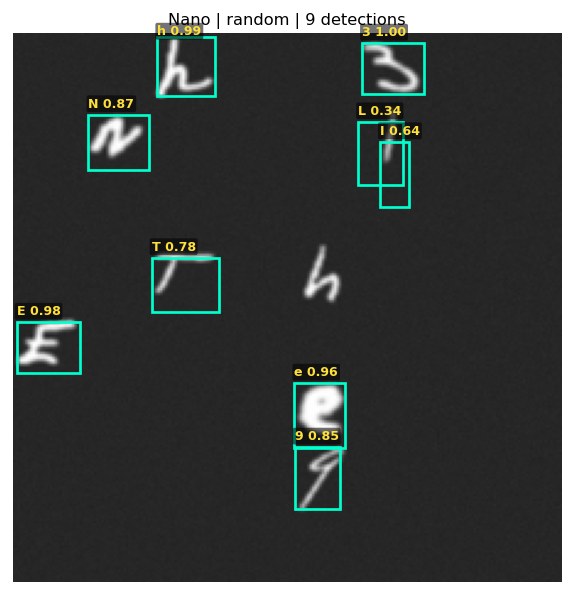 | 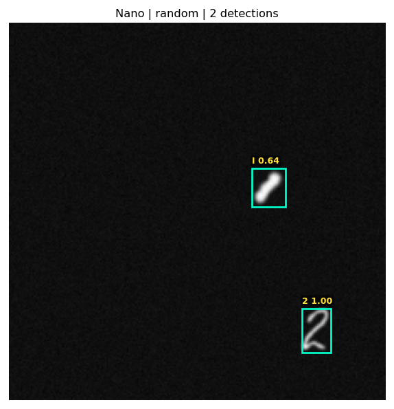 | 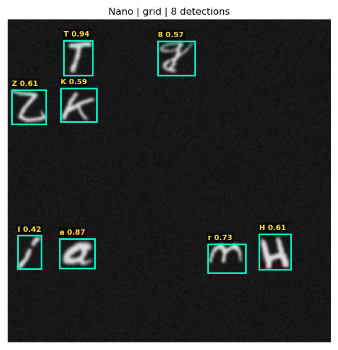 | 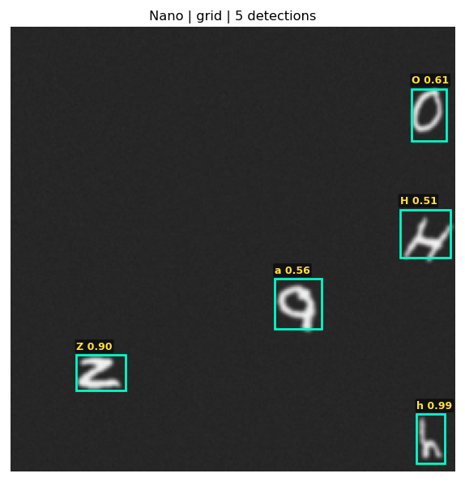 |
| **words** | **words** | **line** | **line** |
| 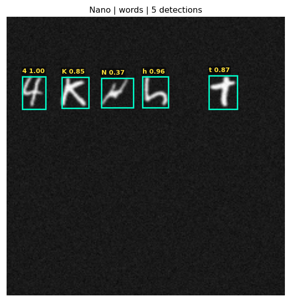 | 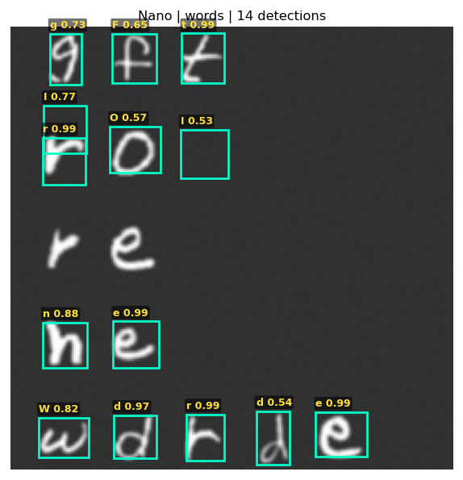 | 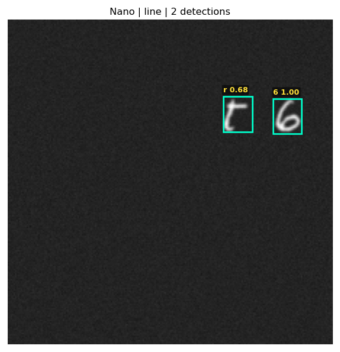 | 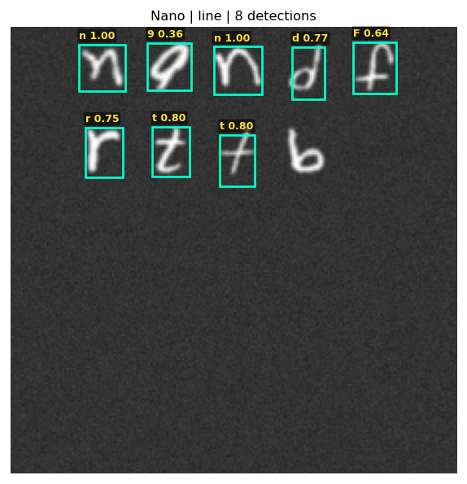 |

### ⚡ Small (2.23M Det / 2.60M Total) — Recommended

| random | random | grid | grid |
|:---:|:---:|:---:|:---:|
| 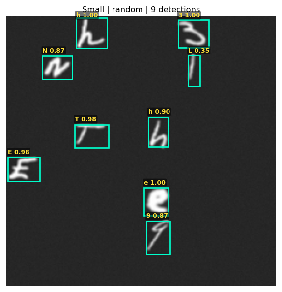 | 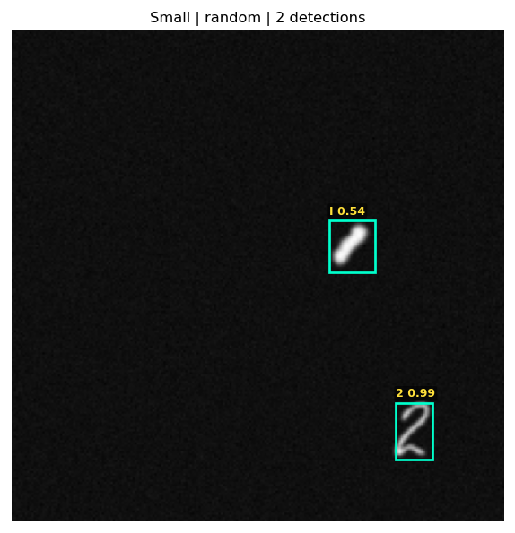 | 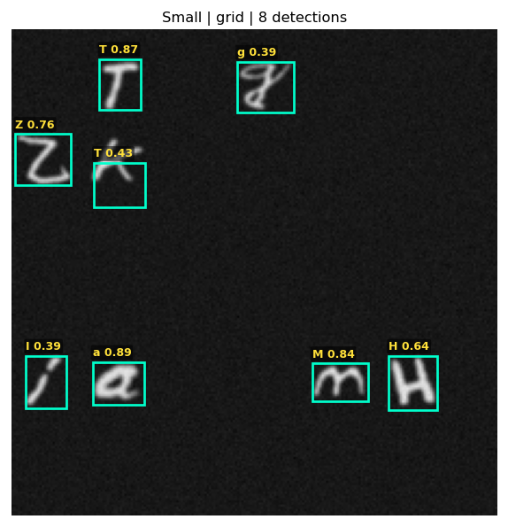 | 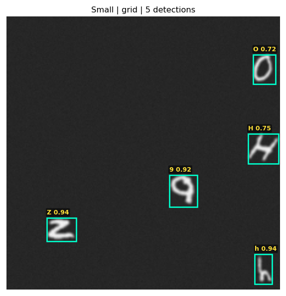 |
| **words** | **words** | **line** | **line** |
|  | 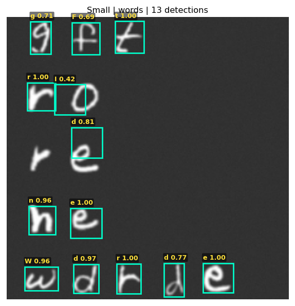 | 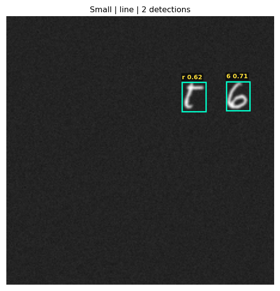 | 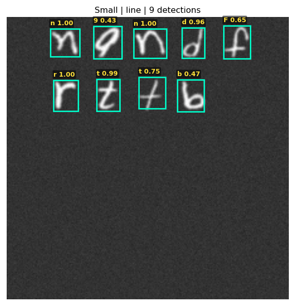 |

### 🎯 Medium (8.84M Det / 9.21M Total) — Best Accuracy

| random | random | grid | grid |
|:---:|:---:|:---:|:---:|
| 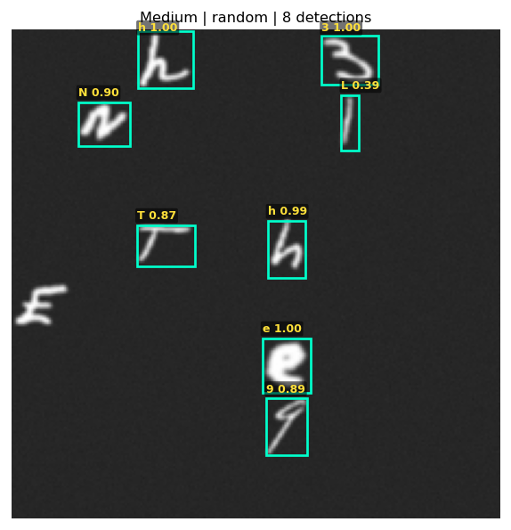 | 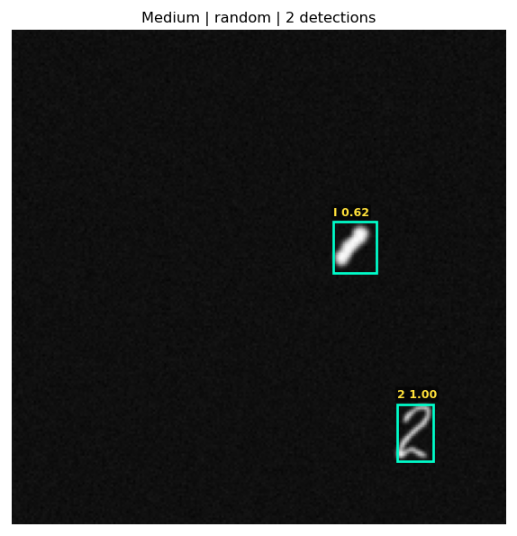 | 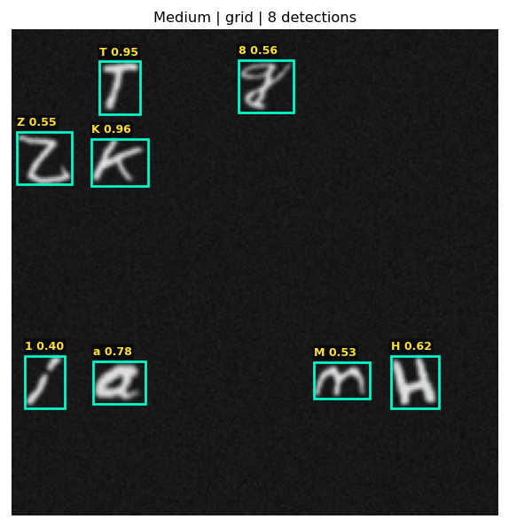 | 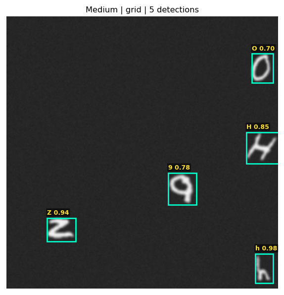 |
| **words** | **words** | **line** | **line** |
| 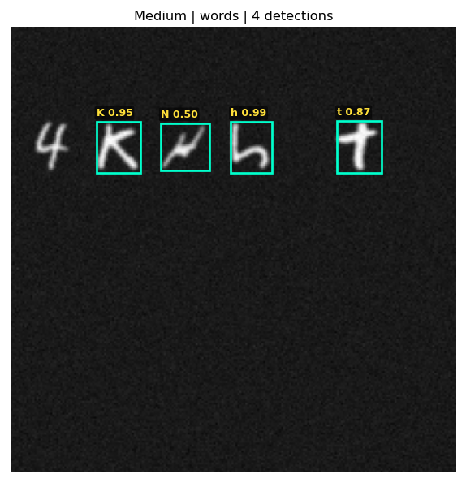 | 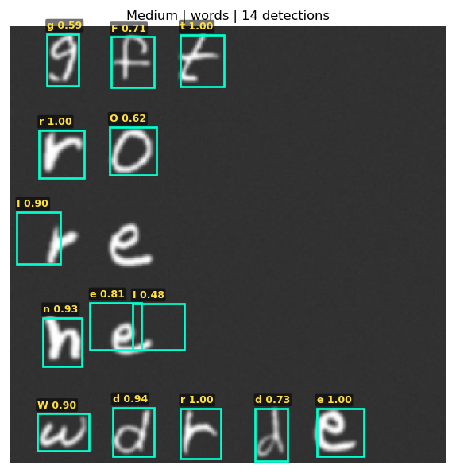 | 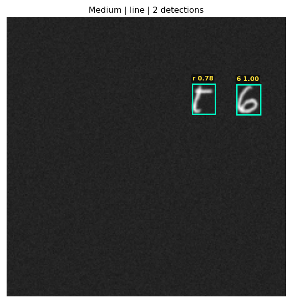 | 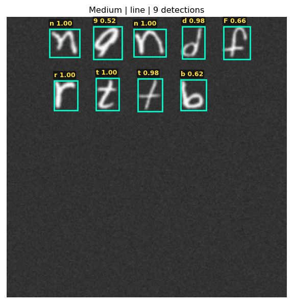 |

---

## Results (Hungarian Matching + NMS Inference)

### 🔬 Nano — 0.57M Detector / 0.94M Total

| Layout | Det Precision | Det Recall | Classifier Acc | End-to-End F1 | Throughput |
|:---|:---:|:---:|:---:|:---:|:---:|
| 🎲 Random | 0.9242 | 0.8566 | 78.03% | 0.6938 | 661 FPS |
| 📐 Grid   | 0.8891 | 0.8158 | 77.38% | 0.6584 | 650 FPS |
| 📝 Words  | 0.9612 | 0.8584 | 71.58% | 0.6491 | 665 FPS |
| 📏 Line   | 0.9580 | 0.8512 | 71.59% | 0.6454 | 673 FPS |

### ⚡ Small — 2.23M Detector / 2.60M Total _(recommended)_

| Layout | Det Precision | Det Recall | Classifier Acc | End-to-End F1 | Throughput |
|:---|:---:|:---:|:---:|:---:|:---:|
| 🎲 Random | 0.9773 | 0.9520 | 78.30% | **0.7552** | 611 FPS |
| 📐 Grid   | 0.9548 | 0.9237 | 78.02% | **0.7326** | 605 FPS |
| 📝 Words  | 0.9870 | 0.9319 | 72.19% | **0.6920** | 618 FPS |
| 📏 Line   | 0.9800 | 0.9292 | 72.08% | **0.6876** | 615 FPS |

### 🎯 Medium — 8.84M Detector / 9.21M Total _(best accuracy)_

| Layout | Det Precision | Det Recall | Classifier Acc | End-to-End F1 | Throughput |
|:---|:---:|:---:|:---:|:---:|:---:|
| 🎲 Random | 0.9900 | 0.9538 | 78.84% | **0.7660** | 393 FPS |
| 📐 Grid   | 0.9809 | 0.9497 | 78.66% | **0.7591** | 387 FPS |
| 📝 Words  | 0.9936 | 0.9489 | 72.99% | **0.7085** | 378 FPS |
| 📏 Line   | 0.9934 | 0.9503 | 72.83% | **0.7075** | 386 FPS |

---

## Model Comparison Summary

| Variant | Detector Params | Classifier Params | Total Pipeline Params | Avg Det Precision | Avg Det Recall | Avg E2E F1 | Avg FPS |
|:---|:---:|:---:|:---:|:---:|:---:|:---:|:---:|
| **Nano (`n`)** | **565,784** (0.57M) | **370,351** (0.37M) | **936,135** (0.94M) | 0.933 | 0.846 | 0.662 | **662 FPS** |
| **Small (`s`)** | **2,227,128** (2.23M) | **370,351** (0.37M) | **2,597,479** (2.60M) | 0.975 | 0.934 | 0.717 | **612 FPS** |
| **Medium (`m`)** | **8,836,856** (8.84M) | **370,351** (0.37M) | **9,207,207** (9.21M) | **0.990** | **0.951** | **0.735** | **386 FPS** |

> **Recommendation**: **Small** offers the best speed/accuracy tradeoff — 4× fewer params than Medium (2.60M vs 9.21M total) with only ~1.8% lower E2E F1, but 58% higher throughput.

---

## Metric Definitions

- **Training Matching** — Hungarian Bipartite Matching (`scipy.optimize.linear_sum_assignment`) pairs predicted slots to GT boxes for loss computation.
- **Inference NMS** — `torchvision.ops.nms` suppresses duplicate slot predictions targeting the same character ($\text{IoU} \ge 0.35$).
- **Det Precision / Recall** — IoU ≥ 0.50 matching between predicted and ground truth boxes.
- **Classifier Acc** — Top-1 accuracy on correctly localized boxes (predicted IoU ≥ 0.50 with a GT box).
- **End-to-End F1** — A detection counts as correct only if the box *and* character label are both right.

---

## Reproducing the Benchmark

```bash
# Generate benchmark dataset (10,000 images, 2,500/layout)
python scripts/generate_benchmark_dataset.py

# Run full evaluation across all 3 detectors (Hungarian matching by default)
python scripts/run_full_benchmark.py

# Run evaluation for a single detector (Small by default)
python scripts/verify_pipeline.py

# Regenerate sample visualization images
python scripts/generate_benchmark_visuals.py
```
