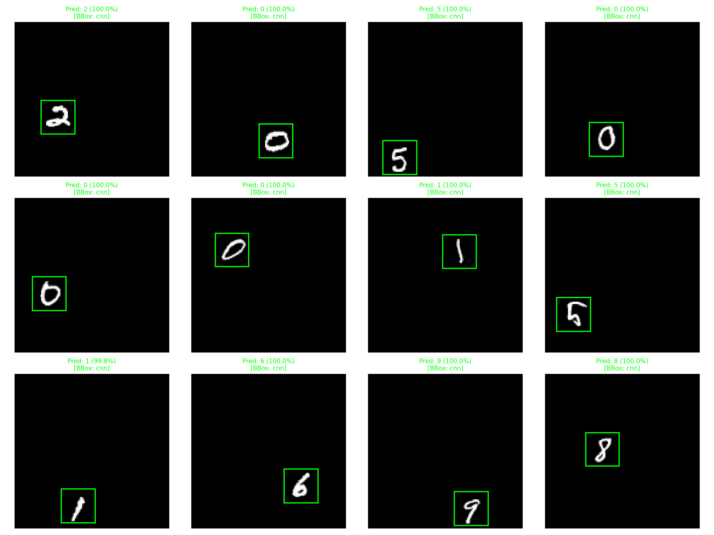

# Object Detection & Digit Recognition from Scratch (PyTorch)

An end-to-end computer vision pipeline built entirely from scratch in **PyTorch**. The repository features a modular, two-stage architecture:
1. **Bounding Box Regression Model**: Detects the location of a digit within an image.
2. **Digit Classification Model**: Classifies the tightly-cropped region into digits (0-9).

This project was built focusing on performance optimization, hyperparameter tuning, and moving away from generic abstractions towards native deep learning operations.

## Architecture

## Architecture Flow

```text
Input Image (128×128)
        │
        ▼
┌──────────────────┐
│  Bbox Detection  │
│  (PyTorch CNN)   │──── Predict [x_min, y_min, x_max, y_max]
└────────┬─────────┘
         │
         │ Invalid bbox?
         ▼
┌──────────────────┐
│ Classical Fallback│
│ (Connected Comp.) │──── Binary threshold → largest component → bbox
└────────┬─────────┘
         │
         ▼
┌──────────────────┐
│   Crop & Resize  │──── PyTorch F.interpolate → 28×28 tensor
└────────┬─────────┘
         │
         ▼
┌──────────────────┐
│ Digit Classifier │──── PyTorch classifier → digit (0-9) + confidence
└──────────────────┘
```

Both models have been highly optimized to run exceptionally fast while maintaining peak accuracy.

### Bounding Box Regressor (`~700k parameters`)
- 4-Block Convolutional stem with Batch Normalization and MaxPooling.
- A $1 \times 1$ Convolutional bottleneck to severely compress spatial feature maps.
- A fully connected head regressing normalized `[x_min, y_min, x_max, y_max]` coordinates.

### Digit Classifier (`~130k parameters` Ultra-Light)
- 3-Block Convolutional stem.
- Deep spatial compression reducing images to $3 \times 3$ feature maps before flattening.
- A compact `Linear(576, 128)` dense layer, ensuring lightning-fast CPU/GPU inference while achieving $>99\%$ accuracy.

## Pipeline Integration

The core integration logic lives in `digit_detector.py`. 
It implements `DigitDetectionPipeline`, which handles:
- **Batched GPU Tensors**: Takes `(N, C, H, W)` tensors directly, running bounding box detection across the entire batch natively on the GPU.
- **Dynamic Cropping**: Automatically extracts sub-tensors using PyTorch's `F.interpolate` based on predicted bounding boxes.
- **Classical Fallback**: Uses `scipy.ndimage.label` (Connected Components) to intelligently fallback if the CNN fails to output valid coordinates or confidence drops.

## Setup & Execution

### Installation
```bash
pip install -r requirements.txt
```

### Running the Full Pipeline Test
To test the pipeline on the `TestImages/` directory:
```bash
python eval_pipeline.py
```
This script will load the pre-trained checkpoints from `./checkpoint/` and `./Models/`, process the test images, and generate a visual output grid `pipeline_test_results.png`.

To run a massive batched test on all images and save the prediction logs:
```bash
python run_full_test.py
```

## Performance Benchmarks

In migrating from our original TensorFlow architecture to the modular **PyTorch** architecture, the pipeline's overall throughput and confidence improved. 

Benchmarks were executed locally on an **RTX 5070 Ti Desktop GPU**.
Tested on **28,000 images** (Detection + Cropping + Classification):

| Run | Architecture | Overall Mean Confidence |
|---|---|---|
| `run_01` | TF CNN + Classical Fallback | 94.01% |
| `run_03` | TF CNN Only | 97.63% |
| **`run_torch`** | **PyTorch Ultra-Light Pipeline** | **99.06%** |

The PyTorch pipeline achieves a significantly higher confidence threshold while taking just **~3.6 seconds** to process all 28,000 images via `predict_batch`.

## Prediction Visualizations

The following grid showcases the end-to-end PyTorch pipeline in action.
- **Lime Box**: Detected Digit Region
- **Title**: PyTorch classification result & BBox source (CNN vs Classical Fallback)


