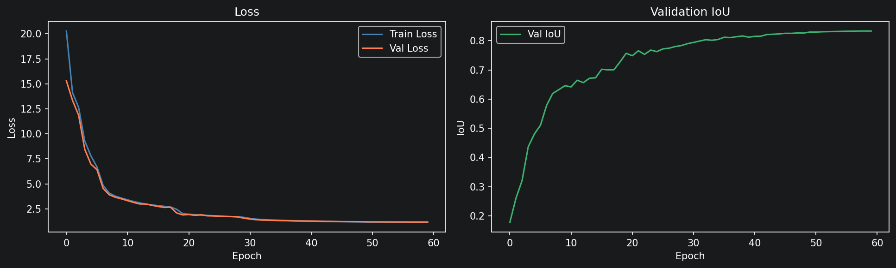
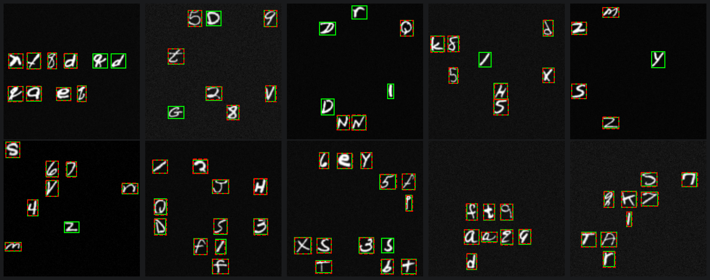

# Object Detection from Scratch (PyTorch)

An end-to-end, **two-stage** scene understanding pipeline built entirely from scratch in PyTorch -- no off-the-shelf detection frameworks. Given a 224x224 grayscale image containing multiple characters, the pipeline detects every character's bounding box and classifies it.

Trained on a custom synthetic dataset generated from EMNIST, running on an **RTX 5070 Ti**.

> **Note**: The end-to-end inference pipeline (combining detector + classifier into a single runnable script) is planned for a future update. The two stages are currently trained and evaluated independently via the notebooks.

---

## Architecture

```
Input Image (224x224 grayscale)
        |
        v
+----------------------+
|   Object Detector    |  ResNet backbone
|   (ResNet CNN)       |  -> (N, 5) slots: [x, y, w, h, confidence]
+----------+-----------+
           |  Per-slot confidence thresholding
           v
+----------------------+
|   Crop & Pad         |  Extract bbox region, add margin, pad to square,
|   & Resize           |  then resize to 28x28 (preserves aspect ratio)
+----------+-----------+
           |
           v
+----------------------+
| Character Classifier |  ResNet-based
| (47 classes)         |  -> character label + confidence per crop
+----------------------+
```

---

## Stage 1 -- Character Classifier

### Architecture
A lightweight **ResNet** backbone with a fully-connected classification head. Input: 28x28 grayscale crop. Output: probability distribution over 47 character classes.

### EMNIST Split -- Why `bymerge`?

We evaluated both the **ByClass** (62 classes) and **ByMerge** (47 classes) EMNIST splits. ByClass treats visually ambiguous pairs (`C/c`, `O/o`, `S/s`, `V/v`, `W/w`, `X/x`, `Z/z`) as separate classes. At our image scale, these pairs are genuinely indistinguishable, which means training on ByClass forces the model to learn an impossible distinction. ByMerge collapses these pairs into a single class, giving the model a clean, learnable label space.

| Split | Val Accuracy |
|---|---|
| ByClass (62 classes) | ~86.0% |
| **ByMerge (47 classes)** | **~89.9%** |

The ~4% gap is purely from removing the impossible ambiguous pairs -- same model, same hyperparameters.

### Training Journey

We went through several optimizer and loss configurations to push past the 89% ceiling:

- Started with **SGD + StepLR** -- slow convergence, settled around 84%.
- Switched to **Adam + OneCycleLR** -- faster convergence and significantly better generalization.
- Added **GPU-side augmentations** (random affine, erasing) -- improved robustness to varied character styles.
- Final config: `Adam`, `OneCycleLR`, `lr=4e-5`, 30 epochs, CrossEntropyLoss.

**Best result: 89.9% validation accuracy** in 30 epochs (~8.4s/epoch on RTX 5070 Ti).

---

## Stage 2 -- Object Detector

### Architecture
A **ResNet-based** backbone with a multi-slot detection head. The model predicts `N` fixed slots, each producing a `[x, y, w, h, confidence]` vector. The maximum number of objects per image defines the slot count.

### From Greedy to Hungarian Matching

The most critical algorithmic improvement was replacing the **greedy argmax assignment** with **Hungarian (bipartite) matching** in the training loss.

#### The Problem with Greedy Matching
The original loss assigned each ground-truth box to the prediction slot with the highest IoU:
```python
_, matched_idx = iou.max(dim=1)   # pure greedy argmax
```
This caused **slot collisions** -- multiple ground-truth objects fighting over the same predicted slot. This is fundamentally a regression task mismatch: the model had no guarantee that each object would get a dedicated slot.

#### Hungarian Matching
Replaced with `scipy.optimize.linear_sum_assignment`, which solves the optimal 1-to-1 bipartite assignment:
```python
pred_idx, gt_idx = linear_sum_assignment(-iou_cost)  # per image in batch
```
This **mathematically guarantees** that every ground-truth object is assigned a unique predicted slot -- zero slot collisions by construction.

#### Impact

| Run | Matching | Val IoU |
|---|---|---|
| Baseline (greedy) | Argmax | 0.833 |
| Greedy (later runs) | Argmax | 0.803-0.810 |
| **Hungarian** | **Bipartite** | **0.903** |



The jump from ~0.81 to **0.903** in a single swap shows just how much the slot collision problem was bottlenecking performance.

### Performance Optimization

The initial Hungarian implementation had a critical bottleneck: running `.cpu().numpy()` and `torch.as_tensor(..., device=device)` **per image inside the batch loop** caused hundreds of GPU synchronization stalls per batch (200ms -> 90ms just from syncs).

Fixed by:
1. **Single bulk transfer**: `iou.detach().cpu().numpy()` once before the loop.
2. **Single bulk push**: `torch.from_numpy(matched_idx_np).to(device)` once after.
3. **Fast-path for single objects**: skip scipy entirely, use `np.argmin` for `n_valid == 1`.
4. **All diagnostics on numpy arrays**: moved the match-ratio diagnostic off GPU entirely.

Result: loss computation time dropped from ~200ms -> **~5ms per batch**. Full epoch time from ~170s -> **~70s**.

### Training Config
- **Model**: `ObjectDetectorResNet`
- **Optimizer**: `AdamW`
- **Scheduler**: `OneCycleLR`
- **Loss**: Huber (box regression) + BCE (confidence) with Hungarian assignment
- **Epochs**: 60
- **Device**: RTX 5070 Ti

---

## Dataset

The synthetic dataset is generated from scratch using EMNIST characters composited onto blank canvases. See [`generator/README.md`](generator/README.md) for full documentation on the generation pipeline, layout strategies, and metadata format.

**Dataset size**: 255,000 training / 45,000 test images.

### Example Predictions
Here are sample multi-object detections from the test set, visualizing the predicted bounding boxes:



---

## Project Structure

```
OD-From-Scratch/
+-- generator/          # Synthetic dataset generation pipeline
|   +-- README.md       # Dataset generation docs
|   +-- generator.py    # DatasetGenerator -- multi-threaded scene creation
|   +-- canvas.py       # Character placement and bbox calculation
|   +-- dataset.py      # EMNIST source data loader
+-- models/             # Model architectures
|   +-- object_detector_res.py        # ResNet multi-slot detector
|   +-- character_classifier_resnet.py # ResNet character classifier
+-- utils/              # Core training utilities
|   +-- dataset.py      # DetectionDataset, DataLoader factories
|   +-- reader.py       # DataReader -- reads PNG images + metadata.jsonl
|   +-- losses.py       # DetectionLoss with Hungarian matching
|   +-- trainer.py      # Training + evaluation loops
|   +-- visualizer.py   # Detection visualization helpers
|   +-- callbacks.py    # Training callbacks (checkpointing etc.)
|   +-- logger.py       # RunLogger -- JSON training logs
+-- notebooks/
|   +-- detection.ipynb     # Detector training + eval notebook
|   +-- classifier.ipynb    # Classifier training notebook
+-- scripts/
|   +-- dataset_setup.py    # One-time EMNIST download and verification
|   +-- verify_pipeline.py  # End-to-end pipeline smoke test
+-- data/OD/            # Generated dataset (not in repo)
+-- logs/               # JSON training run logs (per model)
+-- weights/            # Saved model checkpoints
+-- archive/            # Deprecated / legacy files
+-- requirements.txt
```

---

## Setup

```bash
pip install -r requirements.txt
```

To regenerate the dataset from scratch:
```bash
# See generator/README.md for full options
python -c "from generator.generator import DatasetGenerator; DatasetGenerator().generate()"
```

To run the pipeline smoke test:
```bash
python scripts/verify_pipeline.py
```