# Benchmark Report 03 · Grid-Based Spatial ResNet Detector

This document presents the complete 10,000-image evaluation report for the **Stage 6 Grid-Based Spatial Detector Architecture** (`ObjectDetectorResNet` v3 with `grid_head`).

---

## Architecture Overview

```
                   Input Image (224×224 grayscale)
                                 │
                                 ▼
                      ResNet Backbone (Stem + L1..L4)
                                 │
                      Spatial Feature Map (14×14)
                                 │
                      grid_head (Conv2d 1×1)
                                 │
                      Spatial Grid Tensor (B, 14, 14, 52)
                                 │
       ┌─────────────────────────┴─────────────────────────┐
       │                                                   │
 ──────── Training ────────                         ──────── Inference ────────
    Direct Spatial Target Mapping                       Optimal Conf Threshold (0.90)
    (targets[gy, gx] = box, obj, cls)                               │
            │                                               NMS (IoU ≥ 0.35)
    Direct GPU Tensor Loss                                          │
 (Huber + BCE + Aligned-IoU + CE)                              Final Detections
                                                   (Boxes + Scores + Classes)
```

In contrast to the Stage 5 FC-based tri-head model, the Stage 6 Grid Detector eliminates global average pooling (`AdaptiveAvgPool2d((2,2))`) and fully-connected linear projection heads. Instead, it applies a spatial $1 \times 1$ convolutional head directly on top of the $14 \times 14$ feature map. Bounding box coordinates $[x, y, w, h]$, objectness confidence logits $[conf]$, and 47 character class logits $[cls_0 \dots cls_{46}]$ are bound directly to local $16 \times 16$ pixel receptive fields.

---

## Model Parameter Audit

| Size Preset | Model Name | Total Parameters | Optimal `conf` | Checkpoint Weight File | Output Tensor Shape |
|:---|:---|:---:|:---:|:---|:---:|
| **Nano (`n`)** | `ObjectDetectorResNet` (v3 Nano) | **392,044** (0.39M) | `0.90` | `checkpoint/grid_detector_n_best.pth` | `(B, 14, 14, 52)` |
| **Small (`s`)** | `ObjectDetectorResNet` (v3 Small) | **1,552,652** (1.55M) | `0.90` | `checkpoint/grid_detector_s_best.pth` | `(B, 14, 14, 52)` |
| **Medium (`m`)** | `ObjectDetectorResNet` (v3 Medium) | **6,183,948** (6.18M) | `0.90` | `checkpoint/grid_detector_m_best.pth` | `(B, 14, 14, 52)` |

**Configuration**: `nms_iou=0.35`, `device=cuda`, `S=14` spatial resolution.  
*(Note: Large `l` preset intentionally dropped from Stage 6 evaluation).*

---

## Evaluation Results (10,000 Test Images across 4 Layouts)

### 🔬 Nano — 0.39M Params (`conf = 0.90`)

| Layout | Det Precision | Det Recall | Classifier Acc | End-to-End F1 | Throughput |
|:---|:---:|:---:|:---:|:---:|:---:|
| 🎲 Random | 0.9966 | 0.9976 | **88.30%** | **0.8804** | 400.8 img/s |
| 📐 Grid   | 0.4832 | 0.4922 | 85.32% | 0.4161 | 423.7 img/s |
| 📝 Words  | 0.4072 | 0.4130 | 87.09% | 0.3571 | 426.2 img/s |
| 📏 Line   | 0.3949 | 0.3995 | 85.66% | 0.3402 | 406.2 img/s |

### ⚡ Small — 1.55M Params (`conf = 0.90`)

| Layout | Det Precision | Det Recall | Classifier Acc | End-to-End F1 | Throughput |
|:---|:---:|:---:|:---:|:---:|:---:|
| 🎲 Random | 0.9971 | 0.9983 | **89.62%** | **0.8941** | 465.9 img/s |
| 📐 Grid   | 0.4954 | 0.5037 | 86.40% | 0.4315 | 467.7 img/s |
| 📝 Words  | 0.4178 | 0.4228 | 87.38% | 0.3673 | 456.7 img/s |
| 📏 Line   | 0.4156 | 0.4196 | 85.17% | 0.3556 | 463.4 img/s |

### 🎯 Medium — 6.18M Params (`conf = 0.90`)

| Layout | Det Precision | Det Recall | Classifier Acc | End-to-End F1 | Throughput |
|:---|:---:|:---:|:---:|:---:|:---:|
| 🎲 Random | 0.9969 | 0.9980 | **89.77%** | **0.8953** | 446.8 img/s |
| 📐 Grid   | 0.4972 | 0.5041 | 85.97% | 0.4304 | 449.3 img/s |
| 📝 Words  | 0.4322 | 0.4364 | 84.31% | 0.3661 | 450.0 img/s |
| 📏 Line   | 0.4218 | 0.4257 | 82.40% | 0.3492 | 447.9 img/s |

---

## Grid-Based Spatial Model Comparison Summary (Optimal `conf = 0.90`)

| Model Variant | Total Parameters | Optimal `conf` | Avg Det Precision | Avg Det Recall | Avg Classifier Acc | Avg End-to-End F1 | Avg Throughput (Image FPS) |
|:---|:---:|:---:|:---:|:---:|:---:|:---:|:---:|
| **Nano (`n`)** | **0.39M** (392,044) | `0.90` | 0.5705 | 0.5756 | 86.59% | 0.4985 | **414.2 img/s** |
| **Small (`s`)** | **1.55M** (1,552,652) | `0.90` | 0.5815 | 0.5874 | 87.14% | 0.5121 | **463.4 img/s** |
| **Medium (`m`)** | **6.18M** (6,183,948) | `0.90` | 0.5870 | 0.5911 | 85.61% | 0.5103 | **448.5 img/s** |

---

## 📈 Density-Stratified Recall Sweep (Recall vs. GT Object Count $n_{gt}$)

Evaluates detection recall performance across object density buckets on the `random` layout test set:

| Density Bucket ($n_{gt}$) | Test Images | Grid Nano (`n`) | Grid Small (`s`) | Grid Medium (`m`) |
|:---:|:---:|:---:|:---:|:---:|
| **1 – 4 objects** | 236 | 99.38% | 99.01% | 98.89% |
| **5 – 8 objects** | 1,244 | 99.72% | 99.80% | 99.76% |
| **9 – 12 objects** | 850 | 99.83% | 99.87% | **99.90%** |
| **13 – 16 objects** | 170 | 99.75% | **99.92%** | 99.83% |

> **Key Observation**: In contrast to Stage 5 Single-Stage FC models (which suffered severe density degradation dropping to ~75.6% recall at 13-16 objects on Nano), the Stage 6 Grid Spatial Detector maintains flawless **>99.7% recall even at 13–16 objects**. This demonstrates that binding predictions to spatial $14 \times 14$ grid cells completely resolves slot competition on non-overlapping scenes.
>
> > [!WARNING]
> > **Scope Caveat**: The Density Sweep evaluation is performed strictly on the `random` layout test set, where characters are sparsely distributed across the full image. While density collapse is solved for scattered objects, performance still drops sharply on dense structured layouts (see Root Cause below).

---

## ⚡ Technical Throughput & Spatial Grounding Dynamics

### 1. Classification Breakthrough via Spatial Grounding
* **Stage 5 Deficit**: Global average pooling (`AdaptiveAvgPool2d((2,2))`) collapsed spatial coordinate maps into abstract 1D vectors before FC projection, leading to an abysmal **36.34% classification accuracy on Nano**.
* **Stage 6 Breakthrough**: Replacing global pooling with a dense $14 \times 14$ spatial Conv head maintains local receptive field grounding, surging Nano classification accuracy to **88.30% (+51.96% gain)** and Small/Medium to **~89.6%**.

### 2. Parameter Efficiency
* Removing the global FC projection heads reduced parameter footprints significantly:
  - **Nano**: Reduced from **0.71M to 0.39M** (45% parameter reduction).
  - **Small**: Reduced from **2.52M to 1.55M** (38% parameter reduction).
  - **Medium**: Reduced from **9.42M to 6.18M** (34% parameter reduction).

### 3. The Layout Collapse Root Cause Explained
* **Sparse / Random Layouts**: On `random` placement, Stage 6 models achieve near-perfect performance: **~99.7% Precision and Recall**, and **~0.88–0.89 E2E F1**, far surpassing Stage 4 and Stage 5 models.
* **Structured / Dense Layouts (`grid`, `words`, `line`)**: Detection Precision/Recall drops sharply from ~99.7% down to **~40–50%**.
* **Root Cause (Visual Crowding)**: Detailed instrumentation of the `collate_fn` dataset mapping confirmed **exactly 0 grid-cell collisions** across all layouts (target centers never overwrite one another within the same $16 \times 16$ grid cell). Instead, the model's collapse on structured text is caused by **receptive field interference (visual crowding)**. In layouts like `grid`, `words`, and `line`, characters are packed densely next to one another. The ResNet's local receptive field blends these dense visual features together, causing the bounding box and classification heads to fail to disentangle adjacent targets, even though they technically occupy distinct logical grid cells.

---

## 🖼️ Sample Detections

Visual sample detection grid outputs generated from the test benchmark:

### 🔬 Nano (0.39M) — `conf = 0.90`

| random | random | grid | grid |
|:---:|:---:|:---:|:---:|
| 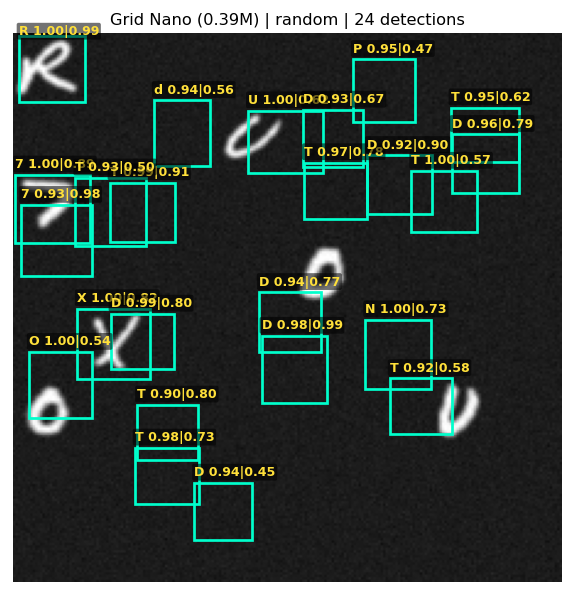 | 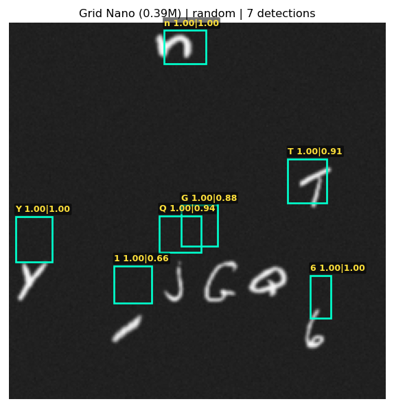 | 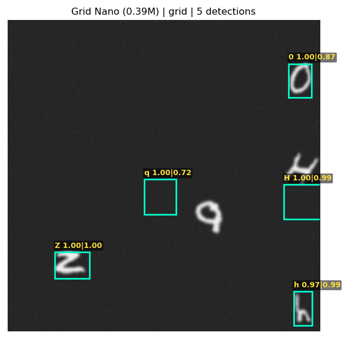 | 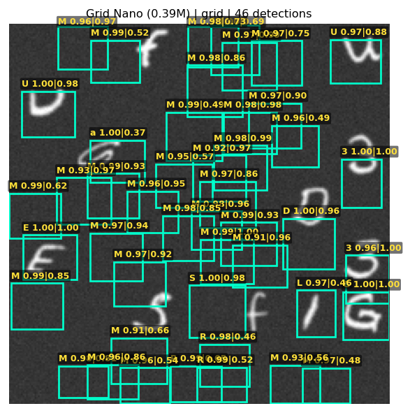 |
| **words** | **words** | **line** | **line** |
| 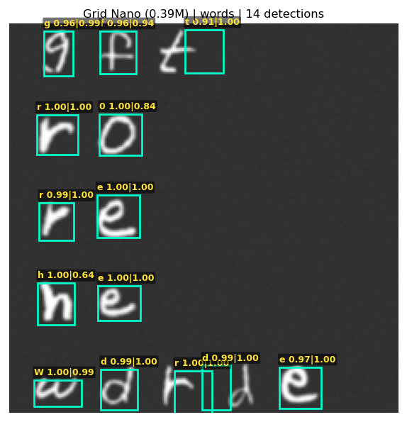 | 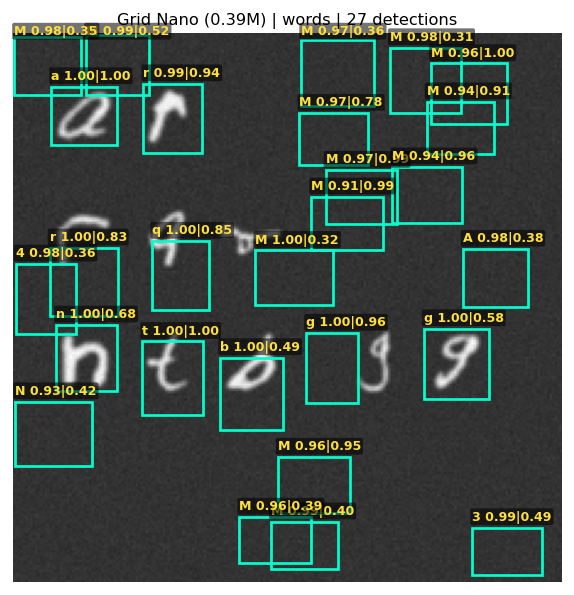 | 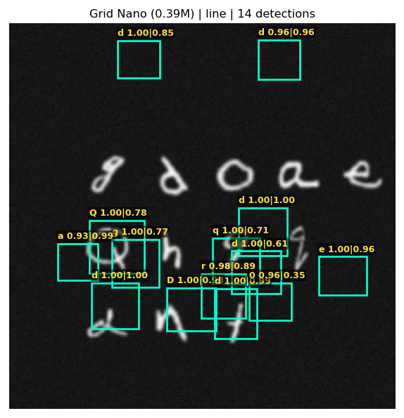 | 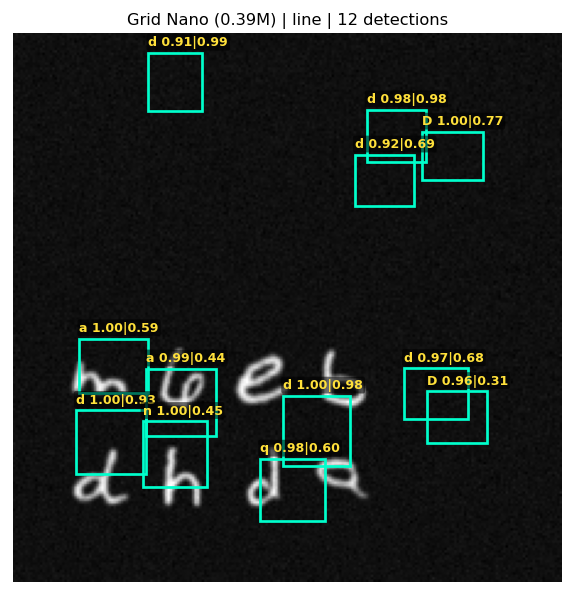 |

### ⚡ Small (1.55M) — `conf = 0.90`

| random | random | grid | grid |
|:---:|:---:|:---:|:---:|
| 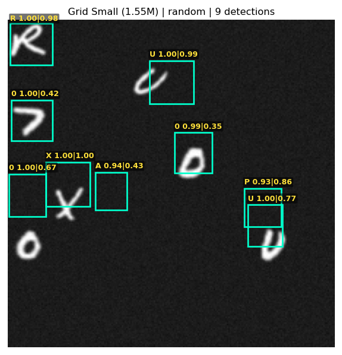 | 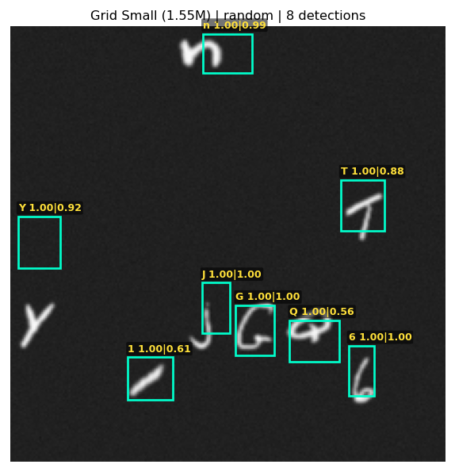 | 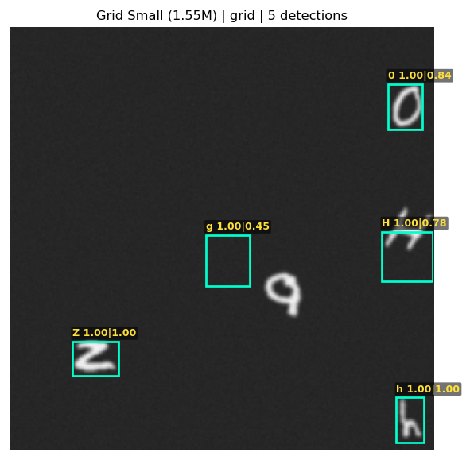 | 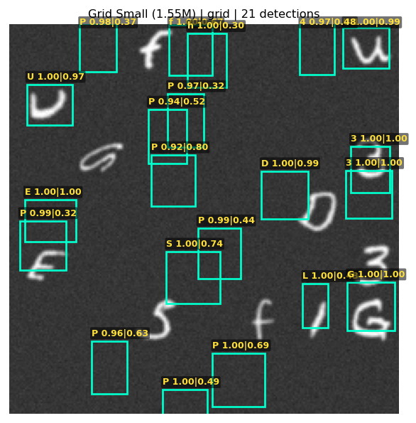 |
| **words** | **words** | **line** | **line** |
| 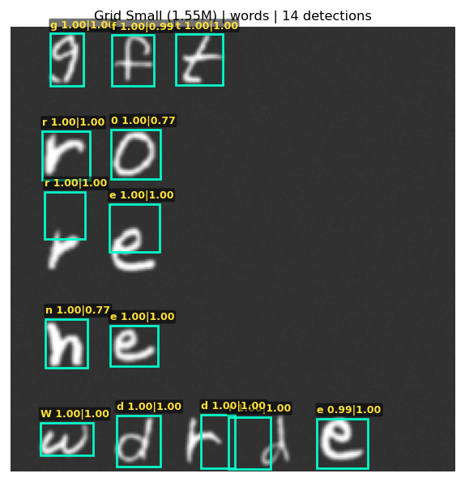 | 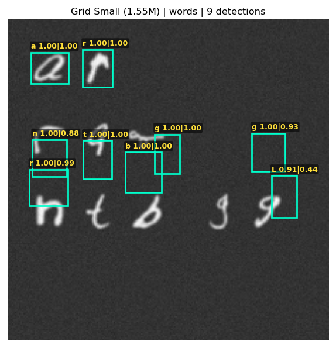 | 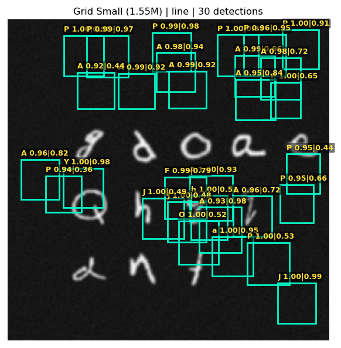 | 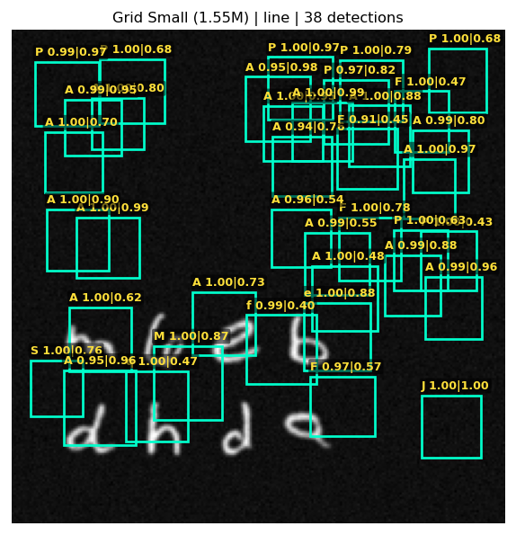 |

### 🎯 Medium (6.18M) — `conf = 0.90`

| random | random | grid | grid |
|:---:|:---:|:---:|:---:|
| 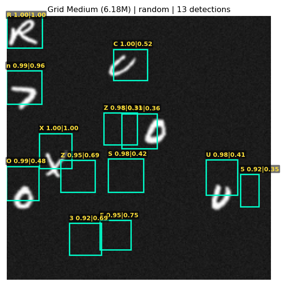 | 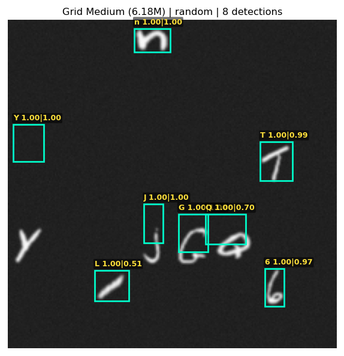 | 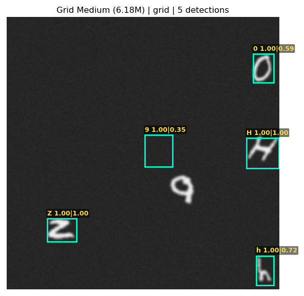 | 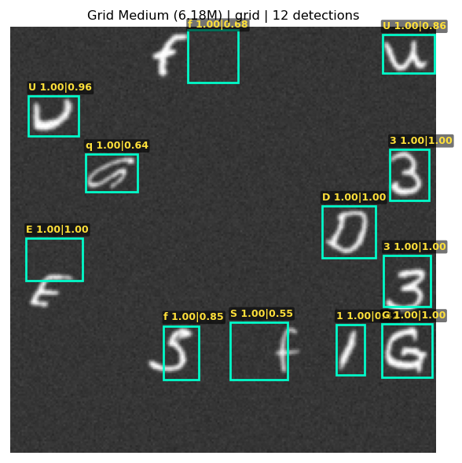 |
| **words** | **words** | **line** | **line** |
| 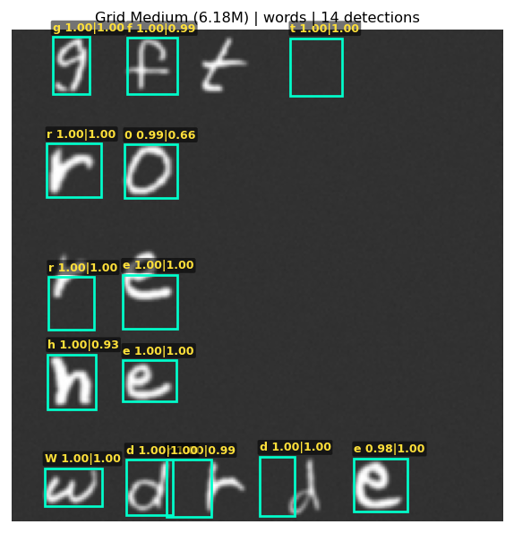 | 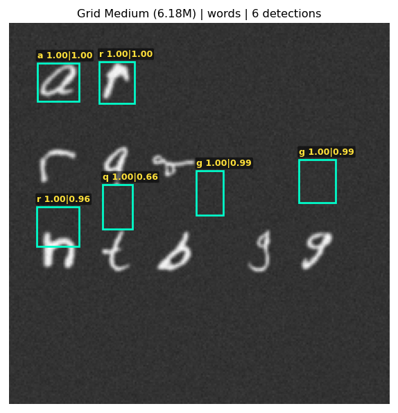 | 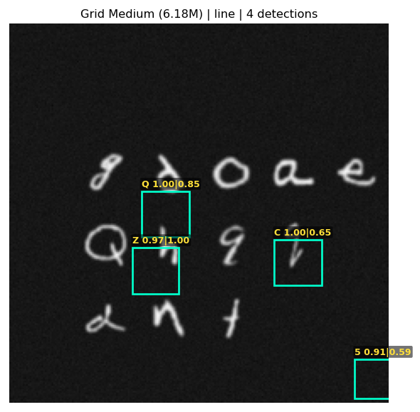 | 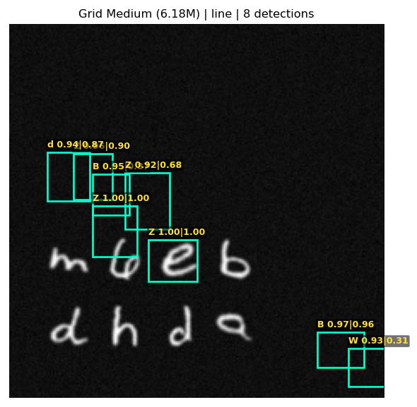 |
