# Benchmark Report 03 · Grid-Based Spatial ResNet Detector

This document presents the complete 10,000-image evaluation report for the **Stage 6 Grid-Based Spatial Detector Architecture** (`ObjectDetectorResNet` v3 with `grid_head`).

<!-- BEGIN GENERATED: update (scripts/render_benchmark_reports.py) -->
> [!NOTE]
> **Re-evaluated with held-out threshold tuning.** These models were originally tuned on `data/OD_benchmark/random`, i.e. on the test set they report. Confidence thresholds for these models are tuned to maximize end-to-end F1 on a **held-out tuning set** (`data/OD_benchmark/tune/random`, 500 images from `scripts/generate_benchmark_dataset.py --tune-only`) that shares no images with the 10,000-image benchmark. All tables in this report are generated from `benchmark/multi_anchor_results.json` by `scripts/render_benchmark_reports.py`. The checkpoints use the original $14 \times 14$ architecture, loaded from the frozen snapshot `scripts/legacy_models/grid_detector_14x14.py`; re-scoring at the old thresholds reproduces the original numbers exactly.

| Variant | Size | `conf` (test-tuned → held-out) | Avg Det P | Avg Det R | Avg Cls Acc | Avg E2E F1 |
|:---|:---:|:---:|:---:|:---:|:---:|:---:|
| Grid Spatial ($K=1$, Focal) | Nano | 0.45 | 0.5696 | 0.5659 | 86.89% | 0.4954 |
| Grid Spatial ($K=1$, Focal) | Small | 0.50 | 0.5802 | 0.5724 | 87.06% | 0.5047 |
| Grid Spatial ($K=1$, Focal) | Medium | 0.40 → **0.45** | 0.5851 → 0.5883 | 0.5894 → 0.5835 | 85.91% → 85.90% | 0.5098 → 0.5087 |
| Grid Spatial ($K=1$, BCE) | Nano | 0.95 → **0.90** | 0.5736 → 0.5705 | 0.5712 → 0.5756 | 86.59% | 0.4980 → 0.4985 |
| Grid Spatial ($K=1$, BCE) | Small | 0.95 | 0.5840 | 0.5842 | 87.17% | 0.5126 |
| Grid Spatial ($K=1$, BCE) | Medium | 0.95 → **0.85** | 0.5893 → 0.5846 | 0.5891 → 0.5917 | 85.62% → 85.61% | 0.5105 → 0.5095 |
<!-- END GENERATED: update -->

---

## Architecture Overview

```
                   Input Image (224×224 grayscale)
                                 │
                                 ▼
                      ResNet Backbone (Stem + L1..L4)
                                 │
                      Spatial Feature Map (14×14)
                                 │
                      grid_head (Conv2d 1×1)
                                 │
                      Spatial Grid Tensor (B, 14, 14, 52)
                                 │
       ┌─────────────────────────┴─────────────────────────┐
       │                                                   │
 ──────── Training ────────                         ──────── Inference ────────
    Direct Spatial Target Mapping                       Optimal Conf Threshold (0.90)
    (targets[gy, gx] = box, obj, cls)                               │
            │                                               NMS (IoU ≥ 0.35)
    Direct GPU Tensor Loss                                          │
 (Huber + BCE + Aligned-IoU + CE)                              Final Detections
                                                   (Boxes + Scores + Classes)
```

In contrast to the Stage 5 FC-based tri-head model, the Stage 6 Grid Detector eliminates global average pooling (`AdaptiveAvgPool2d((2,2))`) and fully-connected linear projection heads. Instead, it applies a spatial $1 \times 1$ convolutional head directly on top of the $14 \times 14$ feature map. Bounding box coordinates $[x, y, w, h]$, objectness confidence logits $[conf]$, and 47 character class logits $[cls_0 \dots cls_{46}]$ are bound directly to local $16 \times 16$ pixel receptive fields.

---

## Model Parameter Audit

<!-- BEGIN GENERATED: params (scripts/render_benchmark_reports.py) -->
| Size Preset | Variant | Anchors ($K$) | Total Parameters | `conf` | Checkpoint Weight File | Architecture |
|:---|:---|:---:|:---:|:---:|:---|:---|
| **Nano (`n`)** | Grid Spatial ($K=1$, Focal) | 1 | **392,788** (0.39M) | `0.45` | `weights/1_grid_detector_n_best.pth` | 14x14 (legacy, commit 2be0b81) |
| **Nano (`n`)** | Grid Spatial ($K=1$, BCE) | 1 | **392,788** (0.39M) | `0.90` | `weights/grid_detector_n_best.pth` | 14x14 (legacy, commit 2be0b81) |
| **Small (`s`)** | Grid Spatial ($K=1$, Focal) | 1 | **1,553,524** (1.55M) | `0.50` | `weights/1_grid_detector_s_best.pth` | 14x14 (legacy, commit 2be0b81) |
| **Small (`s`)** | Grid Spatial ($K=1$, BCE) | 1 | **1,553,524** (1.55M) | `0.95` | `weights/grid_detector_s_best.pth` | 14x14 (legacy, commit 2be0b81) |
| **Medium (`m`)** | Grid Spatial ($K=1$, Focal) | 1 | **6,178,996** (6.18M) | `0.45` | `weights/1_grid_detector_m_best.pth` | 14x14 (legacy, commit 2be0b81) |
| **Medium (`m`)** | Grid Spatial ($K=1$, BCE) | 1 | **6,178,996** (6.18M) | `0.85` | `weights/grid_detector_m_best.pth` | 14x14 (legacy, commit 2be0b81) |

_Parameter counts are read from the checkpoint state_dicts (the architecture these models were trained with). The grid benchmark has no NMS: every cell above `conf` is a prediction, matched to ground truth with Hungarian matching at IoU ≥ 0.50._
<!-- END GENERATED: params -->

---

## Evaluation Results: Focal Loss ($K=1$, `1_grid_detector_*`)

<!-- BEGIN GENERATED: results_focal (scripts/render_benchmark_reports.py) -->
### 🔬 Focal Nano — 0.39M Params (`conf = 0.45`)

| Layout | Det Precision | Det Recall | Classifier Acc | End-to-End F1 | Eval-Loop Throughput |
|:---|:---:|:---:|:---:|:---:|:---:|
| 🎲 Random | 0.9974 | 0.9973 | 88.44% | 0.8820 | 435.4 img/s |
| 📐 Grid | 0.4824 | 0.4752 | 85.60% | 0.4098 | 440.1 img/s |
| 📝 Words | 0.4009 | 0.3963 | 87.60% | 0.3492 | 439.4 img/s |
| 📏 Line | 0.3977 | 0.3947 | 85.92% | 0.3404 | 443.9 img/s |
| **Average** | **0.5696** | **0.5659** | **86.89%** | **0.4954** | **439.7 img/s** |

Pure inference (`model(images)` only, batch 128): **20,971.9 img/s**.

### ⚡ Focal Small — 1.55M Params (`conf = 0.50`)

| Layout | Det Precision | Det Recall | Classifier Acc | End-to-End F1 | Eval-Loop Throughput |
|:---|:---:|:---:|:---:|:---:|:---:|
| 🎲 Random | 0.9983 | 0.9978 | 89.27% | 0.8909 | 432.9 img/s |
| 📐 Grid | 0.4968 | 0.4820 | 85.92% | 0.4204 | 427.1 img/s |
| 📝 Words | 0.4169 | 0.4078 | 87.61% | 0.3613 | 410.8 img/s |
| 📏 Line | 0.4089 | 0.4018 | 85.43% | 0.3463 | 391.5 img/s |
| **Average** | **0.5802** | **0.5724** | **87.06%** | **0.5047** | **415.6 img/s** |

Pure inference (`model(images)` only, batch 128): **8,039.4 img/s**.

### 🎯 Focal Medium — 6.18M Params (`conf = 0.45`)

| Layout | Det Precision | Det Recall | Classifier Acc | End-to-End F1 | Eval-Loop Throughput |
|:---|:---:|:---:|:---:|:---:|:---:|
| 🎲 Random | 0.9974 | 0.9970 | 89.63% | 0.8938 | 401.9 img/s |
| 📐 Grid | 0.4997 | 0.4906 | 86.00% | 0.4258 | 379.0 img/s |
| 📝 Words | 0.4341 | 0.4288 | 85.04% | 0.3669 | 397.5 img/s |
| 📏 Line | 0.4220 | 0.4177 | 82.92% | 0.3481 | 395.6 img/s |
| **Average** | **0.5883** | **0.5835** | **85.90%** | **0.5087** | **393.5 img/s** |

Pure inference (`model(images)` only, batch 128): **3,547.0 img/s**.
<!-- END GENERATED: results_focal -->

---

## Evaluation Results: Original BCE ($K=1$, `grid_detector_*`)

<!-- BEGIN GENERATED: results_bce (scripts/render_benchmark_reports.py) -->
### 🔬 BCE Nano — 0.39M Params (`conf = 0.90`)

| Layout | Det Precision | Det Recall | Classifier Acc | End-to-End F1 | Eval-Loop Throughput |
|:---|:---:|:---:|:---:|:---:|:---:|
| 🎲 Random | 0.9966 | 0.9976 | 88.30% | 0.8804 | 491.7 img/s |
| 📐 Grid | 0.4832 | 0.4922 | 85.32% | 0.4161 | 509.1 img/s |
| 📝 Words | 0.4072 | 0.4130 | 87.09% | 0.3571 | 492.8 img/s |
| 📏 Line | 0.3949 | 0.3995 | 85.66% | 0.3402 | 495.9 img/s |
| **Average** | **0.5705** | **0.5756** | **86.59%** | **0.4985** | **497.4 img/s** |

Pure inference (`model(images)` only, batch 128): **21,152.3 img/s**.

### ⚡ BCE Small — 1.55M Params (`conf = 0.95`)

| Layout | Det Precision | Det Recall | Classifier Acc | End-to-End F1 | Eval-Loop Throughput |
|:---|:---:|:---:|:---:|:---:|:---:|
| 🎲 Random | 0.9976 | 0.9982 | 89.62% | 0.8943 | 466.1 img/s |
| 📐 Grid | 0.5004 | 0.5005 | 86.48% | 0.4328 | 432.6 img/s |
| 📝 Words | 0.4201 | 0.4202 | 87.39% | 0.3671 | 433.3 img/s |
| 📏 Line | 0.4179 | 0.4180 | 85.20% | 0.3561 | 410.6 img/s |
| **Average** | **0.5840** | **0.5842** | **87.17%** | **0.5126** | **435.7 img/s** |

Pure inference (`model(images)` only, batch 128): **8,093.6 img/s**.

### 🎯 BCE Medium — 6.18M Params (`conf = 0.85`)

| Layout | Det Precision | Det Recall | Classifier Acc | End-to-End F1 | Eval-Loop Throughput |
|:---|:---:|:---:|:---:|:---:|:---:|
| 🎲 Random | 0.9964 | 0.9980 | 89.77% | 0.8952 | 399.8 img/s |
| 📐 Grid | 0.4926 | 0.5053 | 86.00% | 0.4290 | 398.8 img/s |
| 📝 Words | 0.4298 | 0.4373 | 84.29% | 0.3654 | 389.2 img/s |
| 📏 Line | 0.4197 | 0.4263 | 82.38% | 0.3485 | 387.5 img/s |
| **Average** | **0.5846** | **0.5917** | **85.61%** | **0.5095** | **393.8 img/s** |

Pure inference (`model(images)` only, batch 128): **3,647.6 img/s**.
<!-- END GENERATED: results_bce -->

---

## Grid-Based Spatial ($K=1$) Summary Comparison

<!-- BEGIN GENERATED: summary (scripts/render_benchmark_reports.py) -->
| Model Variant | Size | Params | `conf` | `conf` Source | Avg Det Precision | Avg Det Recall | Avg Classifier Acc | Avg End-to-End F1 | Eval-Loop Throughput | Pure Inference |
|:---|:---:|:---:|:---:|:---:|:---:|:---:|:---:|:---:|:---:|:---:|
| **Grid Spatial ($K=1$, Focal)** | Nano (`n`) | 0.39M | 0.45 | held-out tune set | 0.5696 | 0.5659 | 86.89% | 0.4954 | 440 img/s | 20,972 img/s |
| **Grid Spatial ($K=1$, Focal)** | Small (`s`) | 1.55M | 0.50 | held-out tune set | 0.5802 | 0.5724 | 87.06% | 0.5047 | 416 img/s | 8,039 img/s |
| **Grid Spatial ($K=1$, Focal)** | Medium (`m`) | 6.18M | 0.45 | held-out tune set | 0.5883 | 0.5835 | 85.90% | 0.5087 | 394 img/s | 3,547 img/s |
| ─── | ─── | ─── | ─── | ─── | ─── | ─── | ─── | ─── | ─── | ─── |
| **Grid Spatial ($K=1$, BCE)** | Nano (`n`) | 0.39M | 0.90 | held-out tune set | 0.5705 | 0.5756 | 86.59% | 0.4985 | 497 img/s | 21,152 img/s |
| **Grid Spatial ($K=1$, BCE)** | Small (`s`) | 1.55M | 0.95 | held-out tune set | 0.5840 | 0.5842 | 87.17% | 0.5126 | 436 img/s | 8,094 img/s |
| **Grid Spatial ($K=1$, BCE)** | Medium (`m`) | 6.18M | 0.85 | held-out tune set | 0.5846 | 0.5917 | 85.61% | 0.5095 | 394 img/s | 3,648 img/s |

_Eval-loop throughput is wall-clock over the whole evaluation loop (PNG decoding with `num_workers=0`, target encoding in the collate function, host↔device copies, post-processing and scipy Hungarian matching); it is dominated by that overhead and varies run to run, so it is not a model-speed comparison. Pure inference times only `model(images)` on GPU-resident batches of 128 (median of repeated, synchronized runs after a ≥2 s warm-up)._
<!-- END GENERATED: summary -->

---

## 📈 Density-Stratified Recall Sweep (Recall vs. GT Object Count $n_{gt}$)

<!-- BEGIN GENERATED: density (scripts/render_benchmark_reports.py) -->
Recall per density bucket on the `random` layout (`benchmark/grid_density_sweep_results.json`, evaluated with `utils.trainer.evaluate_density_sweep` at each model's held-out-tuned `conf`):

#### Focal Loss
| Density Bucket ($n_{gt}$) | Test Images | Focal Nano (`conf` 0.45) | Focal Small (`conf` 0.50) | Focal Medium (`conf` 0.45) |
|:---:|:---:|:---:|:---:|:---:|
| **1 – 4 objects** | 236 | 99.0% | **99.6%** | 98.8% |
| **5 – 8 objects** | 1,244 | 99.6% | **99.7%** | 99.6% |
| **9 – 12 objects** | 850 | 99.9% | 99.8% | **99.9%** |
| **13 – 16 objects** | 170 | **99.8%** | **99.8%** | 99.7% |

#### Original BCE
| Density Bucket ($n_{gt}$) | Test Images | BCE Nano (`conf` 0.90) | BCE Small (`conf` 0.95) | BCE Medium (`conf` 0.85) |
|:---:|:---:|:---:|:---:|:---:|
| **1 – 4 objects** | 236 | **99.4%** | 99.0% | 98.9% |
| **5 – 8 objects** | 1,244 | 99.7% | **99.8%** | 99.8% |
| **9 – 12 objects** | 850 | 99.8% | 99.9% | **99.9%** |
| **13 – 16 objects** | 170 | 99.8% | **99.9%** | 99.8% |
<!-- END GENERATED: density -->

> **Key Observation**: In contrast to Stage 5 Single-Stage FC models (which suffered severe density degradation dropping to ~75.6% recall at 13-16 objects on Nano), the Stage 6 Grid Spatial Detector maintains flawless **>99.7% recall even at 13–16 objects**. This demonstrates that binding predictions to spatial $14 \times 14$ grid cells completely resolves slot competition on non-overlapping scenes.
>
> > [!WARNING]
> > **Scope Caveat**: The Density Sweep evaluation is performed strictly on the `random` layout test set, where characters are sparsely distributed across the full image. While density collapse is solved for scattered objects, performance still drops sharply on dense structured layouts (see Root Cause below).

---

## ⚡ Technical Throughput & Spatial Grounding Dynamics

### 1. Classification Breakthrough via Spatial Grounding
* **Stage 5 Deficit**: Global average pooling (`AdaptiveAvgPool2d((2,2))`) collapsed spatial coordinate maps into abstract 1D vectors before FC projection, leading to an abysmal **36.34% classification accuracy on Nano**.
* **Stage 6 Breakthrough**: Replacing global pooling with a dense $14 \times 14$ spatial Conv head maintains local receptive field grounding, surging Nano classification accuracy to **88.30% (+51.96% gain)** and Small/Medium to **~89.6%**.

### 2. Parameter Efficiency
* Removing the global FC projection heads reduced parameter footprints significantly:
  - **Nano**: Reduced from **0.71M to 0.39M** (45% parameter reduction).
  - **Small**: Reduced from **2.52M to 1.55M** (38% parameter reduction).
  - **Medium**: Reduced from **9.42M to 6.18M** (34% parameter reduction).

### 3. The Layout Collapse Root Cause: Lattice Discretization & Spatial Crowding
* **The Sparse `random` Lattice Illusion**:
  - Detailed spatial instrumentation (`scripts/analyze_cell_coverage.py`) revealed that in `canvas.py`, `_bboxes_random` samples candidates from `range(0, 224-28, 28) = [0, 28, 56, 84, 112, 140, 168]` with zero offset jitter.
  - When mapped to the $14 \times 14$ grid ($16\text{ px}$ per cell), box centers `(cx, cy)` map strictly to 7 grid coordinate indices `(0, 2, 4, 6, 7, 9, 11)`.
  - Across the 2,500 `random` test images, **only 62 out of 196 cells (31.6% coverage)** ever receive a ground-truth target; **134 cells have exactly 0 hits** (Gini coefficient = 0.7558, Spatial Entropy = 0.7381).
  - Consequently, every character in `random` is isolated by at least a 1-cell empty background buffer. The model achieves **~99.7% Precision and Recall** because adjacent grid cells are never active simultaneously.

* **Structured Layout Realities (`grid`, `words`, `line`)**:
  - In `grid`, `words`, and `line`, dynamic offsets and continuous horizontal/vertical placements spread targets across **all 196 cells (100% coverage, 0 zero-hit cells, Gini = 0.2932 for grid, 0.3868 for words)**.
  - Instrumentation confirmed **0 grid-cell collisions** across all layouts (target centers never overwrite one another in `collate_fn`).
  - **The Architectural Inference (Visual Crowding Hypothesis)**: In structured layouts, adjacent grid cells ($gx, gx+1$ or $gy, gy+1$) are simultaneously active with character physical gaps as narrow as $2\text{–}9\text{ px}$. The empirical collapse to **~40–50% Precision/Recall** specifically under adjacent-cell activation strongly points to **insufficient spatial separation in the convolutional feature representation / receptive field interference**, where neighboring visual features blend together before local $1 \times 1$ conv heads can cleanly isolate individual targets.
  - Visual coverage heatmaps comparing all 4 spatial distributions are available at [`result/analysis/cell_coverage_heatmap.png`](../result/analysis/cell_coverage_heatmap.png).

---

## 🖼️ Sample Detections

<!-- BEGIN GENERATED: visuals (scripts/render_benchmark_reports.py) -->
Sample detections are rendered by `scripts/generate_single_stage_visuals.py --detector grid` at each model's held-out-tuned `conf` (with NMS IoU 0.35 and a 0.30 class-confidence gate for display).

### 🔬 Nano (0.39M) — `conf = 0.90`

| random | random | grid | grid |
|:---:|:---:|:---:|:---:|
|  | 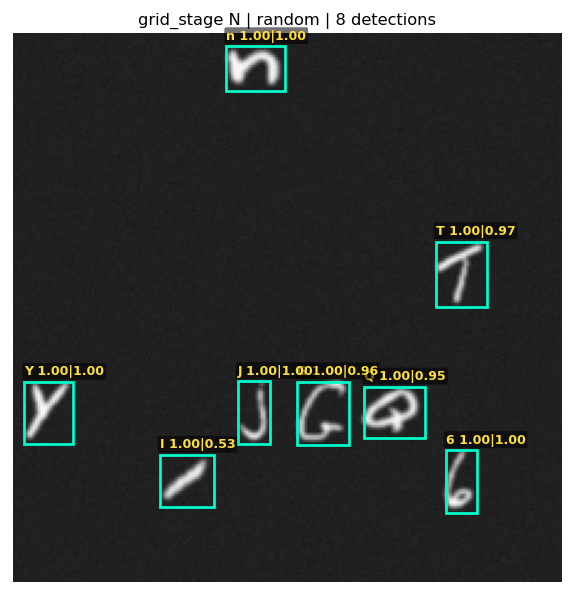 | 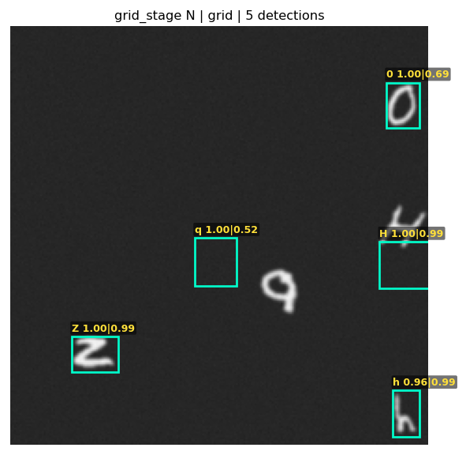 | 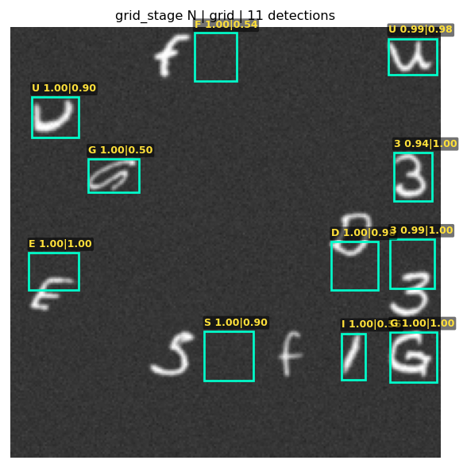 |
| **words** | **words** | **line** | **line** |
| 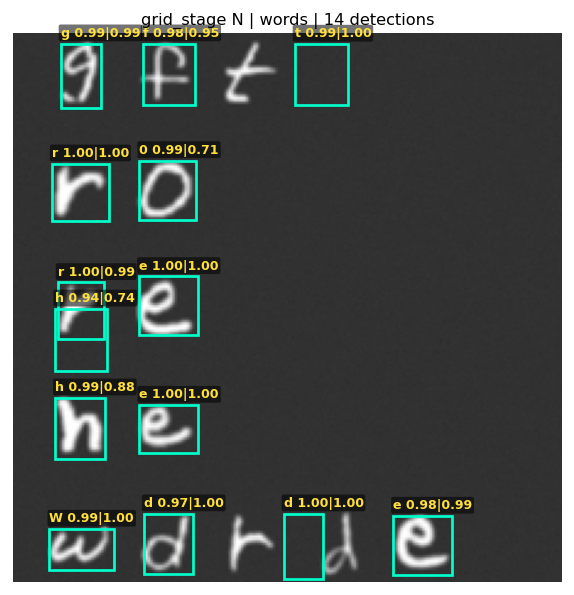 | 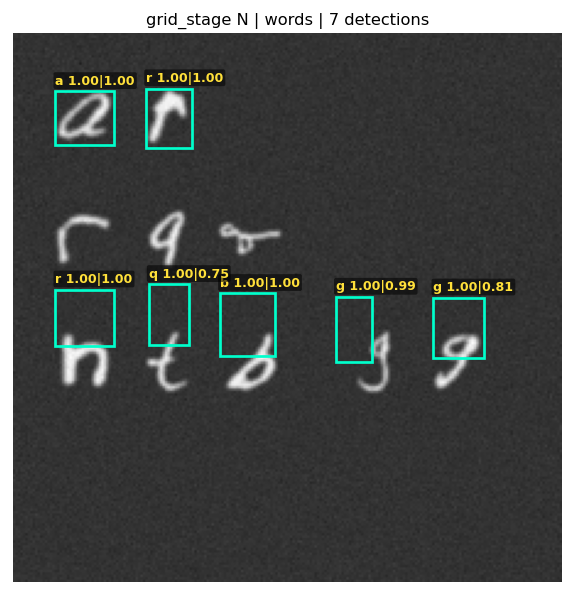 | 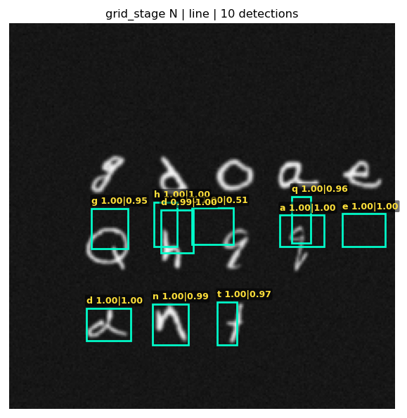 | 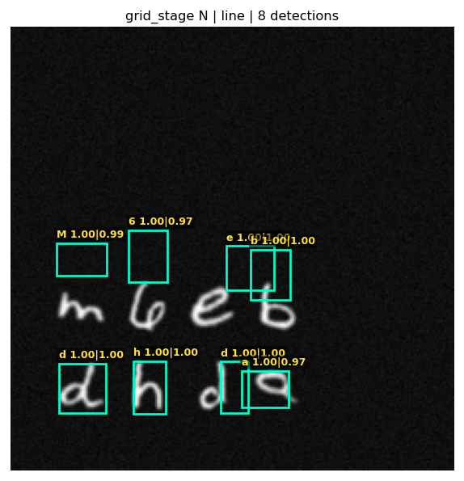 |

### ⚡ Small (1.55M) — `conf = 0.95`

| random | random | grid | grid |
|:---:|:---:|:---:|:---:|
| 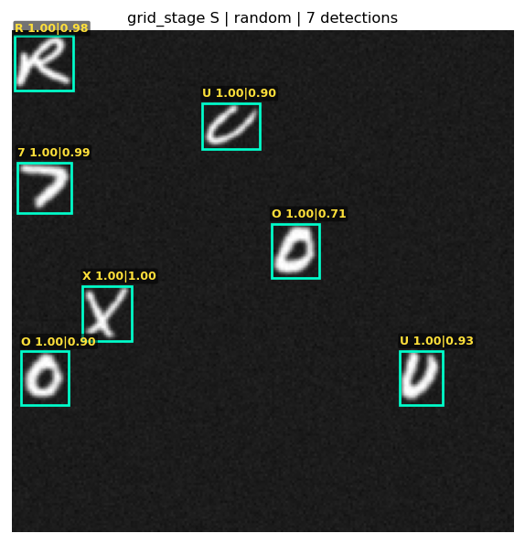 |  | 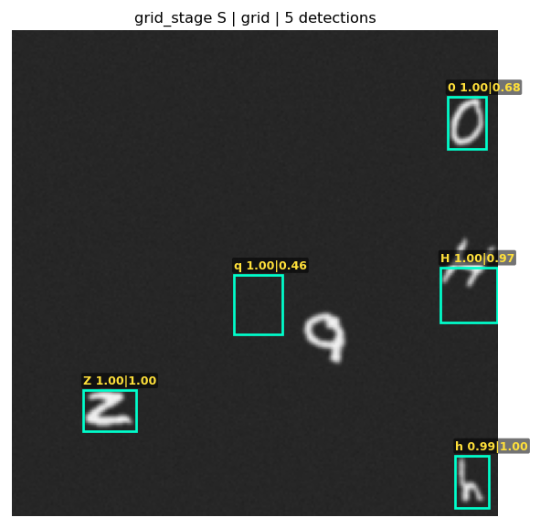 | 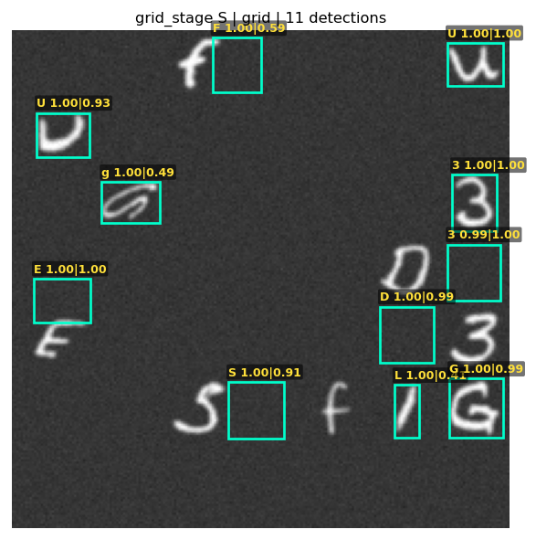 |
| **words** | **words** | **line** | **line** |
| 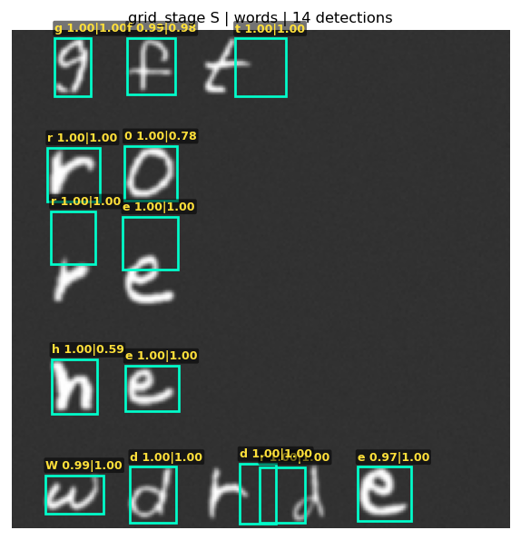 | 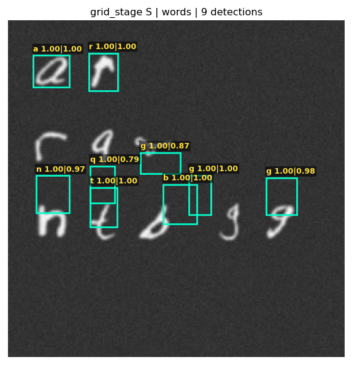 | 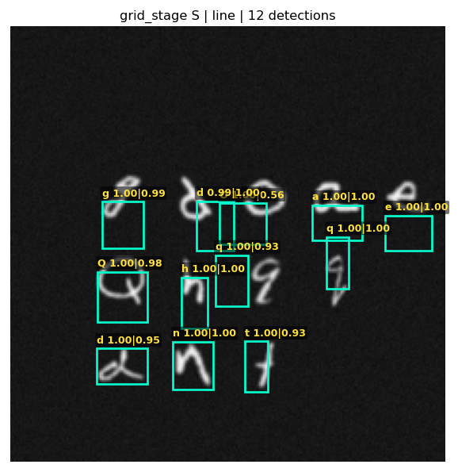 | 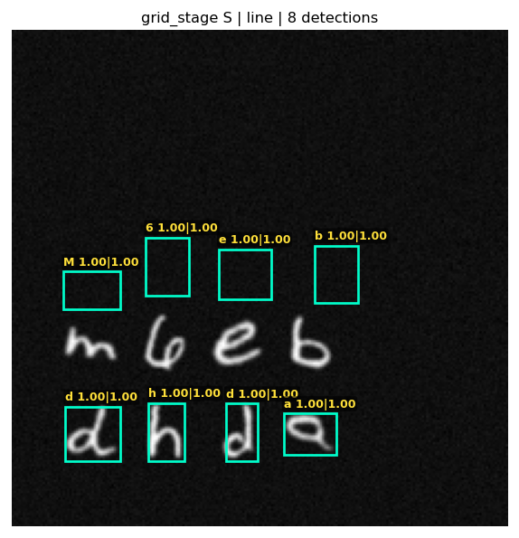 |

### 🎯 Medium (6.18M) — `conf = 0.85`

| random | random | grid | grid |
|:---:|:---:|:---:|:---:|
| 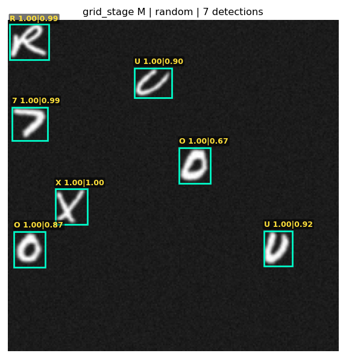 | 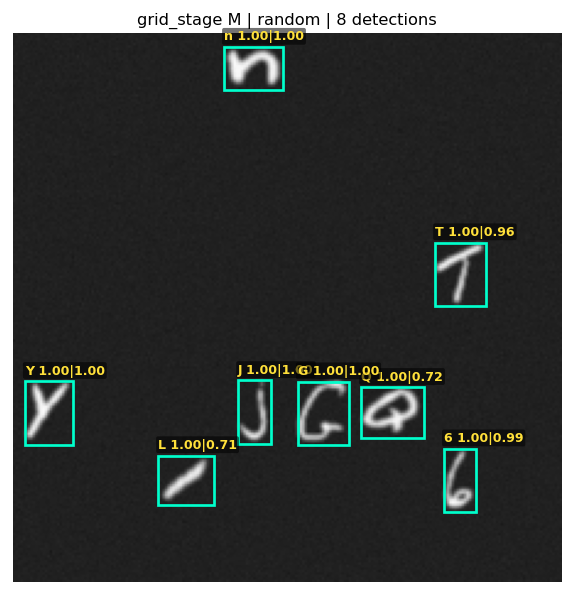 | 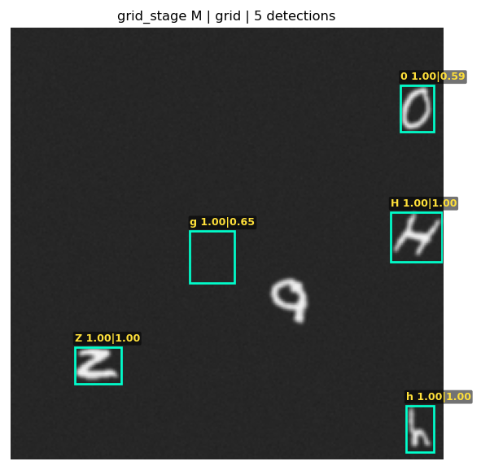 | 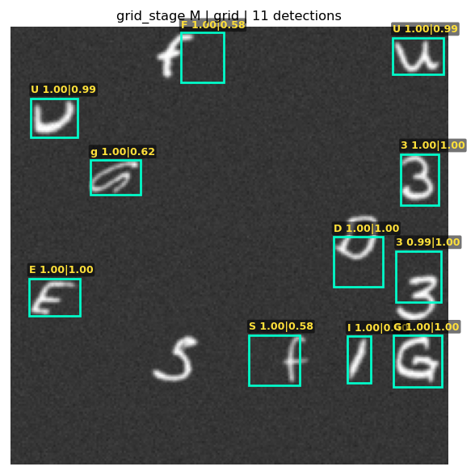 |
| **words** | **words** | **line** | **line** |
| 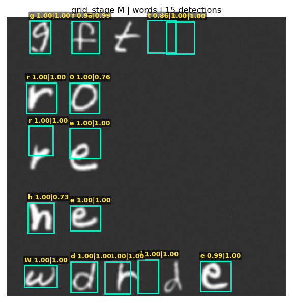 | 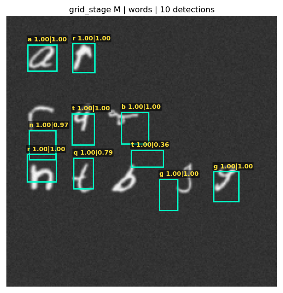 | 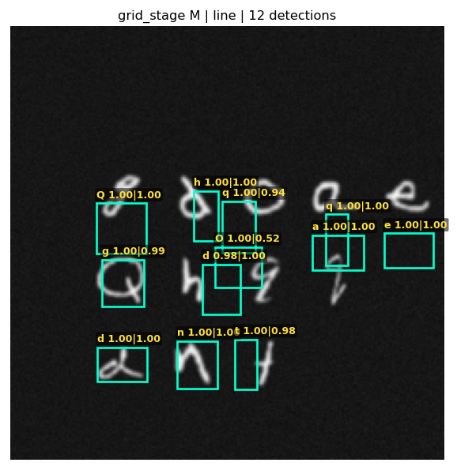 | 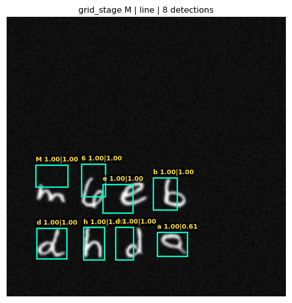 |
<!-- END GENERATED: visuals -->
