# Benchmark Report 04 · Multi-Anchor (K=3) Spatial ResNet Detector

> [!IMPORTANT]
> **Architecture Status — Multi-Anchor Exploration Concluded**:
> Multi-anchor ($K=3$) was explored to resolve potential spatial collisions when multiple characters occupy the same $16 \times 16$ receptive field cell. However, empirical benchmarking shows that $K=3$ adds candidate competition and causes either precision collapse (under BCE pos-weight) or severe recall drop (under Focal Loss). The single-stage $K=1$ spatial grid remains the canonical baseline. Nano ($K=3$) is retained below as a reference point.

---

## Architecture Overview

```
                   Input Image (224×224 grayscale)
                                 │
                                 ▼
                      ResNet Backbone (Stem + L1..L4)
                                 │
                      Spatial Feature Map (14×14)
                                 │
                      grid_head (Conv2d 1×1)
                                 │
                 Spatial Grid Tensor (B, 14, 14, 3, 52)
                                 │
       ┌─────────────────────────┴─────────────────────────┐
       │                                                   │
 ──────── Training ────────                         ──────── Inference ────────
   k-means IoU Fitted Anchors                       Auto-Tuned Conf Threshold (0.50)
   Multi-Anchor Matching per Cell                                   │
            │                                               NMS (IoU ≥ 0.35)
   Direct GPU Tensor Loss                                          │
(Huber + BCE + Aligned-IoU + CE)                              Final Detections
                                                   (Boxes + Scores + Classes)
```

In contrast to the $K=1$ single-anchor spatial grid model, the $K=3$ Multi-Anchor Spatial Detector predicts 3 bounding box slots per $16 \times 16$ receptive field cell, expanding the output head to `(B, 14, 14, 3, 52)`. Anchors are automatically pre-computed from the training dataset using IoU-based k-means clustering.

---

## Model Parameter Audit

| Size Preset | Model Name | Anchors ($K$) | Total Parameters | Optimal `conf` | Checkpoint Weight File | Output Tensor Shape |
|:---|:---|:---:|:---:|:---:|:---|:---:|
| **Nano (`n`)** | `ObjectDetectorResNet` (v3 Nano) | 3 | **392,788** (0.39M) | `0.40` | `weights/3_grid_detector_n_best.pth` | `(B, 14, 14, 3, 52)` |
| **Small (`s`)** | `ObjectDetectorResNet` (v3 Small) | 3 | **1,555,628** (1.55M) | `0.95` | `weights/3_grid_detector_s_best.pth` | `(B, 14, 14, 3, 52)` |
| **Medium (`m`)** | `ObjectDetectorResNet` (v3 Medium) | 3 | **6,189,900** (6.18M) | `0.95` | `weights/3_grid_detector_m_best.pth` | `(B, 14, 14, 3, 52)` |

---

## Evaluation Results (10,000 Test Images across 4 Layouts)

### 🔬 Multi-Anchor Nano — 0.39M Params (`conf = 0.40`)

| Layout | Det Precision | Det Recall | Classifier Acc | End-to-End F1 | Throughput |
|:---|:---:|:---:|:---:|:---:|:---:|
| 🎲 Random | 0.8792 | 0.9433 | 88.16% | 0.8024 | 410.3 img/s |
| 📐 Grid   | 0.4214 | 0.4367 | 84.21% | 0.3612 | 413.7 img/s |
| 📝 Words  | 0.3554 | 0.3600 | 87.57% | 0.3132 | 410.5 img/s |
| 📏 Line   | 0.3476 | 0.3571 | 85.43% | 0.3010 | 413.8 img/s |
| **Average** | **0.5009** | **0.5243** | **86.34%** | **0.4445** | **412.1 img/s** |

### ⚡ Multi-Anchor Small — 1.55M Params (`conf = 0.95`)

| Layout | Det Precision | Det Recall | Classifier Acc | End-to-End F1 | Throughput |
|:---|:---:|:---:|:---:|:---:|:---:|
| 🎲 Random | 0.8954 | **0.9985** | 89.33% | 0.8434 | 396.2 img/s |
| 📐 Grid   | 0.4354 | 0.5034 | 85.63% | 0.3998 | 399.9 img/s |
| 📝 Words  | 0.3756 | 0.4267 | 86.69% | 0.3463 | 389.4 img/s |
| 📏 Line   | 0.3704 | 0.4192 | 84.08% | 0.3307 | 395.4 img/s |
| **Average** | **0.5192** | **0.5870** | **86.43%** | **0.4801** | **395.2 img/s** |

### 🎯 Multi-Anchor Medium — 6.18M Params (`conf = 0.95`)

| Layout | Det Precision | Det Recall | Classifier Acc | End-to-End F1 | Throughput |
|:---|:---:|:---:|:---:|:---:|:---:|
| 🎲 Random | 0.9038 | **0.9971** | **89.84%** | 0.8518 | 370.3 img/s |
| 📐 Grid   | 0.4496 | **0.5113** | 86.35% | 0.4132 | 379.0 img/s |
| 📝 Words  | 0.3897 | **0.4387** | 84.54% | 0.3490 | 379.2 img/s |
| 📏 Line   | 0.3887 | **0.4370** | 81.98% | 0.3373 | 374.8 img/s |
| **Average** | **0.5330** | **0.5960** | **85.68%** | **0.4878** | **375.8 img/s** |

---

## Architectural Comparison: Grid ($K=1$) vs. Multi-Anchor ($K=3$)

| Model Variant | Anchors ($K$) | Total Params | Optimal `conf` | Avg Det Precision | Avg Det Recall | Avg Classifier Acc | Avg End-to-End F1 | Avg Throughput (FPS) |
|:---|:---:|:---:|:---:|:---:|:---:|:---:|:---:|:---:|
| **Grid ($K=1$) BCE Nano** | 1 | 0.39M | `0.95` | **0.5736** | 0.5712 | 86.59% | **0.4980** | **413.1 img/s** |
| **Multi-Anchor ($K=3$) Nano** | 3 | 0.39M | `0.40` | 0.5009 | 0.5243 | 86.34% | 0.4445 | 412.1 img/s |
| ─── | ─── | ─── | ─── | ─── | ─── | ─── | ─── | ─── |
| **Grid ($K=1$) BCE Small** | 1 | 1.55M | `0.95` | **0.5840** | 0.5842 | **87.17%** | **0.5126** | **400.6 img/s** |
| **Multi-Anchor ($K=3$) Small** | 3 | 1.55M | `0.95` | 0.5192 | 0.5870 | 86.43% | 0.4801 | 395.2 img/s |
| ─── | ─── | ─── | ─── | ─── | ─── | ─── | ─── | ─── |
| **Grid ($K=1$) BCE Medium** | 1 | 6.18M | `0.95` | **0.5893** | 0.5891 | 85.63% | **0.5105** | **379.8 img/s** |
| **Multi-Anchor ($K=3$) Medium** | 3 | 6.18M | `0.95` | 0.5330 | **0.5960** | 85.68% | 0.4878 | 375.8 img/s |

---

## 📈 Comprehensive Density-Stratified Recall Sweep ($K=1$ vs. $K=3$)

Evaluates detection recall performance across object density buckets across all 4 placement layouts (`random`, `grid`, `words`, `line`) for the **Medium (6.18M)** model (`conf = 0.95`, `iou = 0.50`):

### 🎲 Random Layout
| Density Bucket ($n_{gt}$) | Test Images | Grid Medium ($K=1$) Recall | Multi-Anchor Medium ($K=3$) Recall |
|:---:|:---:|:---:|:---:|
| **1 – 4 objects** | 236 | 98.89% | **99.14%** |
| **5 – 8 objects** | 1,244 | **99.76%** | 99.53% |
| **9 – 12 objects** | 850 | **99.90%** | 99.86% |
| **13 – 16 objects** | 170 | 99.83% | **99.87%** |

### 📐 Grid Layout
| Density Bucket ($n_{gt}$) | Test Images | Grid Medium ($K=1$) Recall | Multi-Anchor Medium ($K=3$) Recall |
|:---:|:---:|:---:|:---:|
| **1 – 4 objects** | 228 | **46.72%** | 46.10% |
| **5 – 8 objects** | 1,319 | 49.76% | **50.52%** (+0.76%) |
| **9 – 12 objects** | 807 | 51.05% | **51.66%** (+0.61%) |
| **13 – 16 objects** | 146 | 52.75% | **54.08%** (+1.33%) |

### 📝 Words Layout
| Density Bucket ($n_{gt}$) | Test Images | Grid Medium ($K=1$) Recall | Multi-Anchor Medium ($K=3$) Recall |
|:---:|:---:|:---:|:---:|
| **1 – 4 objects** | 253 | 41.85% | **42.87%** (+1.02%) |
| **5 – 8 objects** | 1,235 | 44.86% | **44.70%** |
| **9 – 12 objects** | 866 | 42.20% | **43.19%** (+0.99%) |
| **13 – 16 objects** | 137 | **44.75%** | 44.17% |

### 📏 Line Layout
| Density Bucket ($n_{gt}$) | Test Images | Grid Medium ($K=1$) Recall | Multi-Anchor Medium ($K=3$) Recall |
|:---:|:---:|:---:|:---:|
| **1 – 4 objects** | 244 | 36.87% | **37.69%** (+0.82%) |
| **5 – 8 objects** | 1,231 | **43.22%** | 43.20% |
| **9 – 12 objects** | 862 | 42.12% | **43.64%** (+1.52%) |
| **13 – 16 objects** | 149 | 43.91% | **46.88%** (+2.97%) |

---

## 🖼️ Sample Detections

Below are visual sample detection outputs comparing $K=1$ and $K=3$ models on identical benchmark images:

### 🔬 Multi-Anchor Nano (0.39M) — `conf = 0.40`

| random | random | grid | grid |
|:---:|:---:|:---:|:---:|
| 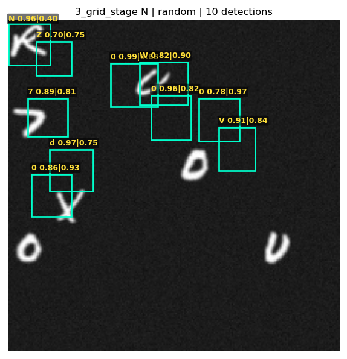 | 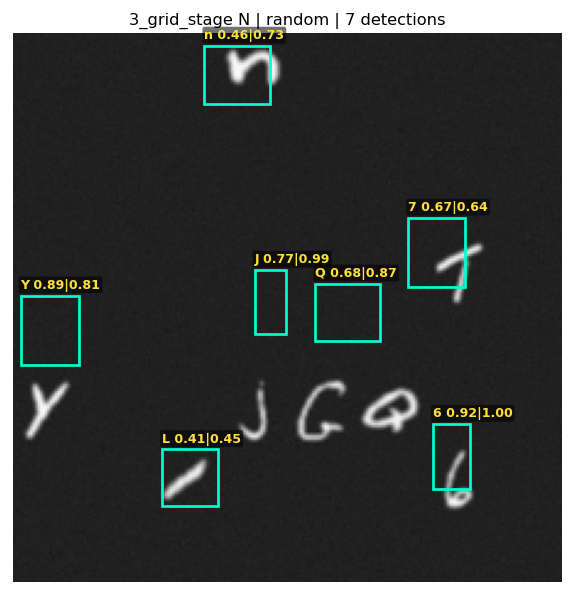 | 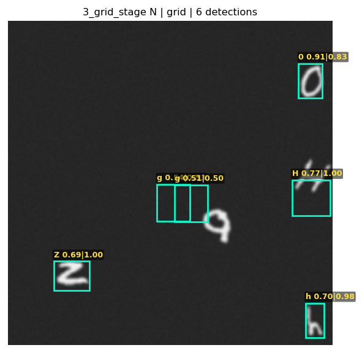 | 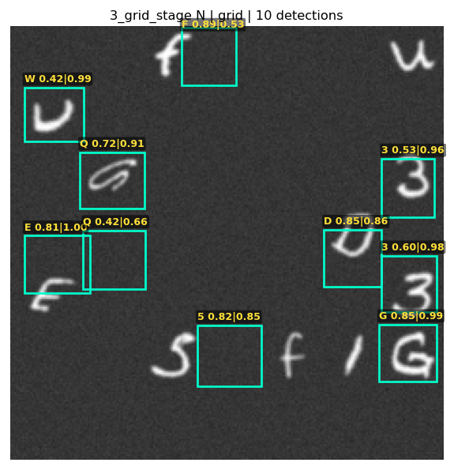 |
| **words** | **words** | **line** | **line** |
| 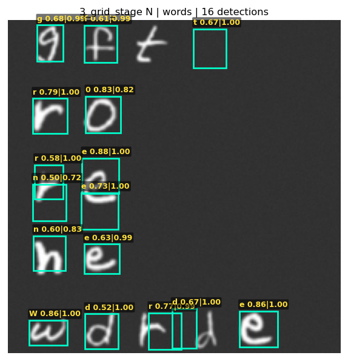 | 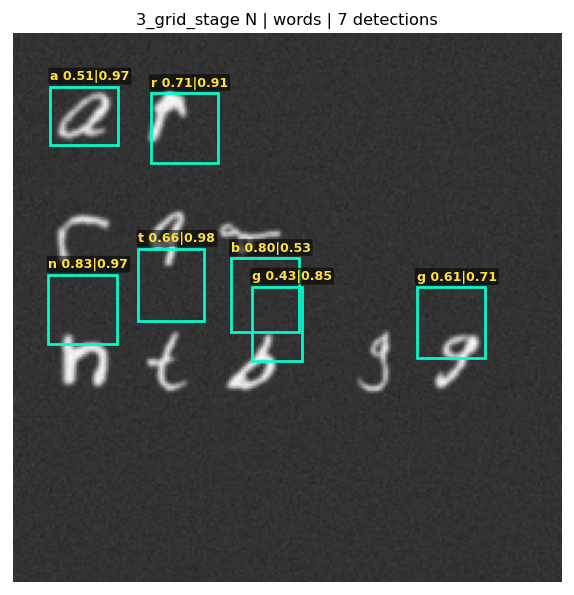 | 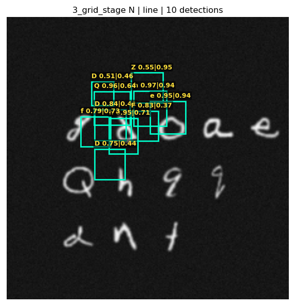 | 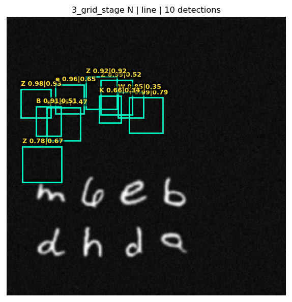 |

### ⚡ Multi-Anchor Small (1.55M) — `conf = 0.95`

| random | random | grid | grid |
|:---:|:---:|:---:|:---:|
| 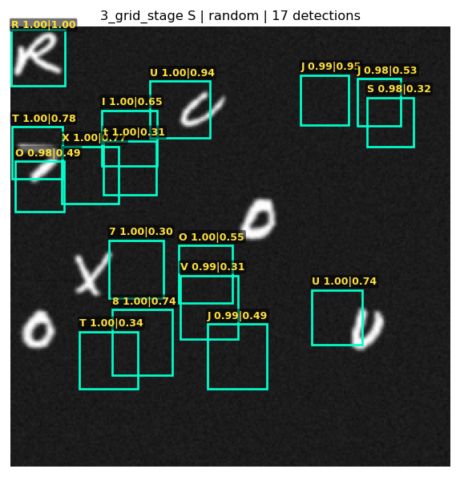 | 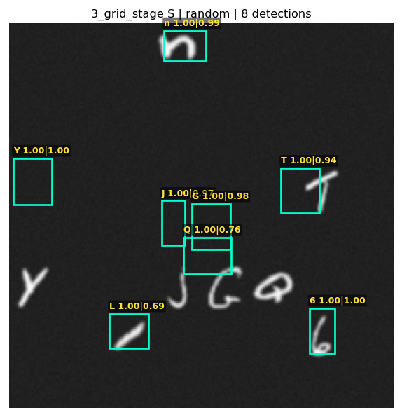 | 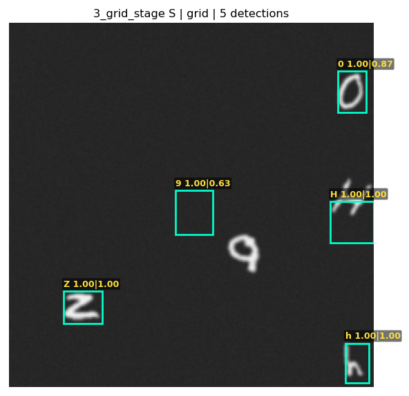 | 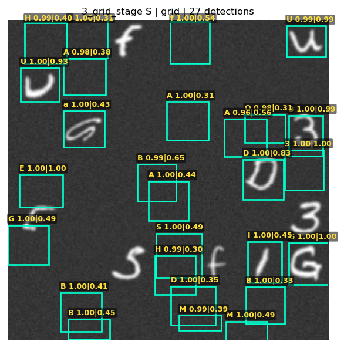 |
| **words** | **words** | **line** | **line** |
| 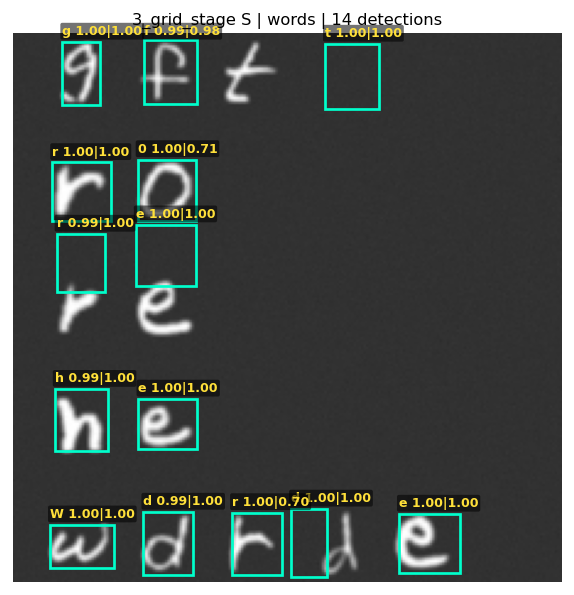 | 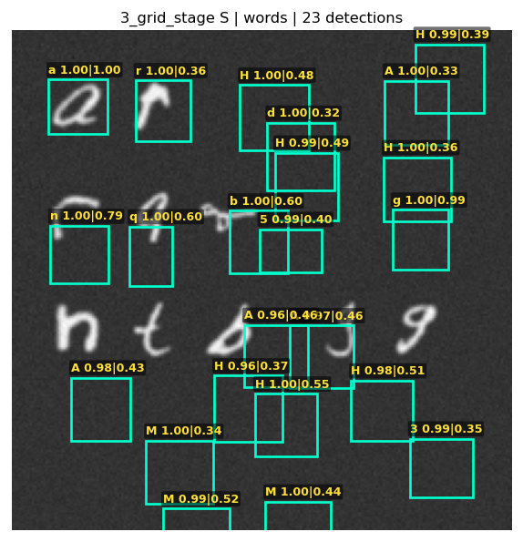 | 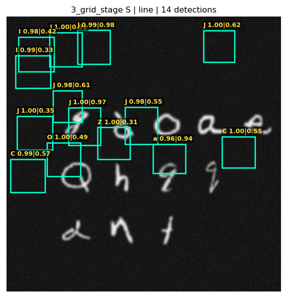 | 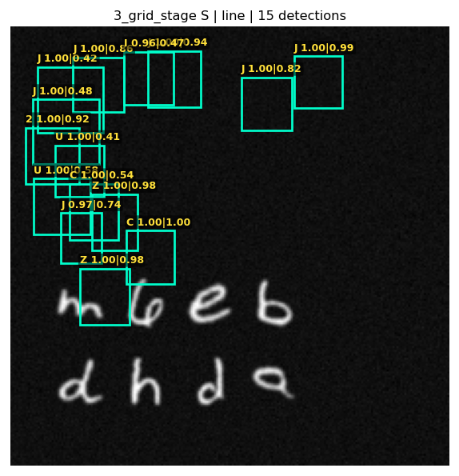 |

### 🎯 Multi-Anchor Medium (6.18M) — `conf = 0.95`

| random | random | grid | grid |
|:---:|:---:|:---:|:---:|
| 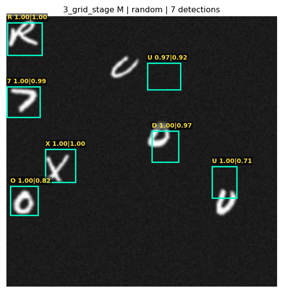 | 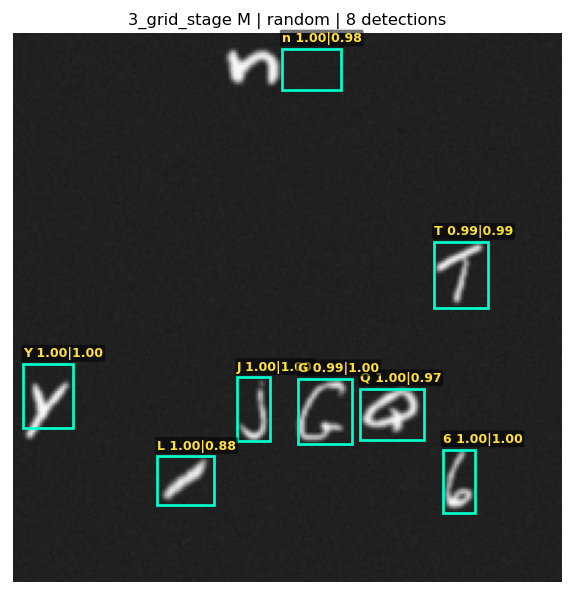 | 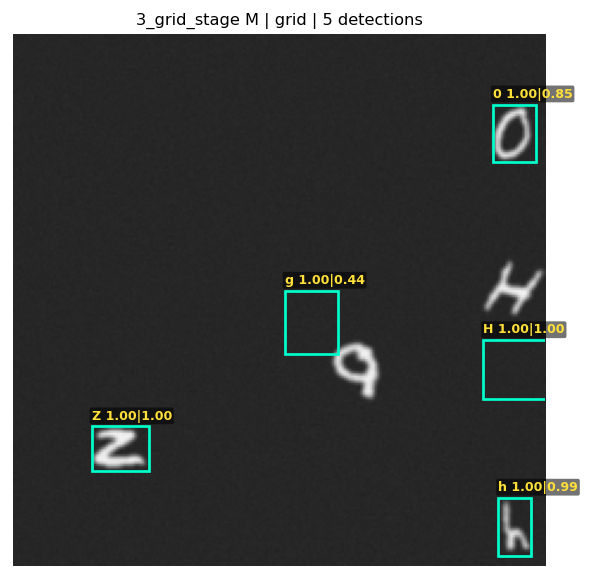 | 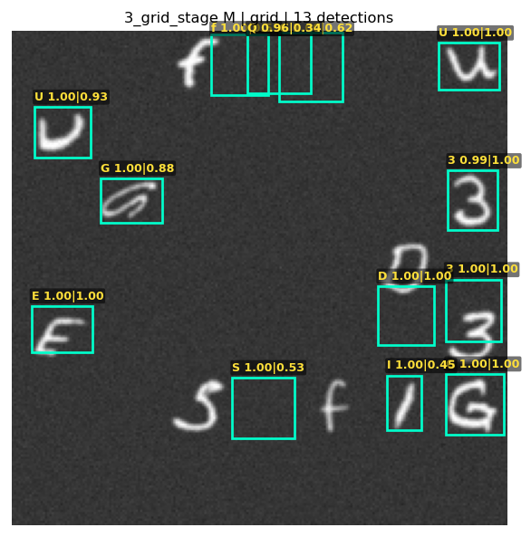 |
| **words** | **words** | **line** | **line** |
| 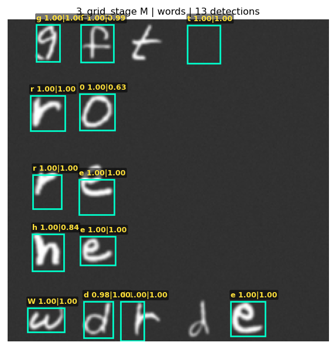 | 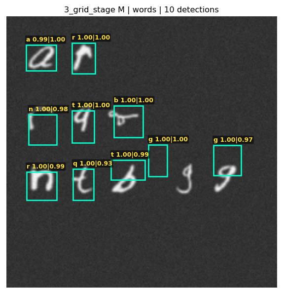 | 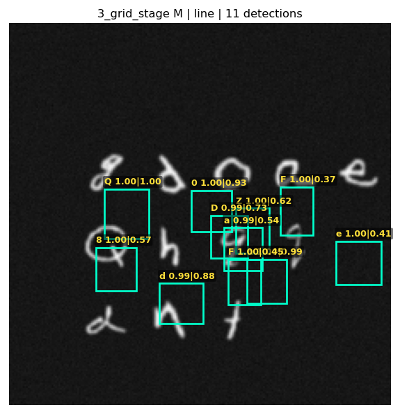 | 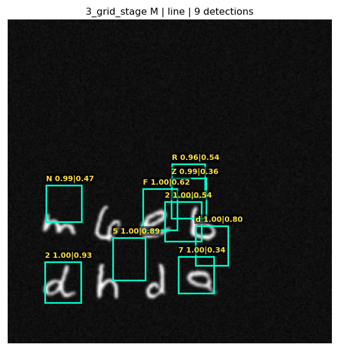 |
