# Benchmark Report 04 · Multi-Anchor (K=3) Spatial ResNet Detector

> [!IMPORTANT]
> **Architecture Status — Multi-Anchor Exploration Concluded**:
> Multi-anchor ($K=3$) was explored to resolve potential spatial collisions when multiple characters occupy the same $16 \times 16$ receptive field cell. However, empirical benchmarking shows that $K=3$ adds candidate competition and causes either precision collapse (under BCE pos-weight) or severe recall drop (under Focal Loss). The single-stage $K=1$ spatial grid remains the canonical baseline. Nano ($K=3$) is retained below as a reference point.

<!-- BEGIN GENERATED: update (scripts/render_benchmark_reports.py) -->
> [!NOTE]
> **Re-evaluated with held-out threshold tuning.** These models were originally tuned on `data/OD_benchmark/random`, i.e. on the test set they report. Confidence thresholds for these models are tuned to maximize end-to-end F1 on a **held-out tuning set** (`data/OD_benchmark/tune/random`, 500 images from `scripts/generate_benchmark_dataset.py --tune-only`) that shares no images with the 10,000-image benchmark. All tables in this report are generated from `benchmark/multi_anchor_results.json` by `scripts/render_benchmark_reports.py`. The checkpoints use the original $14 \times 14$ architecture, loaded from the frozen snapshot `scripts/legacy_models/grid_detector_14x14.py`; re-scoring at the old thresholds reproduces the original numbers exactly.

| Variant | Size | `conf` (test-tuned → held-out) | Avg Det P | Avg Det R | Avg Cls Acc | Avg E2E F1 |
|:---|:---:|:---:|:---:|:---:|:---:|:---:|
| Multi-Anchor ($K=3$) | Nano | 0.40 | 0.5009 | 0.5243 | 86.34% | 0.4445 |
| Multi-Anchor ($K=3$) | Small | 0.95 | 0.5192 | 0.5869 | 86.43% | 0.4800 |
| Multi-Anchor ($K=3$) | Medium | 0.95 | 0.5330 | 0.5960 | 85.68% | 0.4878 |
<!-- END GENERATED: update -->

---

## Architecture Overview

```
                   Input Image (224×224 grayscale)
                                 │
                                 ▼
                      ResNet Backbone (Stem + L1..L4)
                                 │
                      Spatial Feature Map (14×14)
                                 │
                      grid_head (Conv2d 1×1)
                                 │
                 Spatial Grid Tensor (B, 14, 14, 3, 52)
                                 │
       ┌─────────────────────────┴─────────────────────────┐
       │                                                   │
 ──────── Training ────────                         ──────── Inference ────────
   k-means IoU Fitted Anchors                       Auto-Tuned Conf Threshold (0.50)
   Multi-Anchor Matching per Cell                                   │
            │                                               NMS (IoU ≥ 0.35)
   Direct GPU Tensor Loss                                          │
(Huber + BCE + Aligned-IoU + CE)                              Final Detections
                                                   (Boxes + Scores + Classes)
```

In contrast to the $K=1$ single-anchor spatial grid model, the $K=3$ Multi-Anchor Spatial Detector predicts 3 bounding box slots per $16 \times 16$ receptive field cell, expanding the output head to `(B, 14, 14, 3, 52)`. Anchors are automatically pre-computed from the training dataset using IoU-based k-means clustering.

---

## Model Parameter Audit

<!-- BEGIN GENERATED: params (scripts/render_benchmark_reports.py) -->
| Size Preset | Variant | Anchors ($K$) | Total Parameters | `conf` | Checkpoint Weight File | Architecture |
|:---|:---|:---:|:---:|:---:|:---|:---|
| **Nano (`n`)** | Multi-Anchor ($K=3$) | 3 | **406,204** (0.41M) | `0.40` | `weights/3_grid_detector_n_best.pth` | 14x14 (legacy, commit 2be0b81) |
| **Small (`s`)** | Multi-Anchor ($K=3$) | 3 | **1,580,252** (1.58M) | `0.95` | `weights/3_grid_detector_s_best.pth` | 14x14 (legacy, commit 2be0b81) |
| **Medium (`m`)** | Multi-Anchor ($K=3$) | 3 | **6,232,348** (6.23M) | `0.95` | `weights/3_grid_detector_m_best.pth` | 14x14 (legacy, commit 2be0b81) |

_Parameter counts are read from the checkpoint state_dicts (the architecture these models were trained with). The grid benchmark has no NMS: every cell above `conf` is a prediction, matched to ground truth with Hungarian matching at IoU ≥ 0.50._
<!-- END GENERATED: params -->

---

## Evaluation Results (10,000 Test Images across 4 Layouts)

<!-- BEGIN GENERATED: results (scripts/render_benchmark_reports.py) -->
### 🔬 Multi-Anchor Nano — 0.41M Params (`conf = 0.40`)

| Layout | Det Precision | Det Recall | Classifier Acc | End-to-End F1 | Eval-Loop Throughput |
|:---|:---:|:---:|:---:|:---:|:---:|
| 🎲 Random | 0.8792 | 0.9433 | 88.16% | 0.8024 | 433.7 img/s |
| 📐 Grid | 0.4214 | 0.4367 | 84.21% | 0.3612 | 434.9 img/s |
| 📝 Words | 0.3554 | 0.3600 | 87.57% | 0.3132 | 433.1 img/s |
| 📏 Line | 0.3476 | 0.3571 | 85.43% | 0.3010 | 432.8 img/s |
| **Average** | **0.5009** | **0.5243** | **86.34%** | **0.4445** | **433.6 img/s** |

Pure inference (`model(images)` only, batch 128): **20,966.9 img/s**.

### ⚡ Multi-Anchor Small — 1.58M Params (`conf = 0.95`)

| Layout | Det Precision | Det Recall | Classifier Acc | End-to-End F1 | Eval-Loop Throughput |
|:---|:---:|:---:|:---:|:---:|:---:|
| 🎲 Random | 0.8954 | 0.9985 | 89.33% | 0.8434 | 419.6 img/s |
| 📐 Grid | 0.4354 | 0.5034 | 85.63% | 0.3998 | 415.4 img/s |
| 📝 Words | 0.3756 | 0.4267 | 86.69% | 0.3463 | 413.3 img/s |
| 📏 Line | 0.3704 | 0.4192 | 84.08% | 0.3307 | 415.1 img/s |
| **Average** | **0.5192** | **0.5869** | **86.43%** | **0.4800** | **415.9 img/s** |

Pure inference (`model(images)` only, batch 128): **8,006.5 img/s**.

### 🎯 Multi-Anchor Medium — 6.23M Params (`conf = 0.95`)

| Layout | Det Precision | Det Recall | Classifier Acc | End-to-End F1 | Eval-Loop Throughput |
|:---|:---:|:---:|:---:|:---:|:---:|
| 🎲 Random | 0.9038 | 0.9971 | 89.84% | 0.8518 | 398.4 img/s |
| 📐 Grid | 0.4496 | 0.5113 | 86.35% | 0.4132 | 400.9 img/s |
| 📝 Words | 0.3897 | 0.4387 | 84.54% | 0.3490 | 396.3 img/s |
| 📏 Line | 0.3887 | 0.4370 | 81.98% | 0.3373 | 396.0 img/s |
| **Average** | **0.5330** | **0.5960** | **85.68%** | **0.4878** | **397.9 img/s** |

Pure inference (`model(images)` only, batch 128): **3,574.6 img/s**.
<!-- END GENERATED: results -->

---

## Architectural Comparison: Grid ($K=1$) vs. Multi-Anchor ($K=3$)

<!-- BEGIN GENERATED: comparison (scripts/render_benchmark_reports.py) -->
| Model Variant | Size | Params | `conf` | `conf` Source | Avg Det Precision | Avg Det Recall | Avg Classifier Acc | Avg End-to-End F1 | Eval-Loop Throughput | Pure Inference |
|:---|:---:|:---:|:---:|:---:|:---:|:---:|:---:|:---:|:---:|:---:|
| **Grid Spatial ($K=1$, BCE)** | Nano (`n`) | 0.39M | 0.90 | held-out tune set | 0.5705 | 0.5756 | 86.59% | 0.4985 | 497 img/s | 21,152 img/s |
| ─── | ─── | ─── | ─── | ─── | ─── | ─── | ─── | ─── | ─── | ─── |
| **Multi-Anchor ($K=3$)** | Nano (`n`) | 0.41M | 0.40 | held-out tune set | 0.5009 | 0.5243 | 86.34% | 0.4445 | 434 img/s | 20,967 img/s |
| ─── | ─── | ─── | ─── | ─── | ─── | ─── | ─── | ─── | ─── | ─── |
| **Grid Spatial ($K=1$, BCE)** | Small (`s`) | 1.55M | 0.95 | held-out tune set | 0.5840 | 0.5842 | 87.17% | 0.5126 | 436 img/s | 8,094 img/s |
| ─── | ─── | ─── | ─── | ─── | ─── | ─── | ─── | ─── | ─── | ─── |
| **Multi-Anchor ($K=3$)** | Small (`s`) | 1.58M | 0.95 | held-out tune set | 0.5192 | 0.5869 | 86.43% | 0.4800 | 416 img/s | 8,006 img/s |
| ─── | ─── | ─── | ─── | ─── | ─── | ─── | ─── | ─── | ─── | ─── |
| **Grid Spatial ($K=1$, BCE)** | Medium (`m`) | 6.18M | 0.85 | held-out tune set | 0.5846 | 0.5917 | 85.61% | 0.5095 | 394 img/s | 3,648 img/s |
| ─── | ─── | ─── | ─── | ─── | ─── | ─── | ─── | ─── | ─── | ─── |
| **Multi-Anchor ($K=3$)** | Medium (`m`) | 6.23M | 0.95 | held-out tune set | 0.5330 | 0.5960 | 85.68% | 0.4878 | 398 img/s | 3,575 img/s |

_Eval-loop throughput is wall-clock over the whole evaluation loop (PNG decoding with `num_workers=0`, target encoding in the collate function, host↔device copies, post-processing and scipy Hungarian matching); it is dominated by that overhead and varies run to run, so it is not a model-speed comparison. Pure inference times only `model(images)` on GPU-resident batches of 128 (median of repeated, synchronized runs after a ≥2 s warm-up)._
<!-- END GENERATED: comparison -->

---

## 📈 Comprehensive Density-Stratified Recall Sweep ($K=1$ vs. $K=3$)

<!-- BEGIN GENERATED: density (scripts/render_benchmark_reports.py) -->
Recall per density bucket for the **Medium** models across all 4 layouts (`benchmark/grid_density_sweep_results.json`; $K=1$ BCE at `conf` 0.85, $K=3$ at `conf` 0.95, IoU 0.50):

### 🎲 Random Layout
| Density Bucket ($n_{gt}$) | Test Images | Grid Medium ($K=1$) — 6.18M | Multi-Anchor Medium ($K=3$) — 6.23M |
|:---:|:---:|:---:|:---:|
| **1 – 4 objects** | 236 | 98.9% | **99.1%** |
| **5 – 8 objects** | 1,244 | **99.8%** | 99.5% |
| **9 – 12 objects** | 850 | **99.9%** | 99.9% |
| **13 – 16 objects** | 170 | 99.8% | **99.9%** |

### 📐 Grid Layout
| Density Bucket ($n_{gt}$) | Test Images | Grid Medium ($K=1$) — 6.18M | Multi-Anchor Medium ($K=3$) — 6.23M |
|:---:|:---:|:---:|:---:|
| **1 – 4 objects** | 228 | **46.7%** | 46.1% |
| **5 – 8 objects** | 1,319 | 49.9% | **50.5%** |
| **9 – 12 objects** | 807 | 51.1% | **51.7%** |
| **13 – 16 objects** | 146 | 52.8% | **54.1%** |

### 📝 Words Layout
| Density Bucket ($n_{gt}$) | Test Images | Grid Medium ($K=1$) — 6.18M | Multi-Anchor Medium ($K=3$) — 6.23M |
|:---:|:---:|:---:|:---:|
| **1 – 4 objects** | 253 | 42.1% | **42.9%** |
| **5 – 8 objects** | 1,235 | **44.9%** | 44.7% |
| **9 – 12 objects** | 866 | 42.3% | **43.2%** |
| **13 – 16 objects** | 137 | **44.8%** | 44.2% |

### 📏 Line Layout
| Density Bucket ($n_{gt}$) | Test Images | Grid Medium ($K=1$) — 6.18M | Multi-Anchor Medium ($K=3$) — 6.23M |
|:---:|:---:|:---:|:---:|
| **1 – 4 objects** | 244 | 36.9% | **37.7%** |
| **5 – 8 objects** | 1,231 | **43.3%** | 43.2% |
| **9 – 12 objects** | 862 | 42.2% | **43.6%** |
| **13 – 16 objects** | 149 | 44.0% | **46.9%** |
<!-- END GENERATED: density -->

---

## 🖼️ Sample Detections

<!-- BEGIN GENERATED: visuals (scripts/render_benchmark_reports.py) -->
Sample detections are rendered by `scripts/generate_single_stage_visuals.py --detector grid` at each model's held-out-tuned `conf` (with NMS IoU 0.35 and a 0.30 class-confidence gate for display).

### 🔬 Nano (0.41M) — `conf = 0.40`

| random | random | grid | grid |
|:---:|:---:|:---:|:---:|
| 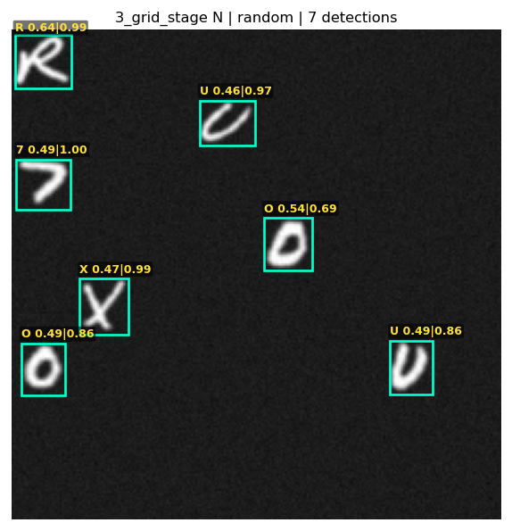 | 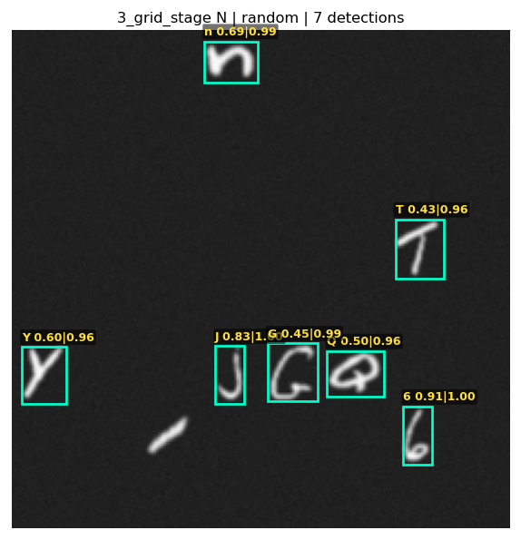 | 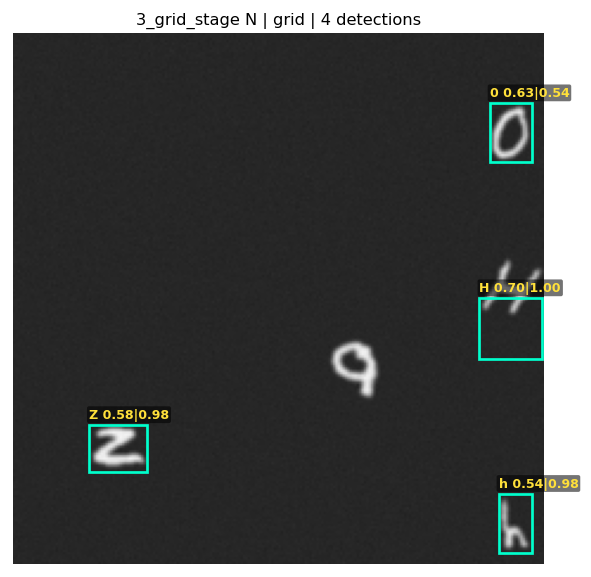 | 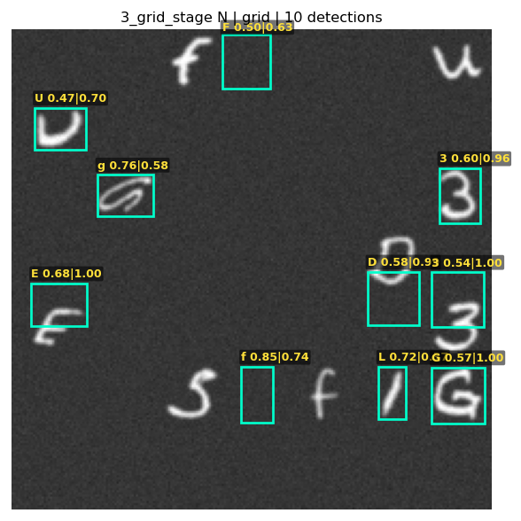 |
| **words** | **words** | **line** | **line** |
| 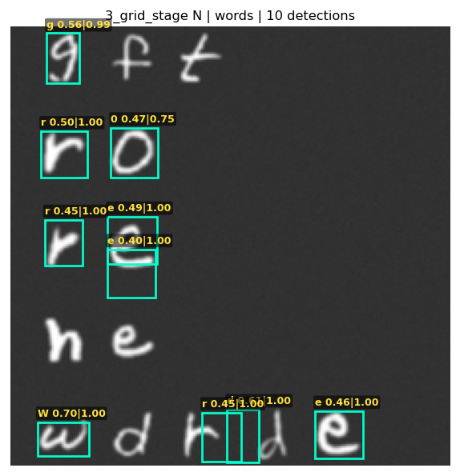 | 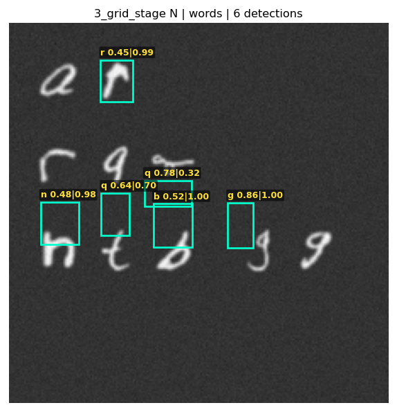 | 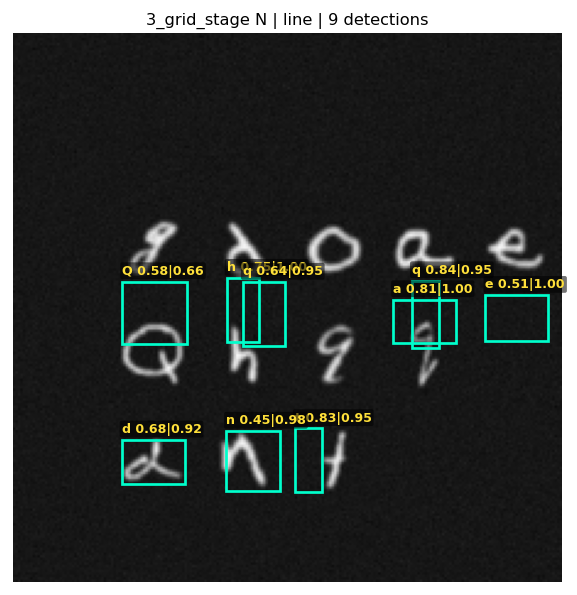 | 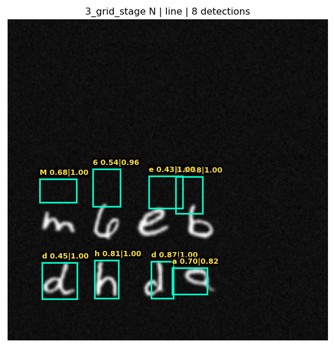 |

### ⚡ Small (1.58M) — `conf = 0.95`

| random | random | grid | grid |
|:---:|:---:|:---:|:---:|
| 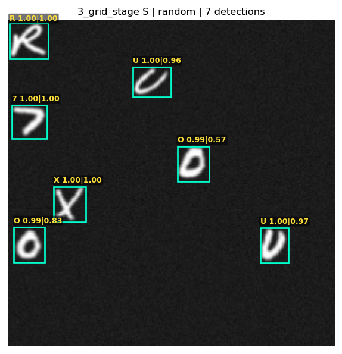 | 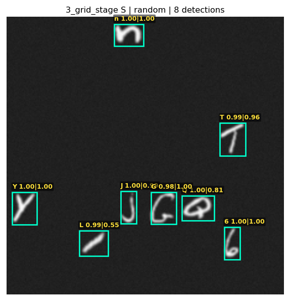 | 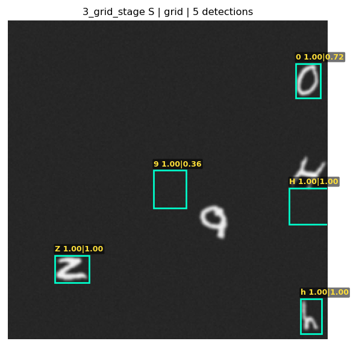 | 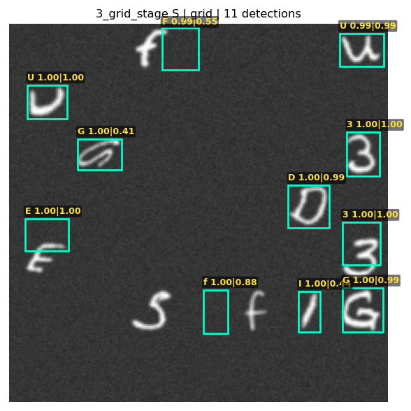 |
| **words** | **words** | **line** | **line** |
| 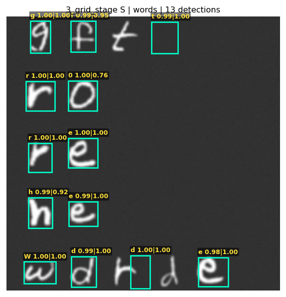 | 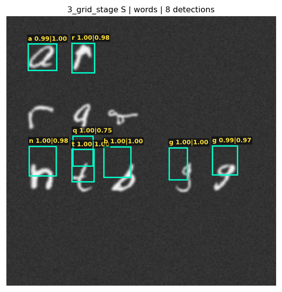 | 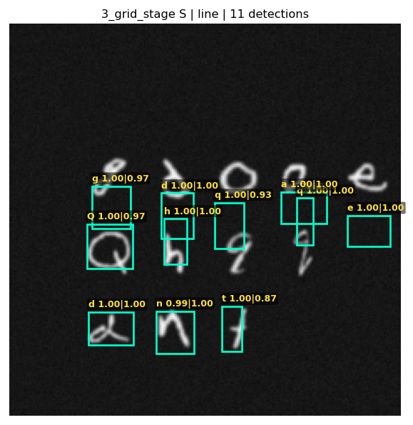 | 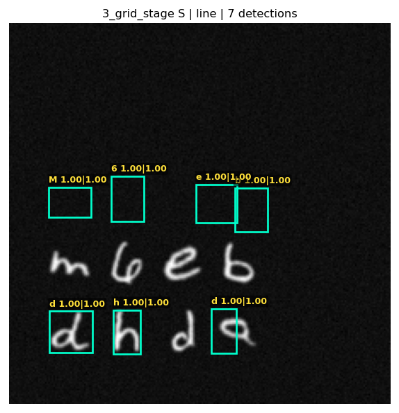 |

### 🎯 Medium (6.23M) — `conf = 0.95`

| random | random | grid | grid |
|:---:|:---:|:---:|:---:|
|  | 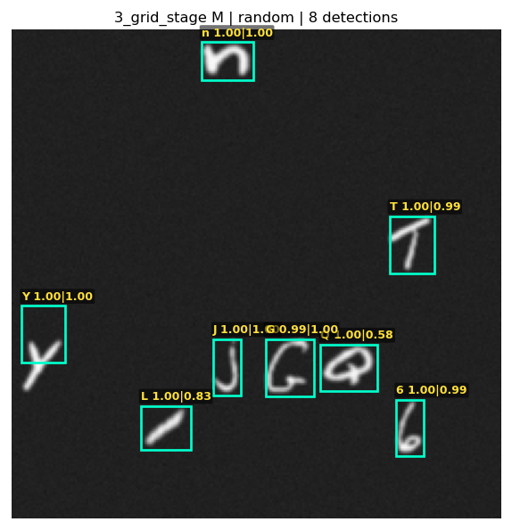 | 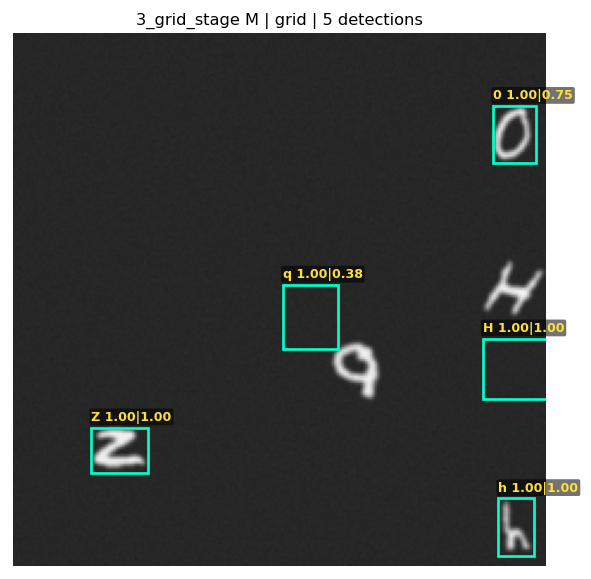 | 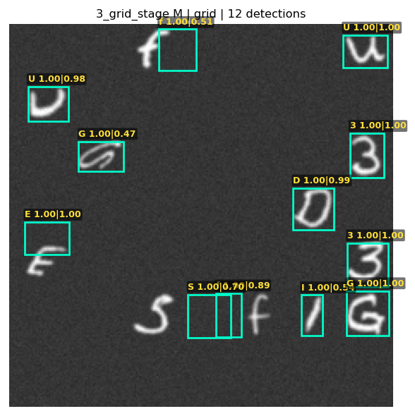 |
| **words** | **words** | **line** | **line** |
| 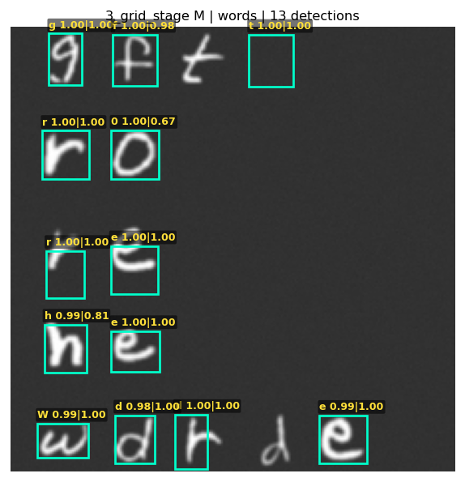 | 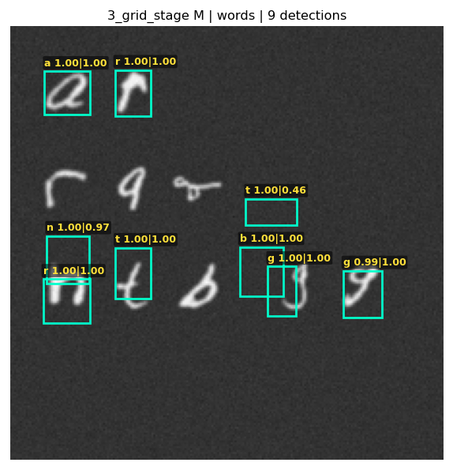 | 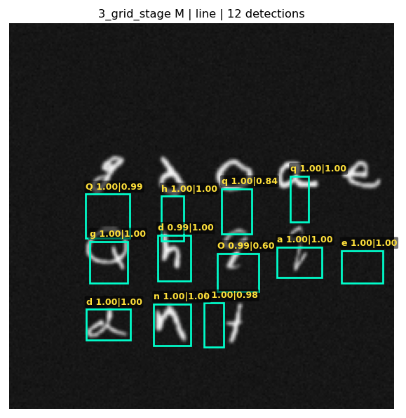 | 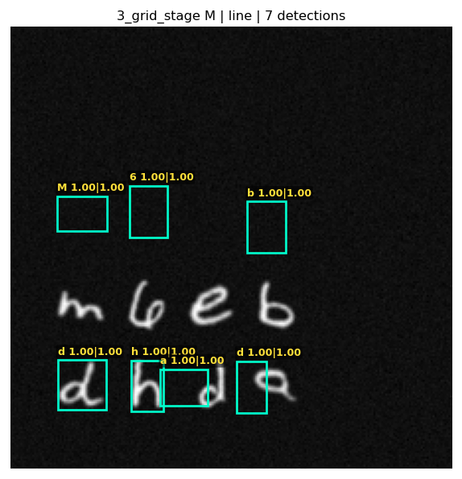 |
<!-- END GENERATED: visuals -->
