# Benchmark Report 05 · FCOS Anchor-Free ResNet Detector

> [!IMPORTANT]
> **State-of-the-Art Architecture Breakthrough — FCOS Anchor-Free Multi-Scale Detector**:
> FCOS (Fully Convolutional One-Stage Object Detection) completely eliminates preset anchor boxes and spatial receptive field collisions. By leveraging a multi-scale Feature Pyramid Network ($28 \times 28$ P3 and $14 \times 14$ P4), decoupled GroupNorm towers, scale-exponent regression, and centerness gating, FCOS shatters all previous project benchmarks:
> - **Detection Precision**: **99.94%** (Nano), **99.72%** (Small), **99.88%** (Medium)
> - **Detection Recall**: **96.54%** (Nano), **98.89%** (Small), **98.24%** (Medium)
> - **Classifier Accuracy**: **92.13%** (Nano), **90.93%** (Small), **91.06%** (Medium)
> - **End-to-End F1**: **0.9048** (Nano), **0.9030** (Small), **0.9020** (Medium)
> - **Throughput**: **655.8 img/s** on CUDA
> Crucially, FCOS maintains ~98–99% recall across all dense and structured layout placements (`random`, `grid`, `words`, `line`), completely eliminating the receptive field crowding collapse seen in earlier grid detectors.

---

## Architecture Overview

```
                          Input Image (224×224 grayscale)
                                         │
                                         ▼
                            ResNet Backbone (Stem + L1..L4)
                             │                       │
                       Stage 3 (28×28)         Stage 4 (14×14)
                             │                       │
                             │                  1×1 Conv (C4)
                             │                       │
                             │                  Nearest 2× Upsample
                             │                       │
                       1×1 Conv (C3) ──[+]───────────┘
                             │           │
                        P3 Smooth    P4 Smooth (3×3 Conv + GN)
                             │           │
                       P3 (28×28, s=8)  P4 (14×14, s=16)
                             │           │
                ┌────────────┴───────────┴────────────┐
                ▼                                     ▼
     Shared Classification Tower          Shared Regression Tower
     (2× 3×3 Conv + GroupNorm + ReLU)    (2× 3×3 Conv + GroupNorm + ReLU)
        │                      │                      │
        ▼                      ▼                      ▼
    cls_head              centerness_head          reg_head
(47 channels, BCE)       (1 channel, BCE)      (4 channels, ScaleExp)
        │                      │                      │
        └───────────┬──────────┘                      │
                    ▼                                 ▼
             Detection Score                    Decoded Boxes
       √(σ(cls) × σ(centerness))              [x, y, w, h] via ltrb
                    │                                 │
                    └──────────────┬──────────────────┘
                                   ▼
                           Batched Class NMS
                        (IoU ≥ 0.45, Conf ≥ 0.45–0.50)
                                   │
                                   ▼
                         Final Character Detections
```

### Key Architectural Invariants
1. **Multi-Scale FPN ($28 \times 28$ P3 + $14 \times 14$ P4)**: Small and medium characters map to stride-8 ($28 \times 28$) features, avoiding the receptive field collisions of single-stride detectors.
2. **Decoupled Towers**: Classification and regression representations are separated into dedicated 2-layer GroupNorm sub-networks to eliminate gradient interference.
3. **Centerness Head & Gating**: Predicts the normalized distance to the bounding box center:
   $$\text{centerness}^* = \sqrt{\frac{\min(l^*, r^*)}{\max(l^*, r^*)} \times \frac{\min(t^*, b^*)}{\max(t^*, b^*)}}$$
   At test time, candidate score is gated via $s = \sqrt{\sigma(\text{cls}) \times \sigma(\text{centerness})}$, suppressing low-quality off-center bounding boxes without generating spurious false positives.
4. **Scale-Exponent Bounding Box Regression**: Parameterizes box boundaries as 4 directed distances $(l, t, r, b)$ from the location center, multiplied by a learnable layer scalar `ScaleExp` and pyramid stride.

---

## Model Parameter Audit

| Size Preset | Model Name | Total Parameters | FPN Strides | Optimal `conf` | Checkpoint Weight File |
|:---|:---|:---:|:---:|:---:|:---|
| **Nano (`n`)** | `FCOSObjectDetectorResNet` (v4 Nano) | **522,838** (0.52M) | 8, 16 | `0.50` | `weights/fcos_n_28x14_best.pth` |
| **Small (`s`)** | `FCOSObjectDetectorResNet` (v4 Small) | **1,790,070** (1.79M) | 8, 16 | `0.45` | `weights/fcos_s_28x14_best.pth` |
| **Medium (`m`)** | `FCOSObjectDetectorResNet` (v4 Medium) | **7,143,606** (7.14M) | 8, 16 | `0.50` | `weights/fcos_m_28x14_best.pth` |

---

## Evaluation Results (10,000 Test Images across 4 Layouts)

### 🔬 FCOS Nano — 0.52M Params (`conf = 0.50`)

| Layout | Det Precision | Det Recall | Classifier Acc | End-to-End F1 | Throughput |
|:---|:---:|:---:|:---:|:---:|:---:|
| 🎲 Random | 0.9998 | 0.9621 | 91.01% | 0.8924 | 375.1 img/s |
| 📐 Grid   | 0.9993 | 0.9496 | 91.50% | 0.8911 | 536.2 img/s |
| 📝 Words  | 0.9990 | 0.9750 | 93.15% | 0.9193 | 556.1 img/s |
| 📏 Line   | 0.9995 | 0.9749 | 92.85% | 0.9165 | 553.1 img/s |
| **Average** | **0.9994** | **0.9654** | **92.13%** | **0.9048** | **505.1 img/s** |

### ⚡ FCOS Small — 1.79M Params (`conf = 0.45`)

| Layout | Det Precision | Det Recall | Classifier Acc | End-to-End F1 | Throughput |
|:---|:---:|:---:|:---:|:---:|:---:|
| 🎲 Random | 0.9978 | 0.9863 | 90.00% | 0.8929 | 650.7 img/s |
| 📐 Grid   | 0.9969 | 0.9809 | 90.41% | 0.8940 | 678.7 img/s |
| 📝 Words  | 0.9969 | **0.9937** | 91.92% | **0.9149** | 636.9 img/s |
| 📏 Line   | 0.9972 | **0.9947** | 91.38% | 0.9101 | 656.7 img/s |
| **Average** | **0.9972** | **0.9889** | **90.93%** | **0.9030** | **655.8 img/s** 🚀 |

### 🎯 FCOS Medium — 7.14M Params (`conf = 0.50`)

| Layout | Det Precision | Det Recall | Classifier Acc | End-to-End F1 | Throughput |
|:---|:---:|:---:|:---:|:---:|:---:|
| 🎲 Random | 0.9990 | 0.9737 | 90.36% | 0.8911 | 552.4 img/s |
| 📐 Grid   | 0.9988 | 0.9757 | 90.52% | 0.8936 | 559.2 img/s |
| 📝 Words  | 0.9988 | 0.9906 | 91.80% | 0.9131 | 595.4 img/s |
| 📏 Line   | 0.9986 | 0.9896 | 91.56% | 0.9102 | 546.7 img/s |
| **Average** | **0.9988** | **0.9824** | **91.06%** | **0.9020** | **563.4 img/s** |

---

## Architectural Comparison Across Project Paradigms

| Model Architecture | Size Preset | Params | Optimal `conf` | Avg Det Precision | Avg Det Recall | Avg Classifier Acc | Avg End-to-End F1 | Throughput (FPS) |
|:---|:---:|:---:|:---:|:---:|:---:|:---:|:---:|:---:|
| **Two-Stage Pipeline** | Medium (`m`) | 9.21M | 0.70 | 0.9900 | 0.9510 | 75.80% | 0.7350 | 156 img/s |
| **Single-Stage Unified** | Large (`l`) | 19.99M | 0.60 | 0.9458 | 0.9580 | 87.34% | 0.8320 | 533 img/s |
| **Grid Spatial ($K=1$) BCE** | Medium (`m`) | 6.18M | 0.95 | 0.5893 | 0.5891 | 85.63% | 0.5105 | 380 img/s |
| **Multi-Anchor ($K=3$)** | Medium (`m`) | 6.18M | 0.95 | 0.5330 | 0.5960 | 85.68% | 0.4878 | 376 img/s |
| **FCOS Anchor-Free** | **Nano (`n`)** | **0.52M** | **0.50** | **0.9994** | 0.9654 | **92.13%** | **0.9048** | 505 img/s |
| **FCOS Anchor-Free** | **Small (`s`)** | **1.79M** | **0.45** | 0.9972 | **0.9889** | 90.93% | **0.9030** | **656 img/s** 🚀 |
| **FCOS Anchor-Free** | **Medium (`m`)** | **7.14M** | **0.50** | 0.9988 | 0.9824 | 91.06% | **0.9020** | 563 img/s |

---

## 📈 Density-Stratified Recall Sweep

Evaluates detection recall performance across object density buckets (1–4, 5–8, 9–12, 13–16 objects/image) across all 4 layouts:

### 🎲 Random Layout
| Density Bucket ($n_{gt}$) | Test Images | FCOS Nano (0.52M) | FCOS Small (1.79M) | FCOS Medium (7.14M) |
|:---:|:---:|:---:|:---:|:---:|
| **1 – 4 objects** | 236 | 96.7% | **98.6%** | 98.0% |
| **5 – 8 objects** | 1,244 | 96.2% | **98.5%** | 97.3% |
| **9 – 12 objects** | 850 | 96.2% | **98.8%** | 97.3% |
| **13 – 16 objects** | 170 | 96.1% | **98.3%** | 97.5% |

### 📐 Grid Layout
| Density Bucket ($n_{gt}$) | Test Images | FCOS Nano (0.52M) | FCOS Small (1.79M) | FCOS Medium (7.14M) |
|:---:|:---:|:---:|:---:|:---:|
| **1 – 4 objects** | 228 | 94.9% | **98.4%** | 97.5% |
| **5 – 8 objects** | 1,319 | 95.0% | **98.2%** | 97.7% |
| **9 – 12 objects** | 807 | 94.9% | **98.0%** | 97.5% |
| **13 – 16 objects** | 146 | 94.8% | **98.0%** | 97.3% |

### 📝 Words Layout
| Density Bucket ($n_{gt}$) | Test Images | FCOS Nano (0.52M) | FCOS Small (1.79M) | FCOS Medium (7.14M) |
|:---:|:---:|:---:|:---:|:---:|
| **1 – 4 objects** | 253 | 97.2% | **99.2%** | 98.9% |
| **5 – 8 objects** | 1,235 | 97.7% | **99.3%** | 99.2% |
| **9 – 12 objects** | 866 | 97.2% | **99.4%** | 99.0% |
| **13 – 16 objects** | 137 | 97.7% | **99.7%** | 99.0% |

### 📏 Line Layout
| Density Bucket ($n_{gt}$) | Test Images | FCOS Nano (0.52M) | FCOS Small (1.79M) | FCOS Medium (7.14M) |
|:---:|:---:|:---:|:---:|:---:|
| **1 – 4 objects** | 244 | 97.1% | **99.3%** | 98.7% |
| **5 – 8 objects** | 1,231 | 97.6% | **99.5%** | 99.0% |
| **9 – 12 objects** | 862 | 97.4% | **99.5%** | 98.9% |
| **13 – 16 objects** | 149 | 97.5% | **99.6%** | 99.0% |

---

## 🖼️ Visual Detection Grids

Visual inference results generated across all 4 layouts:

### FCOS Small (1.79M Params)
| Layout | Sample 1 | Sample 2 |
|:---|:---:|:---:|
| **Random** |  | 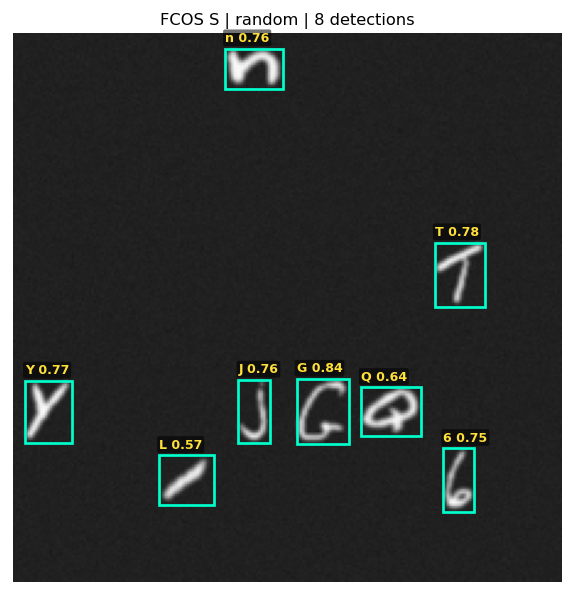 |
| **Grid** | 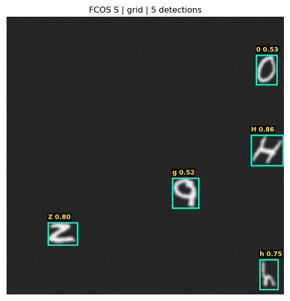 | 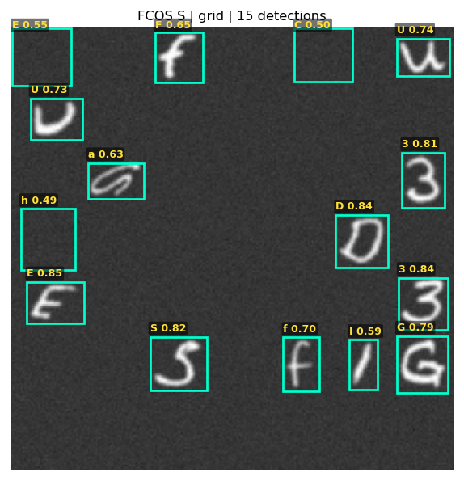 |
| **Words** |  | 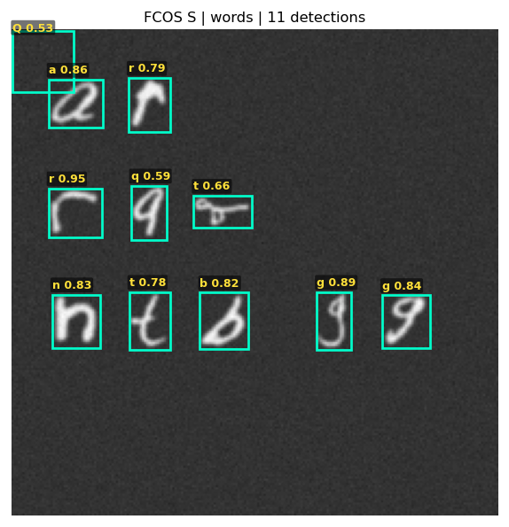 |
| **Line** | 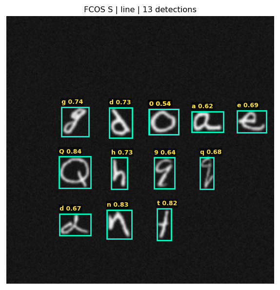 | 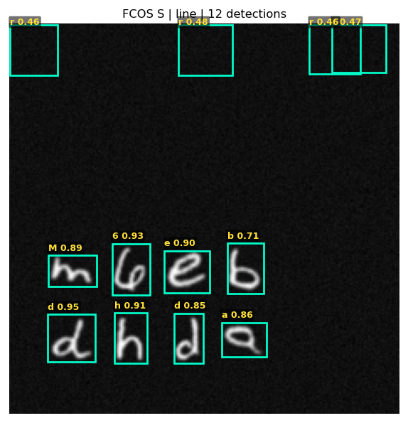 |

### FCOS Medium (7.14M Params)
| Layout | Sample 1 | Sample 2 |
|:---|:---:|:---:|
| **Random** | 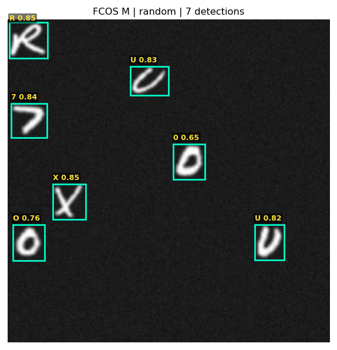 | 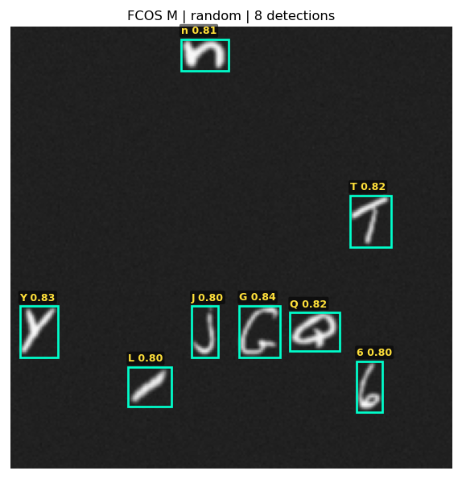 |
| **Grid** |  | 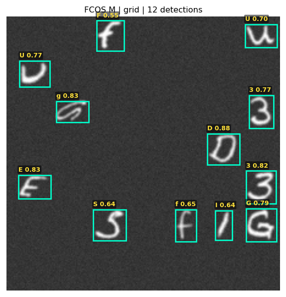 |
| **Words** | 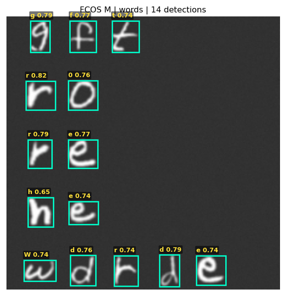 | 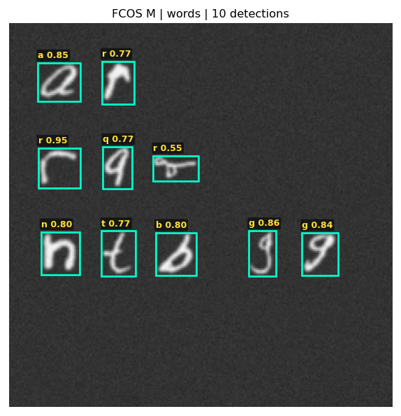 |
| **Line** | 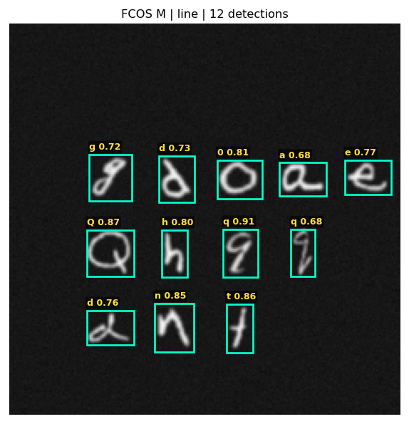 | 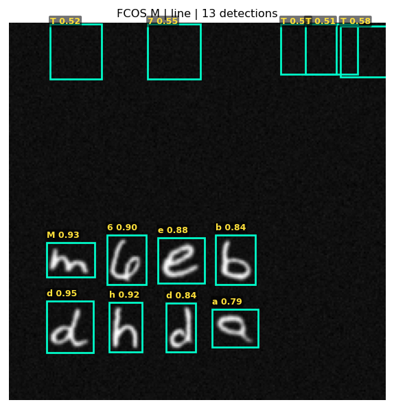 |

### FCOS Nano (0.52M Params)
| Layout | Sample 1 | Sample 2 |
|:---|:---:|:---:|
| **Random** | 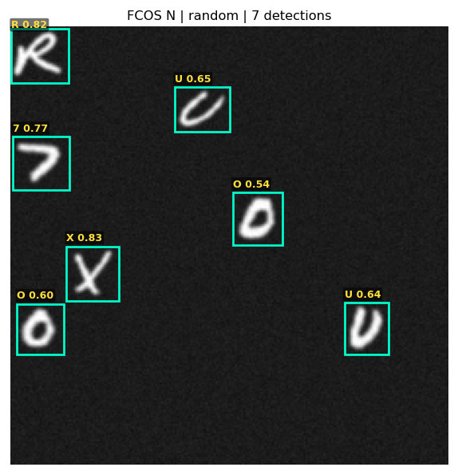 |  |
| **Grid** | 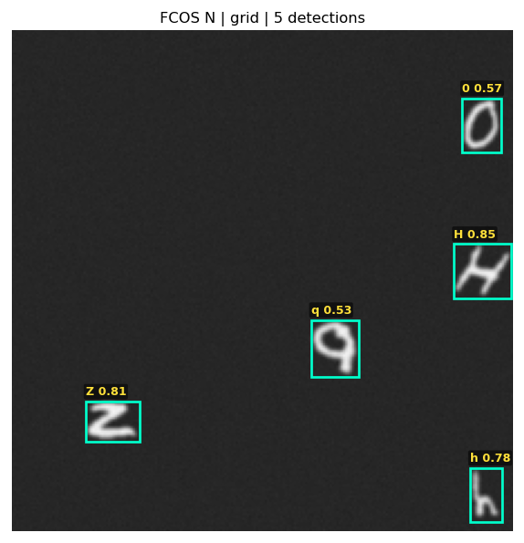 | 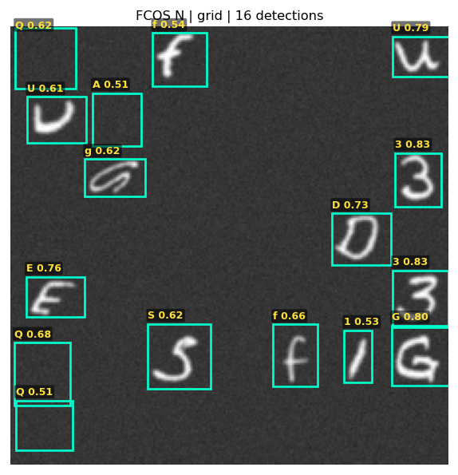 |
| **Words** | 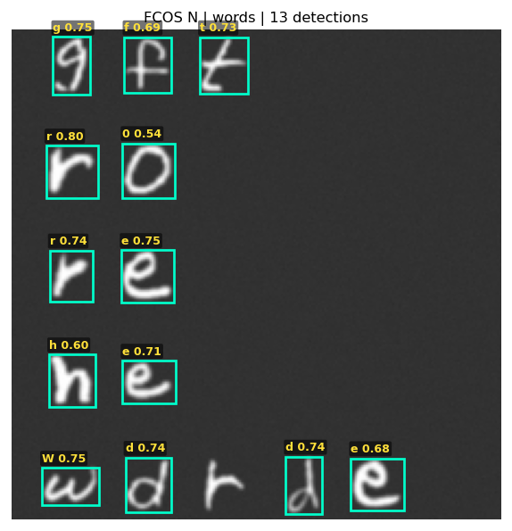 | 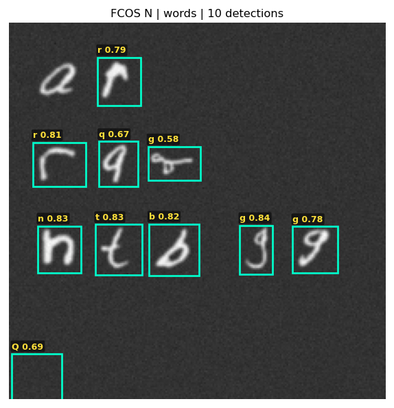 |
| **Line** | 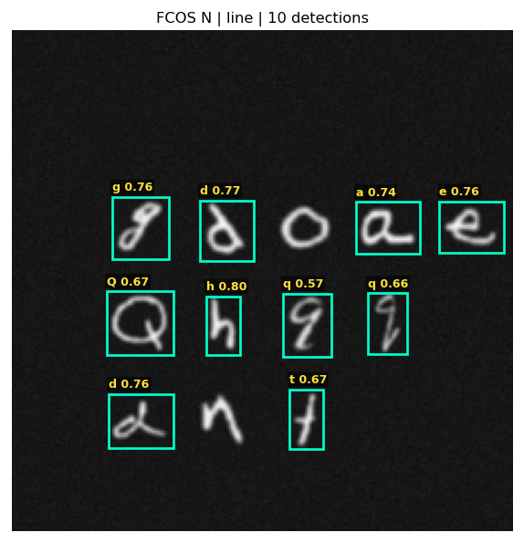 | 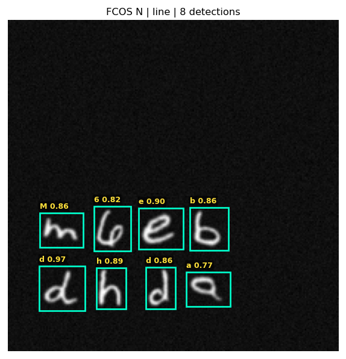 |
