# Benchmark Report 05 · FCOS Anchor-Free ResNet Detector

> [!IMPORTANT]
> **State-of-the-Art Architecture Breakthrough — FCOS Anchor-Free Multi-Scale Detector**:
> FCOS (Fully Convolutional One-Stage Object Detection) completely eliminates preset anchor boxes and spatial receptive field collisions. By leveraging a multi-scale Feature Pyramid Network ($28 \times 28$ P3 and $14 \times 14$ P4), decoupled GroupNorm towers, scale-exponent regression, and centerness gating, FCOS shatters all previous project benchmarks:
> <!-- BEGIN GENERATED: summary (scripts/render_benchmark_reports.py) -->
> - **Detection Precision**: **99.94%** (Nano), **99.72%** (Small), **99.72%** (Medium)
> - **Detection Recall**: **96.54%** (Nano), **98.89%** (Small), **98.95%** (Medium)
> - **Classifier Accuracy** (on detected objects): **92.13%** (Nano), **90.93%** (Small), **90.75%** (Medium)
> - **End-to-End F1**: **0.9048** (Nano), **0.9030** (Small), **0.9015** (Medium)
> - **Pure Inference Throughput** (`model(images)` only, batch 128, CUDA): **15,276 img/s** (Nano), **6,868 img/s** (Small), **2,988 img/s** (Medium)
>
> Per-layout recall ranges across `random`, `grid`, `words`, `line`: Nano 94.96%–97.50%; Small 98.09%–99.47%; Medium 98.44%–99.47%. The lowest cell is Nano on `grid` (94.96%).
> <!-- END GENERATED: summary -->

---

## Architecture Overview

```
                          Input Image (224×224 grayscale)
                                         │
                                         ▼
                            ResNet Backbone (Stem + L1..L4)
                             │                       │
                       Stage 3 (28×28)         Stage 4 (14×14)
                             │                       │
                             │                  1×1 Conv (C4)
                             │                       │
                             │                  Nearest 2× Upsample
                             │                       │
                       1×1 Conv (C3) ──[+]───────────┘
                             │           │
                        P3 Smooth    P4 Smooth (3×3 Conv + GN)
                             │           │
                       P3 (28×28, s=8)  P4 (14×14, s=16)
                             │           │
                ┌────────────┴───────────┴────────────┐
                ▼                                     ▼
     Shared Classification Tower          Shared Regression Tower
     (2× 3×3 Conv + GroupNorm + ReLU)    (2× 3×3 Conv + GroupNorm + ReLU)
        │                      │                      │
        ▼                      ▼                      ▼
    cls_head              centerness_head          reg_head
(47 channels, BCE)       (1 channel, BCE)      (4 channels, ScaleExp)
        │                      │                      │
        └───────────┬──────────┘                      │
                    ▼                                 ▼
             Detection Score                    Decoded Boxes
       √(σ(cls) × σ(centerness))              [x, y, w, h] via ltrb
                    │                                 │
                    └──────────────┬──────────────────┘
                                   ▼
                           Batched Class NMS
                        (IoU ≥ 0.45, Conf ≥ 0.45–0.50)
                                   │
                                   ▼
                         Final Character Detections
```

### Key Architectural Invariants
1. **Multi-Scale FPN ($28 \times 28$ P3 + $14 \times 14$ P4)**: Small and medium characters map to stride-8 ($28 \times 28$) features, avoiding the receptive field collisions of single-stride detectors.
2. **Decoupled Towers**: Classification and regression representations are separated into dedicated 2-layer GroupNorm sub-networks to eliminate gradient interference.
3. **Centerness Head & Gating**: Predicts the normalized distance to the bounding box center:
   $$\text{centerness}^* = \sqrt{\frac{\min(l^*, r^*)}{\max(l^*, r^*)} \times \frac{\min(t^*, b^*)}{\max(t^*, b^*)}}$$
   At test time, candidate score is gated via $s = \sqrt{\sigma(\text{cls}) \times \sigma(\text{centerness})}$, suppressing low-quality off-center bounding boxes without generating spurious false positives.
4. **Scale-Exponent Bounding Box Regression**: Parameterizes box boundaries as 4 directed distances $(l, t, r, b)$ from the location center, multiplied by a learnable layer scalar `ScaleExp` and pyramid stride.

---
## Threshold Tuning Protocol

<!-- BEGIN GENERATED: tuning (scripts/render_benchmark_reports.py) -->
Confidence thresholds for FCOS are tuned to maximize end-to-end F1 on a **held-out tuning set** (`data/OD_benchmark/tune/random`, 500 images from `scripts/generate_benchmark_dataset.py --tune-only`) that shares no images with the 10,000-image benchmark. Selected thresholds: Nano `0.50`, Small `0.45`, Medium `0.45`.

> [!WARNING]
> Grid ($K=1$) and Multi-Anchor ($K=3$) were originally tuned on `data/OD_benchmark/random` (the test set) and have since been re-evaluated with the same held-out protocol (Reports 03–04). Single-Stage (Report 02) thresholds are hard-coded values with no recorded tuning source, and Two-Stage (Report 01) uses a fixed `0.70`; those two rows may be optimistically biased relative to the others.
<!-- END GENERATED: tuning -->

---

## Model Parameter Audit

<!-- BEGIN GENERATED: params (scripts/render_benchmark_reports.py) -->
| Size Preset | Model Name | Total Parameters | FPN Strides | Optimal `conf` | Checkpoint Weight File |
|:---|:---|:---:|:---:|:---:|:---|
| **Nano (`n`)** | `FCOSObjectDetectorResNet` (v4 Nano) | **522,838** (0.52M) | 8, 16 | `0.50` | `weights/fcos_n_28x14_best.pth` |
| **Small (`s`)** | `FCOSObjectDetectorResNet` (v4 Small) | **1,790,070** (1.79M) | 8, 16 | `0.45` | `weights/fcos_s_28x14_best.pth` |
| **Medium (`m`)** | `FCOSObjectDetectorResNet` (v4 Medium) | **7,143,606** (7.14M) | 8, 16 | `0.45` | `weights/fcos_m_28x14_best.pth` |

_Parameter counts are computed by instantiating `FCOSObjectDetectorResNet` for each size._
<!-- END GENERATED: params -->

---

## Evaluation Results (10,000 Test Images across 4 Layouts)

<!-- BEGIN GENERATED: results (scripts/render_benchmark_reports.py) -->
### 🔬 FCOS Nano — 0.52M Params (`conf = 0.50`)

| Layout | Det Precision | Det Recall | Classifier Acc | End-to-End F1 | Eval-Loop Throughput |
|:---|:---:|:---:|:---:|:---:|:---:|
| 🎲 Random | 0.9998 | 0.9621 | 91.01% | 0.8924 | 697.5 img/s |
| 📐 Grid | 0.9993 | 0.9496 | 91.50% | 0.8911 | 705.1 img/s |
| 📝 Words | 0.9990 | 0.9750 | 93.15% | 0.9193 | 707.2 img/s |
| 📏 Line | 0.9995 | 0.9749 | 92.85% | 0.9165 | 703.1 img/s |
| **Average** | **0.9994** | **0.9654** | **92.13%** | **0.9048** | **703.2 img/s** |

Pure inference (`model(images)` only, batch 128): **15,275.8 img/s**.

### ⚡ FCOS Small — 1.79M Params (`conf = 0.45`)

| Layout | Det Precision | Det Recall | Classifier Acc | End-to-End F1 | Eval-Loop Throughput |
|:---|:---:|:---:|:---:|:---:|:---:|
| 🎲 Random | 0.9978 | 0.9863 | 90.00% | 0.8929 | 670.0 img/s |
| 📐 Grid | 0.9969 | 0.9809 | 90.41% | 0.8940 | 647.2 img/s |
| 📝 Words | 0.9969 | 0.9937 | 91.92% | 0.9149 | 639.9 img/s |
| 📏 Line | 0.9972 | 0.9947 | 91.38% | 0.9101 | 641.7 img/s |
| **Average** | **0.9972** | **0.9889** | **90.93%** | **0.9030** | **649.7 img/s** |

Pure inference (`model(images)` only, batch 128): **6,867.6 img/s**.

### 🎯 FCOS Medium — 7.14M Params (`conf = 0.45`)

| Layout | Det Precision | Det Recall | Classifier Acc | End-to-End F1 | Eval-Loop Throughput |
|:---|:---:|:---:|:---:|:---:|:---:|
| 🎲 Random | 0.9973 | 0.9854 | 89.82% | 0.8904 | 601.2 img/s |
| 📐 Grid | 0.9971 | 0.9844 | 90.16% | 0.8932 | 613.2 img/s |
| 📝 Words | 0.9974 | 0.9947 | 91.64% | 0.9128 | 593.2 img/s |
| 📏 Line | 0.9971 | 0.9934 | 91.40% | 0.9096 | 605.0 img/s |
| **Average** | **0.9972** | **0.9895** | **90.75%** | **0.9015** | **603.2 img/s** |

Pure inference (`model(images)` only, batch 128): **2,987.6 img/s**.

_Classifier Acc = correct class / matched detections, so it is graded only on objects each model detected; see the diagnostics section for a like-for-like comparison._
<!-- END GENERATED: results -->

---

## Throughput: Pure Inference vs. Eval Loop

<!-- BEGIN GENERATED: throughput (scripts/render_benchmark_reports.py) -->
| Size | Pure Inference (median) | Pure Inference (min–max over repeats) | Eval-Loop Throughput (avg of 4 layouts) | Eval-Loop range across layouts |
|:---|:---:|:---:|:---:|:---:|
| **Nano** | **15,275.8 img/s** | 15,106.4–15,357.9 | 703.2 img/s | 697.5–707.2 |
| **Small** | **6,867.6 img/s** | 6,803.9–6,873.6 | 649.7 img/s | 639.9–670.0 |
| **Medium** | **2,987.6 img/s** | 2,930.6–2,992.2 | 603.2 img/s | 593.2–613.2 |

- **Pure inference** times only `model(images)` on GPU-resident batches of 128 (real images, fp32): ≥2 s of warm-up, then 11 repeats × 30 forward passes with `torch.cuda.synchronize()` around each repeat; the median is reported.
- **Eval-loop throughput** is wall-clock over the whole evaluation loop: PNG decoding (`num_workers=0`), FCOS target generation in the collate function, host↔device copies, decoding + NMS, and scipy Hungarian matching. It is dominated by that overhead, not by the model, and varies run to run — do not use it to compare model speed.
<!-- END GENERATED: throughput -->

---

## Architectural Comparison Across Project Paradigms

<!-- BEGIN GENERATED: comparison (scripts/render_benchmark_reports.py) -->
| Model Architecture | Size | Params | `conf` | `conf` Source | Avg Det Precision | Avg Det Recall | Avg Classifier Acc | Avg End-to-End F1 | Eval-Loop Throughput | Pure Inference |
|:---|:---:|:---:|:---:|:---:|:---:|:---:|:---:|:---:|:---:|:---:|
| **Two-Stage Pipeline** | Medium (`m`) | 9.21M | 0.70 | fixed | 0.9895 | 0.9507 | 75.83% | 0.7353 | 386 img/s | — |
| ─── | ─── | ─── | ─── | ─── | ─── | ─── | ─── | ─── | ─── | ─── |
| **Single-Stage Unified** | Large (`l`) | 19.99M | 0.60 | hard-coded, source unrecorded | 0.9458 | 0.9580 | 87.43% | 0.8320 | 532 img/s | — |
| ─── | ─── | ─── | ─── | ─── | ─── | ─── | ─── | ─── | ─── | ─── |
| **Grid Spatial ($K=1$, BCE)** | Medium (`m`) | 6.18M | 0.85 | held-out tune set | 0.5846 | 0.5917 | 85.61% | 0.5095 | 394 img/s | 3,648 img/s |
| ─── | ─── | ─── | ─── | ─── | ─── | ─── | ─── | ─── | ─── | ─── |
| **Multi-Anchor ($K=3$)** | Medium (`m`) | 6.23M | 0.95 | held-out tune set | 0.5330 | 0.5960 | 85.68% | 0.4878 | 398 img/s | 3,575 img/s |
| ─── | ─── | ─── | ─── | ─── | ─── | ─── | ─── | ─── | ─── | ─── |
| **FCOS Anchor-Free** | Nano (`n`) | 0.52M | 0.50 | held-out tune set | 0.9994 | 0.9654 | 92.13% | 0.9048 | 703 img/s | 15,276 img/s |
| **FCOS Anchor-Free** | Small (`s`) | 1.79M | 0.45 | held-out tune set | 0.9972 | 0.9889 | 90.93% | 0.9030 | 650 img/s | 6,868 img/s |
| **FCOS Anchor-Free** | Medium (`m`) | 7.14M | 0.45 | held-out tune set | 0.9972 | 0.9895 | 90.75% | 0.9015 | 603 img/s | 2,988 img/s |

_Sources: Two-Stage — `benchmark/01_two_stage_resnet.md` (per-layout table; no JSON is saved), conf from `scripts/run_full_benchmark.py`; Single-Stage — `benchmark/single_stage_results.json`, conf from Report 02; Grid/Multi-Anchor — `benchmark/multi_anchor_results.json`; FCOS — `benchmark/fcos_results.json`. Averages are unweighted means over the 4 layouts. Non-FCOS params are counted from checkpoint state_dicts. Eval-loop throughput comes from a different evaluation loop per architecture._
<!-- END GENERATED: comparison -->

---

## 📈 Density-Stratified Recall Sweep

Evaluates detection recall performance across object density buckets (1–4, 5–8, 9–12, 13–16 objects/image) across all 4 layouts:

<!-- BEGIN GENERATED: density (scripts/render_benchmark_reports.py) -->
Thresholds used for this sweep (`benchmark/fcos_density_sweep_results.json`): Nano `0.50`, Small `0.45`, Medium `0.45`.

### 🎲 Random Layout
| Density Bucket ($n_{gt}$) | Test Images | FCOS Nano (0.52M) | FCOS Small (1.79M) | FCOS Medium (7.14M) |
|:---:|:---:|:---:|:---:|:---:|
| **1 – 4 objects** | 236 | 96.7% | 98.6% | **99.1%** |
| **5 – 8 objects** | 1,244 | 96.2% | **98.5%** | 98.4% |
| **9 – 12 objects** | 850 | 96.2% | **98.8%** | 98.6% |
| **13 – 16 objects** | 170 | 96.1% | 98.3% | **98.5%** |

### 📐 Grid Layout
| Density Bucket ($n_{gt}$) | Test Images | FCOS Nano (0.52M) | FCOS Small (1.79M) | FCOS Medium (7.14M) |
|:---:|:---:|:---:|:---:|:---:|
| **1 – 4 objects** | 228 | 94.9% | 98.4% | **98.5%** |
| **5 – 8 objects** | 1,319 | 95.0% | 98.2% | **98.5%** |
| **9 – 12 objects** | 807 | 94.9% | 98.0% | **98.4%** |
| **13 – 16 objects** | 146 | 94.8% | 98.0% | **98.3%** |

### 📝 Words Layout
| Density Bucket ($n_{gt}$) | Test Images | FCOS Nano (0.52M) | FCOS Small (1.79M) | FCOS Medium (7.14M) |
|:---:|:---:|:---:|:---:|:---:|
| **1 – 4 objects** | 253 | 97.2% | 99.2% | **99.5%** |
| **5 – 8 objects** | 1,235 | 97.7% | 99.3% | **99.6%** |
| **9 – 12 objects** | 866 | 97.2% | **99.4%** | 99.4% |
| **13 – 16 objects** | 137 | 97.7% | **99.7%** | 99.5% |

### 📏 Line Layout
| Density Bucket ($n_{gt}$) | Test Images | FCOS Nano (0.52M) | FCOS Small (1.79M) | FCOS Medium (7.14M) |
|:---:|:---:|:---:|:---:|:---:|
| **1 – 4 objects** | 244 | 97.1% | **99.3%** | 99.1% |
| **5 – 8 objects** | 1,231 | 97.6% | **99.5%** | 99.4% |
| **9 – 12 objects** | 862 | 97.4% | **99.5%** | 99.3% |
| **13 – 16 objects** | 149 | 97.5% | **99.6%** | 99.4% |
<!-- END GENERATED: density -->

---

## 🔎 Classification-Accuracy Diagnostics

<!-- BEGIN GENERATED: cls_diagnostics (scripts/render_benchmark_reports.py) -->
Classifier accuracy above is `correct / detected`, so a model with higher recall is graded on more hard objects. `scripts/fcos_cls_diagnostics.py` records the outcome for every ground-truth object (key: placement, image, GT index) and re-scores each model on the **intersection** of objects that all three sizes detect. Output: `benchmark/fcos_cls_diagnostics.json`.

### Selection effect: own detections vs. common intersection

| Setting | Objects | Nano | Small | Medium |
|:---|:---:|:---:|:---:|:---:|
| Own detections, mean of layouts (`opt_conf` = 0.50, 0.45, 0.45) | 77,157 / 79,033 / 79,075 | 92.13% | 90.93% | 90.75% |
| Intersection, pooled (`opt_conf`) | 76,767 of 79,916 | 92.30% | 92.00% | 91.85% |
| Own detections, mean of layouts (`val_conf` = 0.50, 0.50, 0.50) | 77,157 / 77,790 / 78,512 | 92.13% | 91.58% | 91.06% |
| Intersection, pooled (`val_conf`) | 76,079 of 79,916 | 92.60% | 92.33% | 92.18% |

| Paired test on intersection (`opt_conf`) | A right, B wrong | B right, A wrong | McNemar exact p |
|:---|:---:|:---:|:---:|
| Nano (A) vs. Small (B) | 1,842 | 1,605 | 5.79e-05 |
| Nano (A) vs. Medium (B) | 2,227 | 1,878 | 5.49e-08 |
| Small (A) vs. Medium (B) | 2,071 | 1,959 | 0.0804 |

Objects that the larger models detect but Nano misses are hard: Small classifies 54.59% of its 2,004 such objects correctly and Medium 54.31% of 2,191. Removing them shrinks the Nano–Medium accuracy spread from +1.38 pp (own detections) to +0.45 pp (intersection).

### Benchmark vs. validation accuracy

Validation `val_cls_acc` is taken at the best-checkpoint epoch (last `is_best: true`) of each training log. The validation split comes from `data/OD/train` and so reuses the EMNIST-train glyph pool seen in training; the benchmark uses EMNIST-test glyphs. Benchmark accuracy is weighted by the training placement mix (random 0.50, grid 0.35, words 0.10, line 0.05).

| Size | Best Epoch | Val Cls Acc | Benchmark (train-mix), `conf` 0.50 | Gap | Benchmark (train-mix), `opt_conf` | Gap | Intersection (train-mix), `conf` 0.50 | Gap |
|:---|:---:|:---:|:---:|:---:|:---:|:---:|:---:|:---:|
| **Nano** | 56 | 92.35% | 91.49% | -0.86 pp | 91.49% | -0.86 pp | 92.00% | -0.35 pp |
| **Small** | 45 | 92.74% | 91.19% | -1.55 pp | 90.40% | -2.34 pp | 91.94% | -0.80 pp |
| **Medium** | 56 | 92.74% | 90.62% | -2.12 pp | 90.20% | -2.54 pp | 91.80% | -0.94 pp |

### Conclusion

- **Mostly a selection effect.** About 67% of the Nano–Medium classifier-accuracy spread on own detections disappears on the common intersection. Larger models are graded on extra hard objects that Nano never detects.
- **A small real difference survives.** On identical objects Nano is still +0.45 pp ahead of Medium (McNemar p = 5.5e-08) and ahead of Small (p = 5.8e-05); Small vs. Medium is not significant (p = 0.08).
- **The val→benchmark gap grows with model size** (Nano -0.86 pp, Small -1.55 pp, Medium -2.12 pp at `conf` 0.50; -0.35 pp, -0.80 pp, -0.94 pp on the intersection), consistent with mild memorization of EMNIST-train glyphs by the larger models. Val accuracy is itself scored on each model's own detections (val recall Nano 96.00%, Small 96.70%, Medium 98.03%), so the larger models' val numbers already include more hard objects, which if anything understates this trend. This is suggestive, not conclusive: validation also differs in matching (greedy vs. Hungarian) and precision (bf16 vs. fp32), and a direct check would require scoring on EMNIST-test glyphs in the training placement mix.
<!-- END GENERATED: cls_diagnostics -->

---

## 🖼️ Visual Detection Grids

Visual inference results generated across all 4 layouts:

### FCOS Small (1.79M Params)
| Layout | Sample 1 | Sample 2 |
|:---|:---:|:---:|
| **Random** | 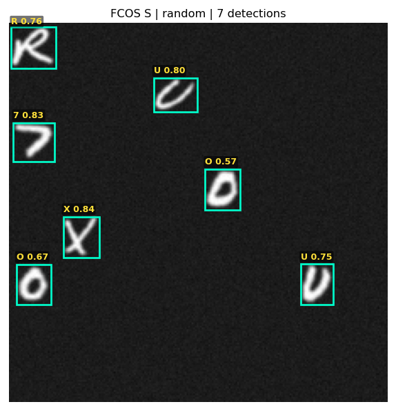 | 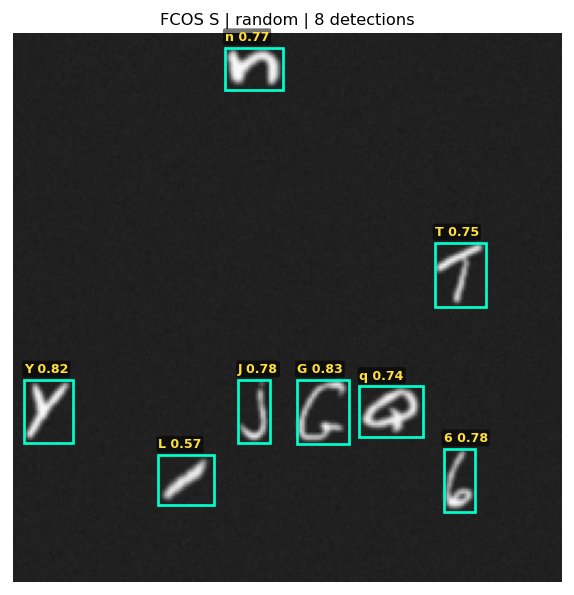 |
| **Grid** | 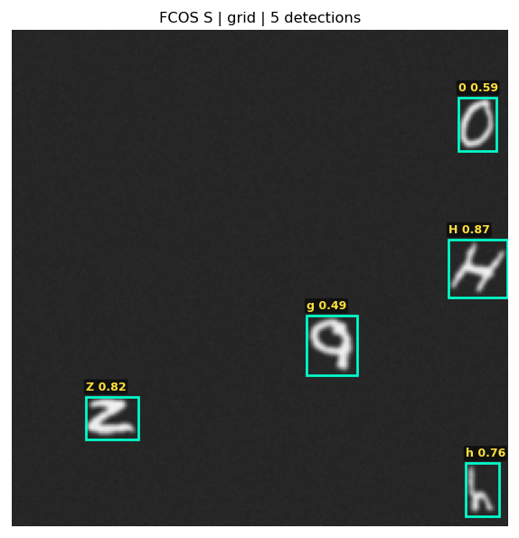 | 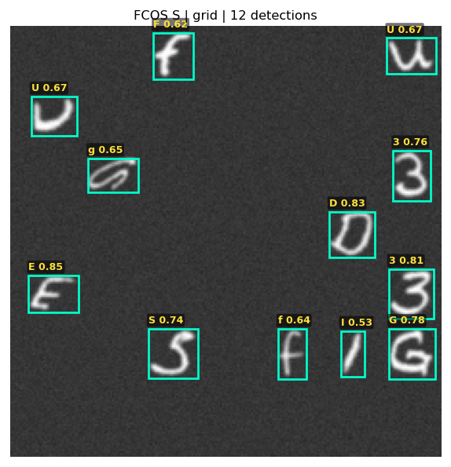 |
| **Words** | 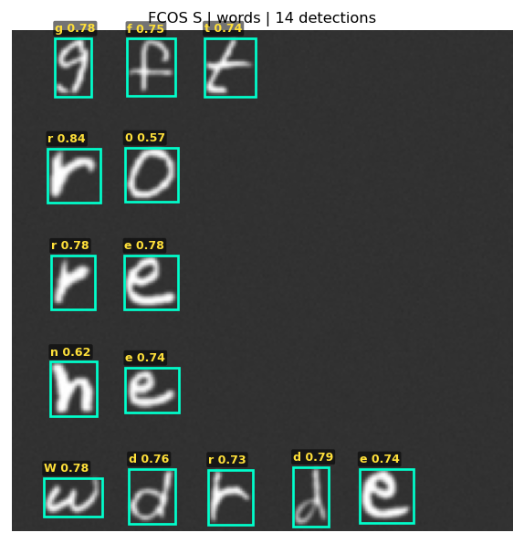 |  |
| **Line** | 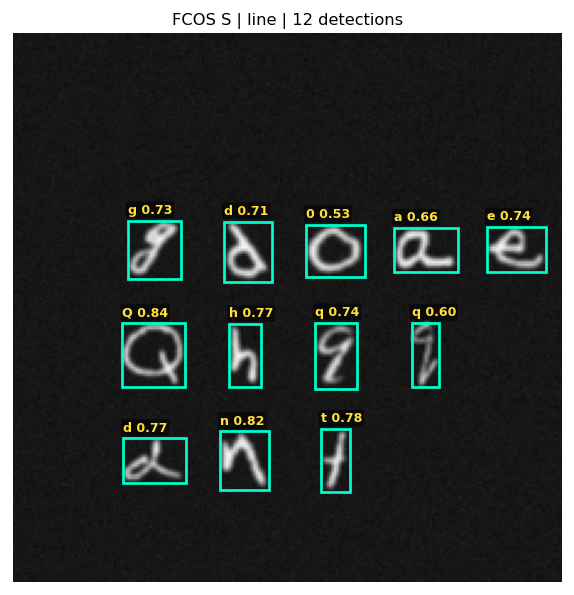 |  |

### FCOS Medium (7.14M Params)
| Layout | Sample 1 | Sample 2 |
|:---|:---:|:---:|
| **Random** | 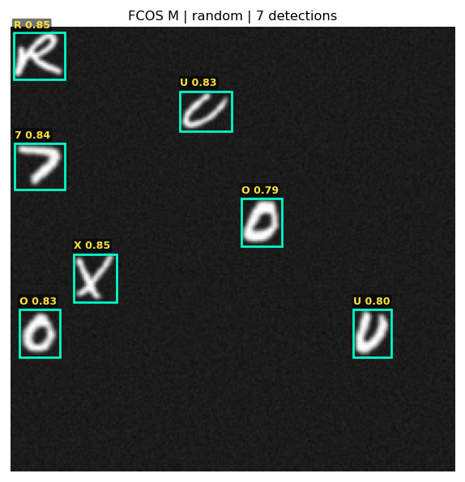 | 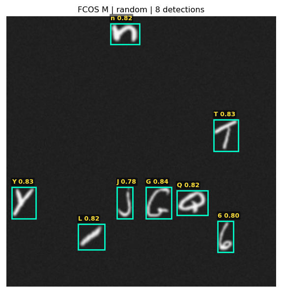 |
| **Grid** | 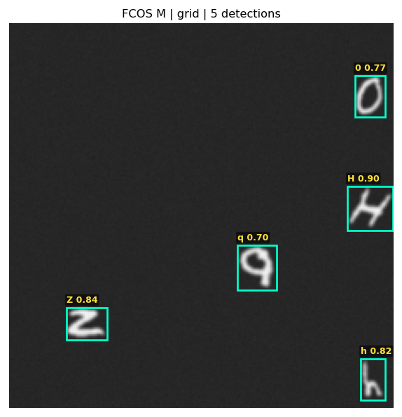 | 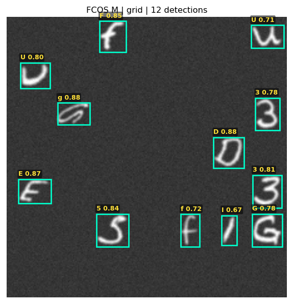 |
| **Words** | 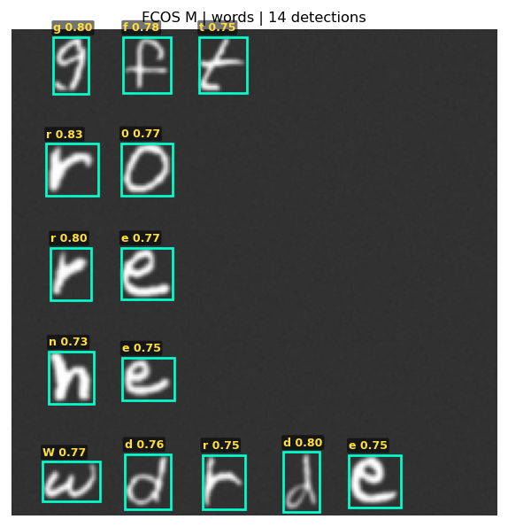 | 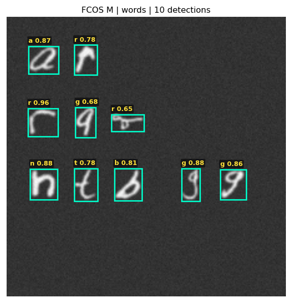 |
| **Line** | 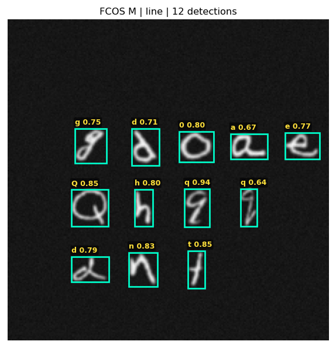 | 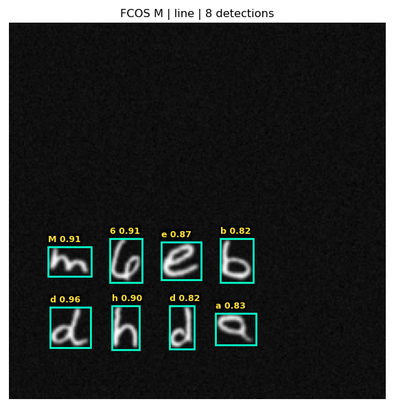 |

### FCOS Nano (0.52M Params)
| Layout | Sample 1 | Sample 2 |
|:---|:---:|:---:|
| **Random** | 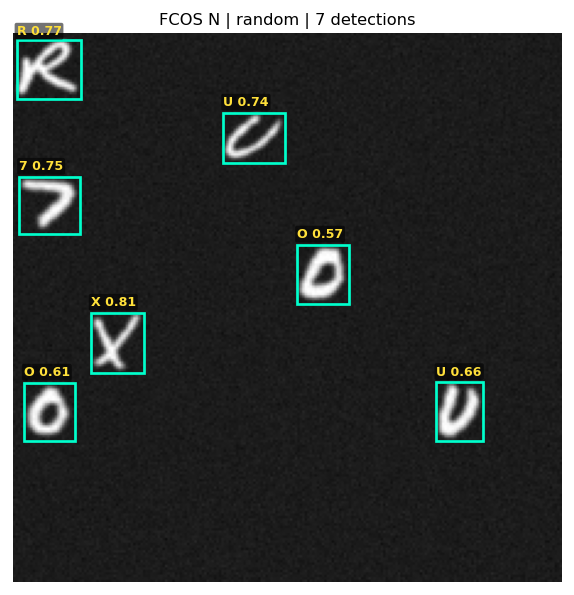 |  |
| **Grid** | 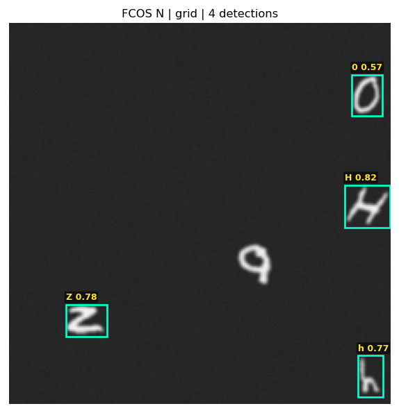 | 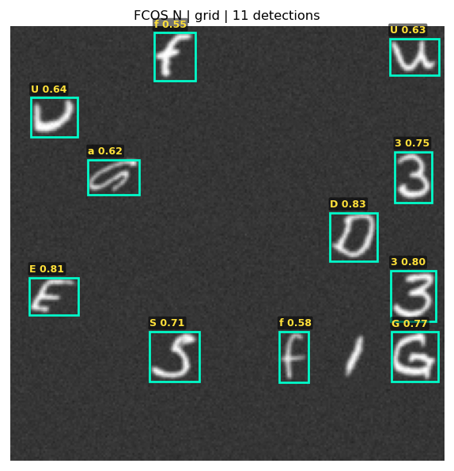 |
| **Words** | 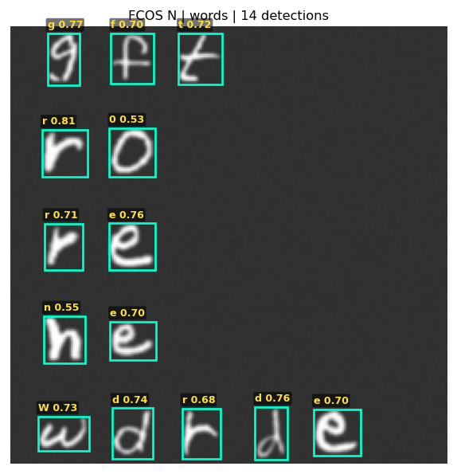 | 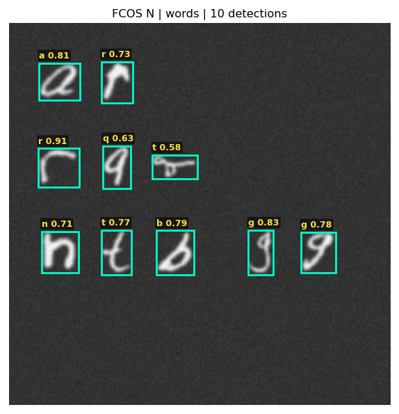 |
| **Line** | 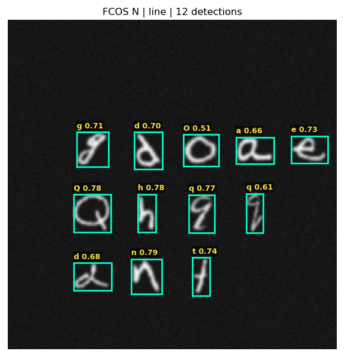 |  |
