# YOLOv8-Inspired Anchor-Free Detector Benchmark

This report benchmarks the trained Nano, Small, and Medium YOLOv8-inspired detectors on the four held-out placement layouts. Each model predicts LTRB boxes and class probabilities at 28 × 28 and 14 × 14 scales. Nano and Small confidence thresholds are selected on the separate tuning split; Medium uses the recorded benchmark test-sweep override.

## Summary

<!-- BEGIN GENERATED: summary -->
- **Detection Precision**: **99.48%** (Nano), **99.43%** (Small), **99.74%** (Medium)
- **Detection Recall**: **94.21%** (Nano), **96.14%** (Small), **95.94%** (Medium)
- **Classifier Accuracy**: **93.90%** (Nano), **92.70%** (Small), **91.94%** (Medium)
- **End-to-End F1**: **0.9087** (Nano), **0.9061** (Small), **0.8990** (Medium)
- **Pure Inference Throughput** (`model(images)` only, batch 128, CUDA): **11,084 img/s** (Nano), **4,827 img/s** (Small), **2,298 img/s** (Medium)

Per-layout detection recall ranges across `random`, `grid`, `words`, and `line`: Nano 92.48%–95.93%; Small 94.37%–97.88%; Medium 94.13%–97.78%.
<!-- END GENERATED: summary -->

## Confidence Thresholds

<!-- BEGIN GENERATED: tuning -->
YOLOv8 confidence thresholds are recorded per size. Nano and Small use the held-out tuning set (`data/OD_benchmark/tune/random`); Medium uses an explicit benchmark test-sweep override. Selected thresholds: Nano `0.45` (held-out tune set), Small `0.45` (held-out tune set), Medium `0.50` (test-sweep override).
<!-- END GENERATED: tuning -->

## Model and Checkpoint Audit

<!-- BEGIN GENERATED: params -->
| Size Preset | Model Name | Total Parameters | Prediction Scales | Optimal `conf` | Checkpoint File |
|:---|:---|:---:|:---:|:---:|:---|
| **Nano (`n`)** | `YOLOv8ObjectDetector` | **831,608** (0.83M) | 28 × 28, 14 × 14 | `0.45` | `checkpoint/yolov8_n_28x14_best.pth` |
| **Small (`s`)** | `YOLOv8ObjectDetector` | **2,509,576** (2.51M) | 28 × 28, 14 × 14 | `0.45` | `checkpoint/yolov8_s_28x14_best.pth` |
| **Medium (`m`)** | `YOLOv8ObjectDetector` | **6,472,536** (6.47M) | 28 × 28, 14 × 14 | `0.50` | `checkpoint/yolov8_m_28x14_best.pth` |

_Parameter counts are read from each trained checkpoint state_dict, excluding BatchNorm buffers._
<!-- END GENERATED: params -->

## Per-Layout Results

<!-- BEGIN GENERATED: results -->
### 🔬 YOLOv8 Nano — 0.83M Params (`conf = 0.45`)

| Layout | Det Precision | Det Recall | Classifier Acc | End-to-End F1 | Eval-Loop Throughput |
|:---|:---:|:---:|:---:|:---:|:---:|
| 🎲 Random | 0.9954 | 0.9248 | 93.41% | 0.8956 | 708.8 img/s |
| 📐 Grid | 0.9949 | 0.9250 | 93.55% | 0.8969 | 712.6 img/s |
| 📝 Words | 0.9949 | 0.9593 | 94.39% | 0.9220 | 700.0 img/s |
| 📏 Line | 0.9941 | 0.9592 | 94.26% | 0.9202 | 724.6 img/s |
| **Average** | **0.9948** | **0.9421** | **93.90%** | **0.9087** | **711.5 img/s** |

Pure inference (`model(images)` only, batch 128): **11,084.3 img/s**.

### ⚡ YOLOv8 Small — 2.51M Params (`conf = 0.45`)

| Layout | Det Precision | Det Recall | Classifier Acc | End-to-End F1 | Eval-Loop Throughput |
|:---|:---:|:---:|:---:|:---:|:---:|
| 🎲 Random | 0.9949 | 0.9437 | 92.42% | 0.8952 | 706.5 img/s |
| 📐 Grid | 0.9957 | 0.9445 | 92.92% | 0.9008 | 684.6 img/s |
| 📝 Words | 0.9936 | 0.9788 | 92.65% | 0.9137 | 663.4 img/s |
| 📏 Line | 0.9928 | 0.9787 | 92.80% | 0.9147 | 693.4 img/s |
| **Average** | **0.9943** | **0.9614** | **92.70%** | **0.9061** | **687.0 img/s** |

Pure inference (`model(images)` only, batch 128): **4,827.2 img/s**.

### 🎯 YOLOv8 Medium — 6.47M Params (`conf = 0.50`)

| Layout | Det Precision | Det Recall | Classifier Acc | End-to-End F1 | Eval-Loop Throughput |
|:---|:---:|:---:|:---:|:---:|:---:|
| 🎲 Random | 0.9974 | 0.9421 | 92.22% | 0.8935 | 587.6 img/s |
| 📐 Grid | 0.9986 | 0.9413 | 92.56% | 0.8969 | 585.8 img/s |
| 📝 Words | 0.9969 | 0.9778 | 91.48% | 0.9031 | 572.5 img/s |
| 📏 Line | 0.9967 | 0.9762 | 91.50% | 0.9025 | 576.5 img/s |
| **Average** | **0.9974** | **0.9594** | **91.94%** | **0.8990** | **580.6 img/s** |

Pure inference (`model(images)` only, batch 128): **2,297.6 img/s**.
<!-- END GENERATED: results -->

## Throughput

<!-- BEGIN GENERATED: throughput -->
| Size | Pure Inference (median) | Pure Inference (min–max over repeats) | Eval-Loop Throughput (avg of 4 layouts) | Eval-Loop range across layouts |
|:---|:---:|:---:|:---:|:---:|
| **Nano** | **11,084.3 img/s** | 11,046.4–11,102.6 | 711.5 img/s | 700.0–724.6 |
| **Small** | **4,827.2 img/s** | 4,815.5–4,837.4 | 687.0 img/s | 663.4–706.5 |
| **Medium** | **2,297.6 img/s** | 2,289.8–2,302.4 | 580.6 img/s | 572.5–587.6 |

- Pure inference times only `model(images)` on CUDA-resident batches of 128; it uses at least 2 seconds of warm-up and 11 repeats × 30 synchronized forward passes. The median is reported.
- Eval-loop throughput includes image loading, target collation, decoding, NMS, device transfers, and Hungarian matching; it is context for the full evaluation path rather than a model-only speed measure.
<!-- END GENERATED: throughput -->

## Density-Stratified Recall

<!-- BEGIN GENERATED: density -->
Density recall uses the thresholds recorded in `benchmark/yolov8_results.json` and IoU 0.50.
Threshold provenance: Nano held-out tune set, Small held-out tune set, Medium test-sweep override.

### 🎲 Random Layout
| Density Bucket ($n_{gt}$) | Test Images | YOLOv8 Nano (0.83M) | YOLOv8 Small (2.51M) | YOLOv8 Medium (6.47M) |
|:---:|:---:|:---:|:---:|:---:|
| **1 – 4 objects** | 236 | 92.7% | **94.2%** | 94.1% |
| **5 – 8 objects** | 1,244 | 92.2% | **94.1%** | 93.9% |
| **9 – 12 objects** | 850 | 92.5% | **94.5%** | 94.5% |
| **13 – 16 objects** | 170 | 93.1% | **94.9%** | 94.5% |

### 📐 Grid Layout
| Density Bucket ($n_{gt}$) | Test Images | YOLOv8 Nano (0.83M) | YOLOv8 Small (2.51M) | YOLOv8 Medium (6.47M) |
|:---:|:---:|:---:|:---:|:---:|
| **1 – 4 objects** | 228 | 92.6% | **94.3%** | 94.0% |
| **5 – 8 objects** | 1,319 | 92.8% | **94.6%** | 94.2% |
| **9 – 12 objects** | 807 | 92.5% | **94.4%** | 94.1% |
| **13 – 16 objects** | 146 | 91.4% | **93.9%** | 93.6% |

### 📝 Words Layout
| Density Bucket ($n_{gt}$) | Test Images | YOLOv8 Nano (0.83M) | YOLOv8 Small (2.51M) | YOLOv8 Medium (6.47M) |
|:---:|:---:|:---:|:---:|:---:|
| **1 – 4 objects** | 253 | 95.8% | 97.4% | **98.0%** |
| **5 – 8 objects** | 1,235 | 96.3% | **97.9%** | 97.7% |
| **9 – 12 objects** | 866 | 95.6% | **98.0%** | 97.8% |
| **13 – 16 objects** | 137 | 95.9% | 97.6% | **97.7%** |

### 📏 Line Layout
| Density Bucket ($n_{gt}$) | Test Images | YOLOv8 Nano (0.83M) | YOLOv8 Small (2.51M) | YOLOv8 Medium (6.47M) |
|:---:|:---:|:---:|:---:|:---:|
| **1 – 4 objects** | 244 | 94.9% | **98.2%** | 97.4% |
| **5 – 8 objects** | 1,231 | 95.9% | **97.8%** | 97.7% |
| **9 – 12 objects** | 862 | 96.0% | **98.0%** | 97.6% |
| **13 – 16 objects** | 149 | 96.0% | **98.0%** | 97.3% |
<!-- END GENERATED: density -->

## Visual Examples

<!-- BEGIN GENERATED: visuals -->
Visuals use each model's recorded threshold and the shared ltrb decoder with class-wise NMS.

### 🔬 Nano (0.83M) — `conf = 0.45`

| random | random | grid | grid |
|:---:|:---:|:---:|:---:|
| 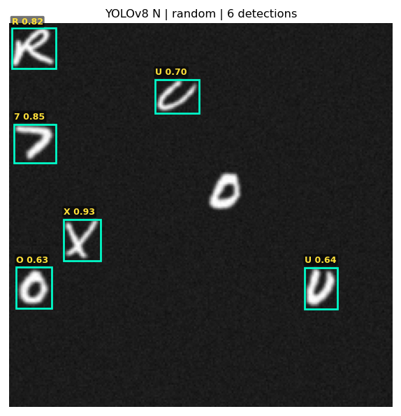 | 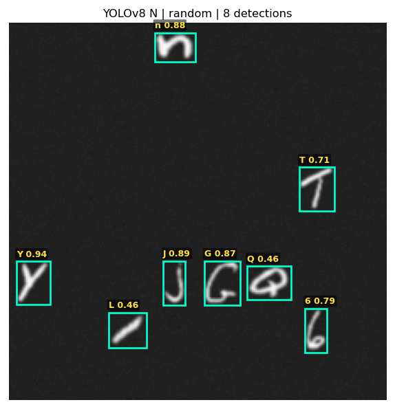 |  | 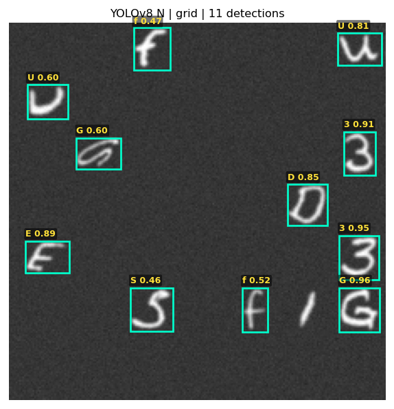 |
| **words** | **words** | **line** | **line** |
| 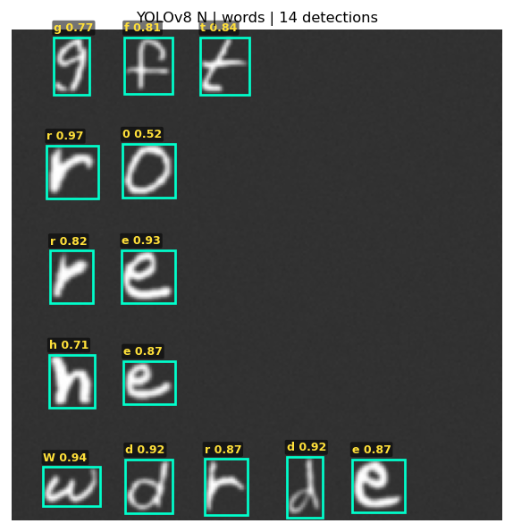 |  | 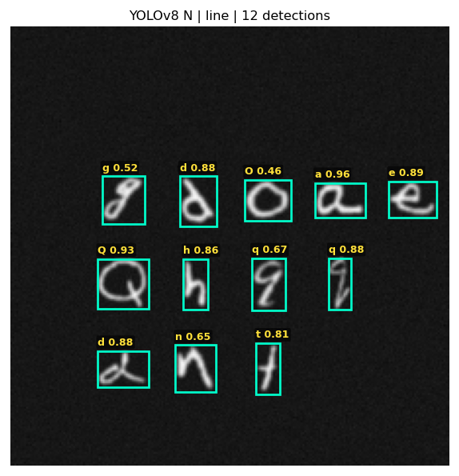 | 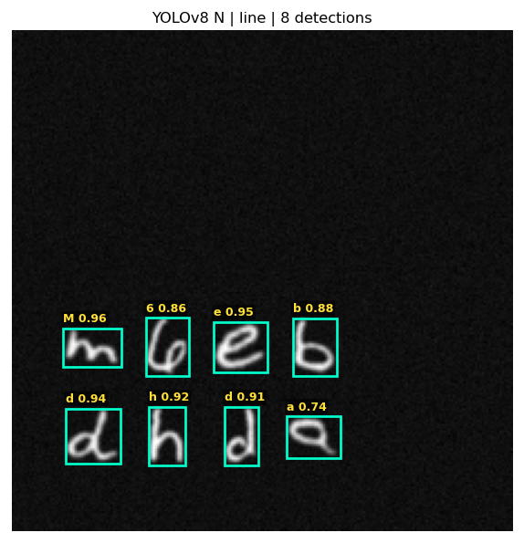 |

### ⚡ Small (2.51M) — `conf = 0.45`

| random | random | grid | grid |
|:---:|:---:|:---:|:---:|
| 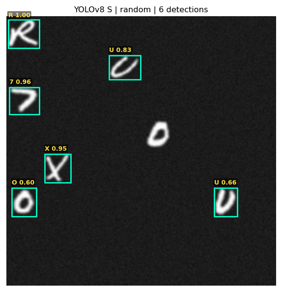 | 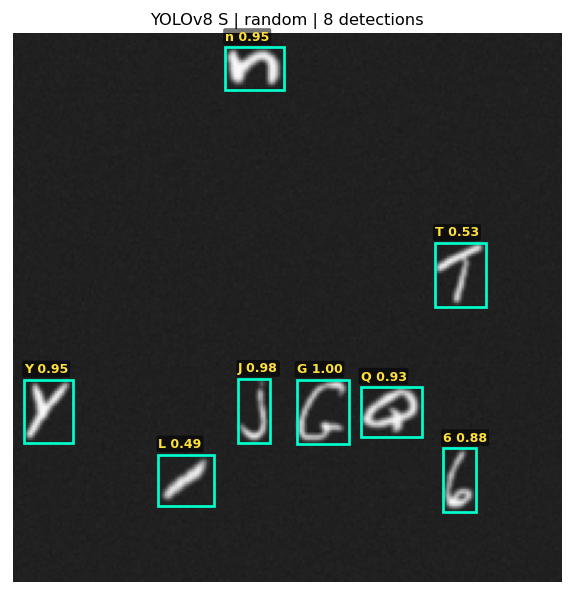 | 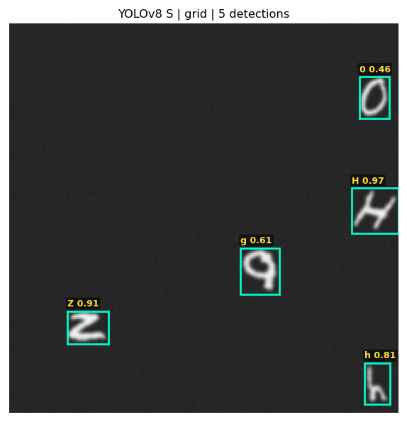 | 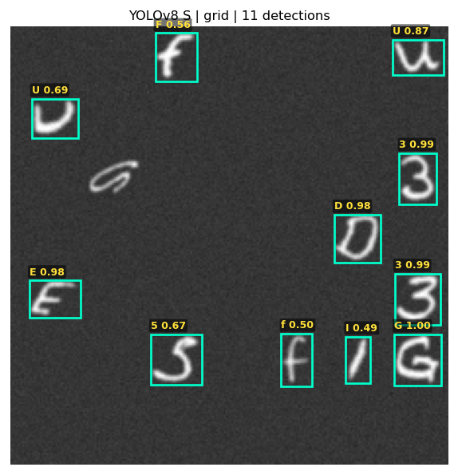 |
| **words** | **words** | **line** | **line** |
| 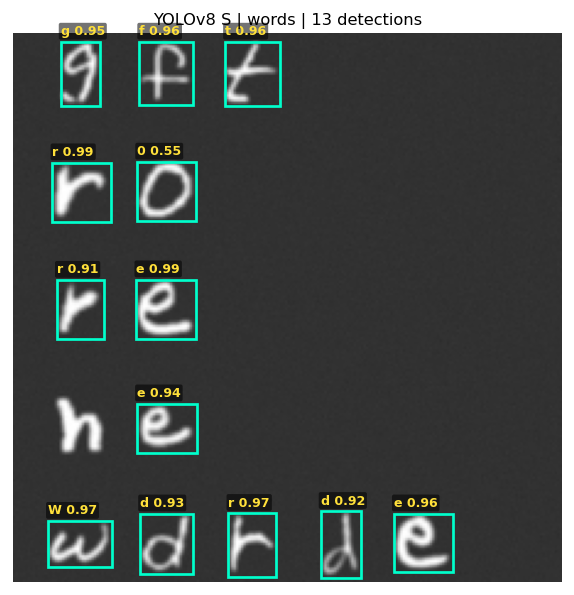 | 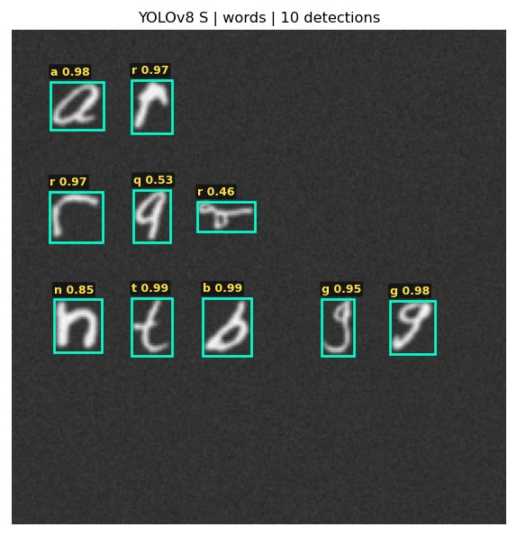 |  |  |

### 🎯 Medium (6.47M) — `conf = 0.50`

| random | random | grid | grid |
|:---:|:---:|:---:|:---:|
|  | 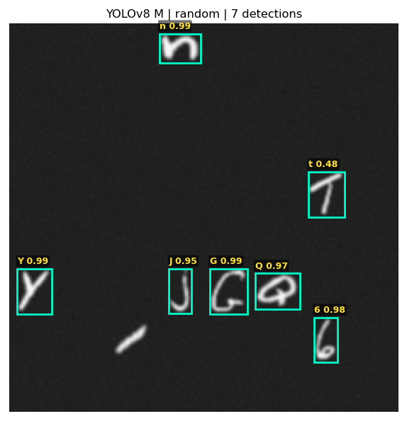 | 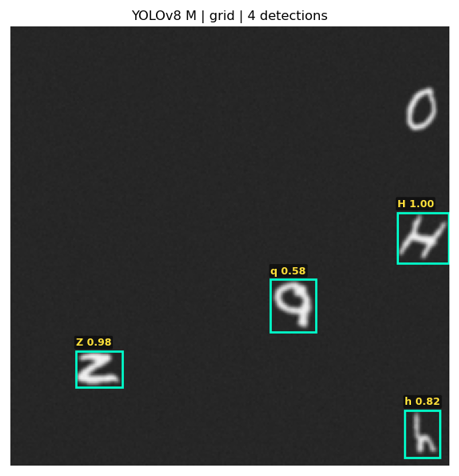 | 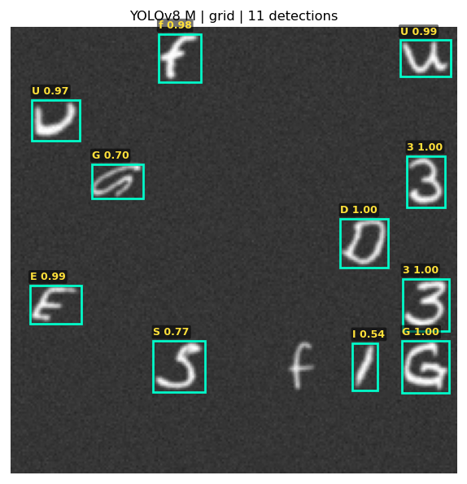 |
| **words** | **words** | **line** | **line** |
| 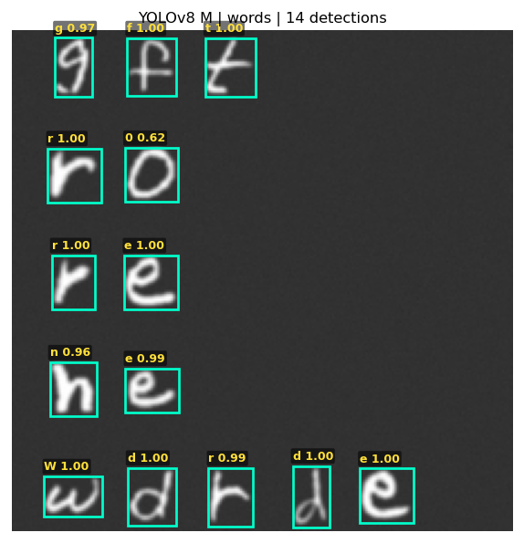 | 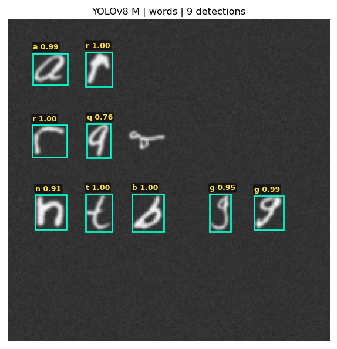 | 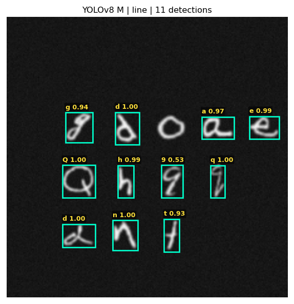 | 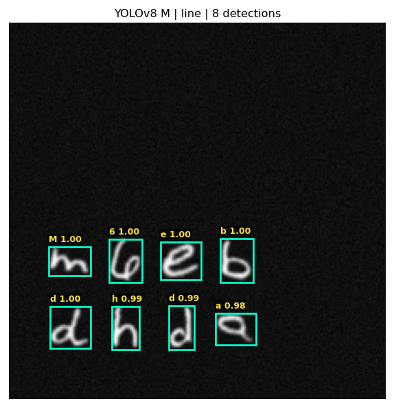 |
<!-- END GENERATED: visuals -->
